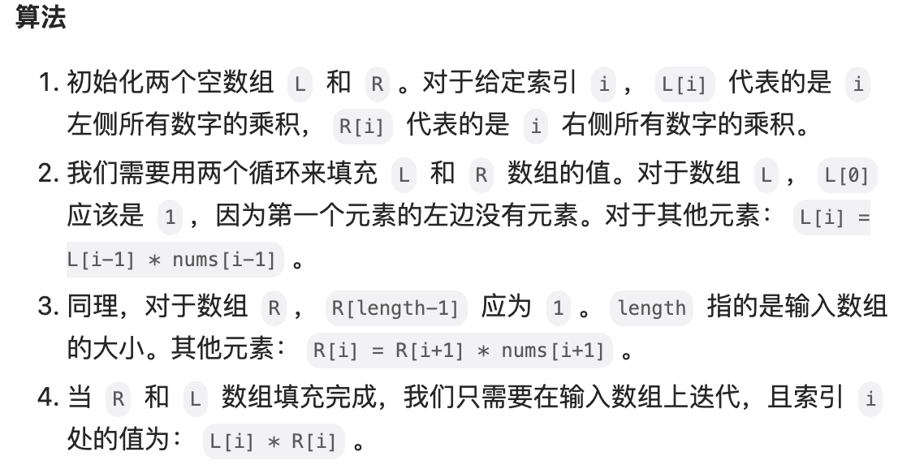

# 238. 除自身以外数组的乘积
(mid)

类似双指针写法

---


### 问题描述

给你一个整数数组 nums，返回 数组 answer ，其中 answer[i] 等于 nums 中除 nums[i] 之外其余各元素的乘积 。

题目数据 保证 数组 nums之中任意元素的全部前缀元素和后缀的乘积都在  32 位 整数范围内。

请 **不要使用除法**，且在 O(n) 时间复杂度内完成此题。


**示例 1:**

    输入: nums = [1,2,3,4]
    输出: [24,12,8,6]


**示例 2:**

    输入: nums = [-1,1,0,-3,3]
    输出: [0,0,9,0,0]


<br>
<br>
<br>


### 算法思想

我们不必将所有数字的乘积除以给定索引处的数字得到相应的答案，而是利用索引左侧所有数字的乘积和右侧所有数字的乘积（即前缀与后缀）相乘得到答案。

对于给定索引 i，我们将使用它左边所有数字的乘积乘以右边所有数字的乘积。下面让我们更加具体的描述这个算法。




<br>
<br>

```cpp
class Solution {
public:
    vector<int> productExceptSelf(vector<int>& nums) {
        int length = nums.size();   //作为下标的话，多一个

        vector<int> L(length, 0), R(length, 0);  //初始化2个分别记录左右乘积的空数组

        vector<int> answer(length);

        L[0] = 1;   //  最左边是没有元素的
        for(int i = 1; i< length; i++){
            L[i] = L[i-1]*nums[i-1];
        }

        R[length-1] = 1;
        for(int j = length-2; j >=0; j--){
            R[j] = R[j+1]*nums[j+1];
        }

        for(int k = 0; k<length; k++){
            answer[k] = L[k] * R[k];
        }

        return answer;

    }
};
```

