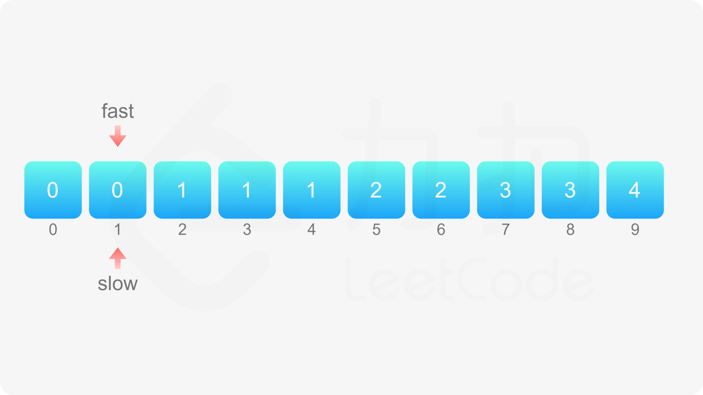

# 26. 删除有序数组中的重复项
**(easy)**

---

给你一个 **非严格递增排列** 的数组 `nums` ，请你 **原地** 删除重复出现的元素，使每个元素 只出现一次 ，返回删除后数组的新长度。元素的 **相对顺序** 应该保持 **一致** 。然后返回 `nums` 中唯一元素的个数。

- 考虑 `nums` 的唯一元素的数量为 `k` ，你需要做以下事情确保你的题解可以被通过：

- 更改数组 `nums` ，使 `nums` 的前 `k` 个元素包含唯一元素，并按照它们最初在 `nums` 中出现的顺序排列。`nums` 的其余元素与 `nums` 的大小不重要。
返回 `k` 

<br>
<br>
<br>

**示例 1：**

    输入：nums = [1,1,2]
    输出：2, nums = [1,2,_]
    解释：函数应该返回新的长度 2 ，并且原数组 nums 的前两个元素被修改为 1, 2 。不需要考虑数组中超出新长度后面的元素。

**示例 2：**

    输入：nums = [0,0,1,1,1,2,2,3,3,4]
    输出：5, nums = [0,1,2,3,4]
    解释：函数应该返回新的长度 5 ， 并且原数组 nums 的前五个元素被修改为 0, 1, 2, 3, 4 。不需要考虑数组中超出新长度后面的元素。
 

提示：

- `1 <= nums.length <= 3 * 104`
- `-104 <= nums[i] <= 104`
- `nums` 已按 **非严格递增** 排列


<br>
<br>
<br>

### 解法：



**算法思想：**
1. 给定序列是有序，那就是说，**相等的元素**在数组中的下标一定是连续的，故可通过双指针删除
2. 当数组 `nums` 的长度大于 0 时，数组中至少包含一个元素，**在删除重复元素之后也至少剩下一个元素**，因此 `nums[0]` 保持原状即可，**从下标 1 开始删除重复元素**
3. 定义两个指针，fast和slow，fast表示遍历数组时到达的位置，slow表示下一次不同元素填入的位置，起始位置均从第一位开始。
4. 只要 `nums[fast] != nums[fast-1]`, 那么就填入, 即 `nums[slow] = nums[fast]`; 并且两个指针都需要移动一位。`fast` 也要移动，因为要从下一次开始。


```cpp{.line-numbers}
class Solution {
public:
    int removeDuplicates(vector<int>& nums) {
        int slow = 1, fast = 1, len = nums.size();

        if(nums.empty()){
            return 0;
        }

        while(fast < len){
            if(nums[fast] != nums[fast-1]){
                nums[slow] = nums[fast];
                slow++;
                fast++;
            }
            else{
                fast++;
            }
        }
        return slow;

    }
};
```