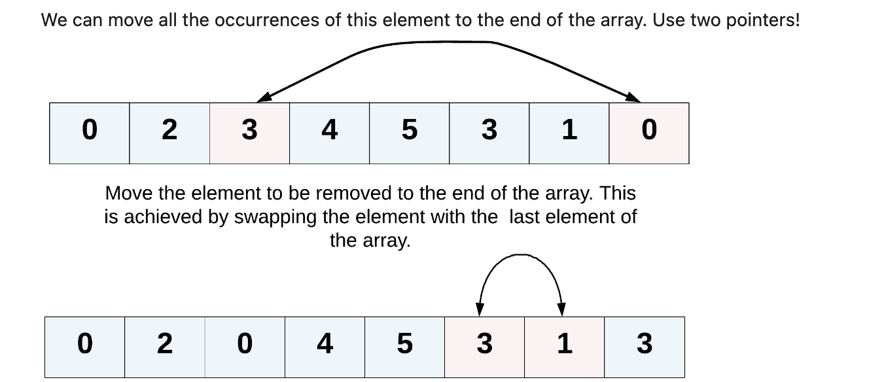

# 移除元素
**（easy）**

---
###  1. describe
给你一个数组 `nums` 和一个值 `val`，你需要 **原地** 移除所有数值等于 `val` 的元素，并返回移除后数组的新长度。

不要使用额外的数组空间，你必须仅使用 `O(1)` 额外空间并 **原地** 修改输入数组。

元素的顺序可以改变。你不需要考虑数组中超出新长度后面的元素。

<br>
<br>
<br>

**示例 1：**

    输入：nums = [3,2,2,3], val = 3
    输出：2, nums = [2,2]
    解释：函数应该返回新的长度 2, 并且 nums 中的前两个元素均为 2。你不需要考虑数组中超出新长度后面的元素。例如，函数返回的新长度为 2 ，而 nums = [2,2,3,3] 或 nums = [2,2,0,0]，也会被视作正确答案。

**示例 2：**
    输入：nums = [0,1,2,2,3,0,4,2], val = 2
    输出：5, nums = [0,1,3,0,4]
    解释：函数应该返回新的长度 5, 并且 nums 中的前五个元素为 0, 1, 3, 0, 4。注意这五个元素可为任意顺序。你不需要考虑数组中超出新长度后面的元素。
 

**提示：**
- `0 <= nums.length <= 100`
- `0 <= nums[i] <= 50`
- `0 <= val <= 100`



<br>
<br>
<br>

### 解法

#### 错误解法
```cpp{.line-numbers}
class Solution {
public:
    int removeElement(vector<int>& nums, int val) {
        int len = nums.size();
        int* head = nums.data();
        int* tail = head+len-1;
        int n = 1;

        while(head != tail){
            if(*head == val){
                *head = *tail;
                tail--;
            }
            else{
                head++;
                n++;
            }
        }
        return n;
    }
};
```
    Line 6: Char 29: runtime error: applying non-zero offset 18446744073709551612 to null pointer (solution.cpp)
    SUMMARY: UndefinedBehaviorSanitizer: undefined-behavior prog_joined.cpp:15:29

**解释：**
- 空指针了，需要判断 `nums`  是否为空，不然 `head` 和 `tail` 都是空指针
- 第二个错是， `head != tail` 有可能导致越界访问
- 还有一个错误可能导致，`head` 指向新值后，`tail` 并没有进行更新，有可能最后 `tail` 并不是在最后一个有效元素位置上，因为 `tail` 指向的值可能也是 `==val`

<br>
<br>


#### 正确解法(参考标准答案)

```cpp{.line-numbers}
class Solution {
public:
    int removeElement(vector<int>& nums, int val) {
        int left = 0, right = nums.size();
        while(left < right){
            if(nums[left] == val){
                nums[left] = nums[right-1]; // move the tail val to curr pos
                right--; //the tail pos move pre
            }
            else{
                left++; //vec pos move next
            }
        }
        return left;    // two point encount
    }
};
```


**算法思路:**
双指针
1. 两指针相遇，遍历完整个数组
2. 如果当前头部 `left` 的值**等于** `val`,  就将尾部 `right` 的值复制到前面，此时尾部指针向前一位
3. 如果 `left` 的值**不等于** `val` , 有效位置 `left` 前后一位
4. 直到两指针相遇，退出 `while` ，返回 有效位置 `left`


