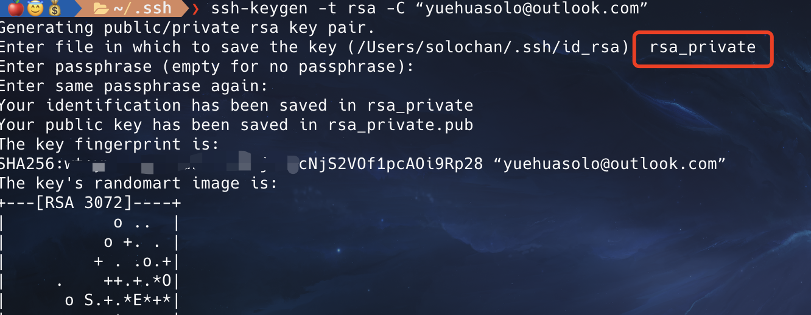

# 在其他电脑中添加 另一个 github 账户
---

### 首先，给本地配置想要添加的 github 账户 生成新的 ssh key

`ssh-keygen -t rsa -C “xxx@xx.com”`

需要注意的是：
- 要重新命名，否则会覆盖之前的 `id_rsa`

结果类似如下：
- 命名为 rsa_private




配置本地 `.ssh/` 文件夹下的 `config` 文件：
```shell
# one
Host github_yuehuasolo.com
Hostname ssh.github.com
Port 443
IdentityFile ~/.ssh/id_rsa
ServerAliveInterval 60


# other account
Host github_yyhchen.com
Hostname ssh.github.com
Port 22
IdentityFile ~/.ssh/rsa_private
```

其中， `Hostname` 是统一的，链接用；`Host` 是 `git@xx` 中的后缀，比如后面需要 `clone` 项目的时候，`git clone git@github_yyhchen: 用户名/仓库名.git` 即可


配置完文件后， 用 `git -T git@github_yyhchen.com` 测试，结果如下：
```
Hi yyhchen! You've successfully authenticated, but GitHub does not provide shell access.
```

同理，测试原来的账户也是用 `git -T git@自己配的Host`


<br>


### 其次，需要注意的是，因为有多个账户，所以需要取消原来的全局用户名和邮箱

```shell
git config --global --unset user.name

git config --global --unset user.email

```

之后需要 `clone` 项目，先设置 该文件下 的用户名和邮箱：
```shell
git config --local user.name

git config --local user.email
```

然后再 使用 `git clone git@github_yyhchen.com: 用户名/仓库名.git` 即可 


<br>


### 最后，千万要记住！！！ 如果到原来的电脑上更新仓库，必须先 `git pull origin main` !!!


# 在当前情况新增github仓库

---

1. github 先创好仓库
2. git remote add origin 的时候，这里用上 之前定义的 hostname, 即完整的应该是 `git clone git@github_yyhchen: 用户名/仓库名.git` ; 否则会报错！！