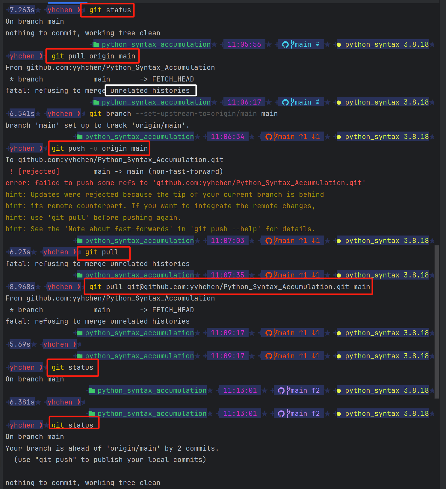

# git 合并存在 unrelated的问题




这个问题通常发生在**两个不相关（unrelated）的 Git 历史尝试合并**的情况下。在 **Git 2.9 版本**之后，Git 引入了一项安全功能，防止将两个不相关的分支合并，以防止意外合并导致混乱。

在你的情况下，**由于本地分支和远程分支的历史不相关**，Git 拒绝了合并请求。为了解决这个问题，你可以执行以下步骤：

1. **强制合并：** 你可以在 `git pull` 命令中加入 `--allow-unrelated-histories` 选项来强制合并两个不相关的历史。执行以下命令：

    ```bash
    git pull --allow-unrelated-histories origin main
    ```

    或者：

    ```bash
    git pull --allow-unrelated-histories git@github.com:yyhchen/Python_Syntax_Accumulation.git main
    ```

2. **解决冲突（如果有的话）：** 如果两个历史之间有冲突，你需要解决这些冲突。Git 会提示你合并冲突的文件，你需要手动编辑这些文件以解决冲突。

3. **提交并推送：** 完成合并后，你可以提交更改并推送到远程仓库：

    ```bash
    git commit -m "Merge unrelated histories"
    git push origin main
    ```

这应该解决合并不相关历史的问题。请注意，这样的合并可能会导致一些混乱，因为两个历史之间可能存在不一致的部分。确保你知道你在做什么，并且在合并之前备份你的工作。