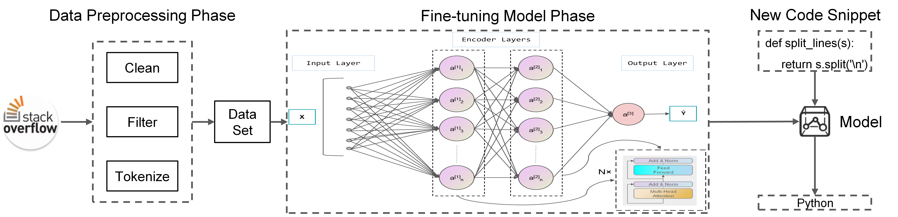

# Paper Note

[DeepSCC: Source Code Classification Based on Fine-Tuned RoBERTa](https://arxiv.org/pdf/2110.00914.pdf)

---

# 1. Instruction

* 之前的研究都把**代码语言类型**分类问题作为**文本分类**
 

### **主要的方法都有：**(或者受到启发)

**1. *Machine learning***
* **Naive Bayesian classifier**
  * J. N. Khasnabish, M. Sodhi, J. Deshmukh, and G. Srinivasaraghavan, *“Detecting programming language from source code using bayesian learning techniques,”* in International Workshop on Machine Learning and Data Mining in Pattern Recognition, **2014**, pp. 513–522.
* **Random forest classifier and XGBoost**
  * K. Alrashedy, D. Dharmaretnam, D. M. German, V. Srinivasan, and T. A. Gulliver, *“Scc++: predicting the programming language of questions and snippets of stack overflow,”* Journal of Systems and Software, vol. 162, p. 110505, **2020**.

**2. *Deep learning***
*  **neural text Classification and code semantic learning**
   * D. Chen, X. Chen, H. Li, J. Xie, and Y. Mu, “Deepcpdp: Deep learning based cross-project defect prediction,” IEEE Access, vol. 7, pp.184 832–184 848, **2019**.

 
 
 

### **state-of-the-art baselines**

**1. two baselines**
* **source code classification field(SCC field)**
  * **K. Alrashedy**, D. Dharmaretnam, D. M. German, V. Srinivasan, and T. A. Gulliver, *“Scc++: predicting the programming language of questions and snippets of stack overflow,”* Journal of Systems and Software, vol. 162, p. 110505, **2020**. **(同上 Random forest classifier and XGBoost, ==需要注意的是，作者的数据清洗和过滤是这篇文章的数据为基础==)**
  * **K. Alreshedy**, D. Dharmaretnam, D. M. German, V. Srinivasan, and T. A. Gulliver, *“Scc: automatic classification of code snippets,”* arXiv preprint arXiv:1809.07945, **2018**. **(这篇paper用的是scc方式分类, Naive Bayes分类)**

**2. remaining baselines**
* **neural text classification field**
  * **Y. Kim**, “Convolutional neural networks for sentence classification,” CoRR, vol. abs/1408.5882, 2014.
  * **P. Bojanowski**, E. Grave, A. Joulin, and T. Mikolov, “Enriching word vectors with subword information,” Transactions of the Association for Computational Linguistics, vol. 5, pp. 135–146, **2017**.
  * **T. Mikolov**, I. Sutskever, K. Chen, G. Corrado, and J. Dean, “Distributed representations of words and phrases and their compositionality,” arXiv preprint arXiv:1310.4546, **2013**.
  * **A. Vaswani**, N. Shazeer, N. Parmar, J. Uszkoreit, L. Jones, A. N. Gomez, L. Kaiser, and I. Polosukhin, “Attention is all you need,” arXiv preprint arXiv:1706.03762, **2017**.
  * **J. Devlin**, M.-W. Chang, K. Lee, and K. Toutanova, “Bert: Pretraining of deep bidirectional transformers for language understanding,” arXiv preprint arXiv:1810.04805, **2018**.

 
 
 

# 2. Related Work

### 这些paper提到了从Github收集数据
* **J. K. Van Dam** and V. Zaytsev, “Software language identification with natural language classifiers,” in Proceedings of International Conference on Software Analysis, Evolution, and Reengineering, **2016**, pp. 624–628. **(19种编程语言)**
* **J. N. Khasnabish**, M. Sodhi, J. Deshmukh, and G. Srinivasaraghavan, “Detecting programming language from source code using bayesian learning techniques,” in International Workshop on Machine Learning and Data Mining in Pattern Recognition, **2014**, pp. 513–522 **(收集了20,000个源代码文件)**
* **D. Klein**, K. Murray, and S. Weber, “Algorithmic programming language identification,” arXiv preprint arXiv:1106.4064, **2011**. **(从GitHub收集了41,000个源代码文件作为训练集)**

**However：**
**their methods, which are based on ==supervised learning== and ==feature selection methods==, can only achieve 48% accuracy at most**

 

[但用scc方式用naive bayes 分类，达到75% 的精度](#state-of-the-art-baselines)

 
 
 

# 3. Method

### DeepSCC架构图

没看出来哪里创新了

 
 
 

### 数据处理阶段

之前的研究工作中 **(code classification methods)**，把 code word 视为一个 basic unit。这导致容易出现 OOV（Out of Vocabulary）问题，也就是说，有些word存在测试集，但又不在训练集。**（==所以导致模型可能不认识，从而分类失败==）**

作者解决 OOV 问题用的是 **Byte-Pair Encoding (BPE)**
* **R. Sennrich**, B. Haddow, and A. Birch, *“Neural machine translationof rare words with subword units,”* arXiv preprint arXiv:1508.07909, **2015**.

 

**It is a mixture between character-level and word level representations.**（还是有点东西的）

**Using BPE can ==avoid a large number of ”[UNK]” symbols== in the test set, as ”[UNK]” symbols may decrease the performance of the pre-trained model.**

(作者还举了个例子，这里就不写上去了)

 
 
 

### 模型 fine-tuned 阶段

用**code类型数据**在RoBERTa上进行pre-trained（**MLM方式**），然后再进行fine-tuning。（作者fine-tuned的时候没改bias，LayerNorm和weights的参数，梯度算法用的**AdamW**）

 
 
 

# 4. Experiment

语料库选择的是 [Alreshedy （上述,有21中语言）](#state-of-the-art-baselines) ,去掉了Markdown类型(相比其他太少了)，去掉了HTML类型（包含了CSS和Javascript），最终数据 **179,556** 条 code snipets 用来训练，**44,889** 条用来测试。（fine-tuning 用LoRA的话最少的有个**2w条数据**才能见效）

