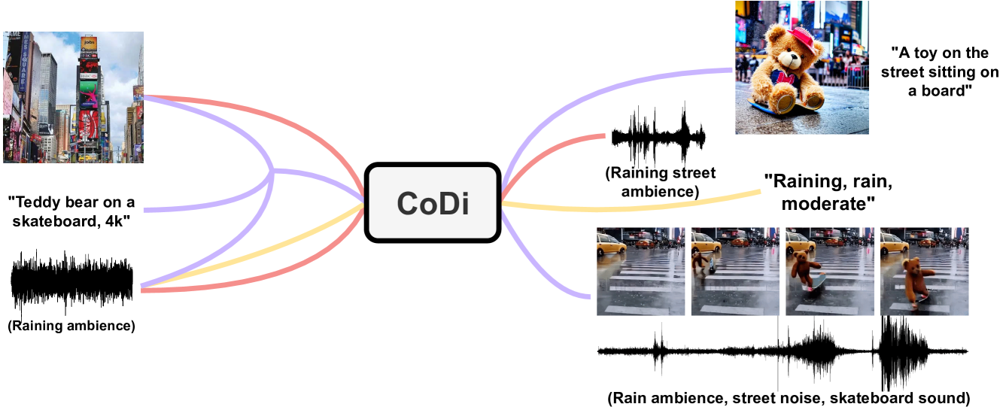
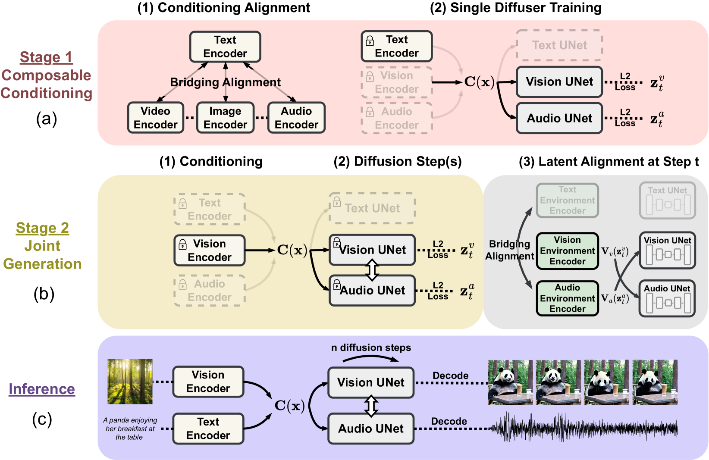

# Any-to-Any Generation via Composable Diffusion
---

## Abstract
我们提出了可组合扩散 （CoDi），这是一种新颖的生成模型，**能够从输入模态的任意组合中生成输出模态的任意组合**，例如语言、图像、视频或音频。与现有的生成式 AI 系统不同，CoDi 可以并行生成多个模态，其输入不限于文本或图像等模态的子集。尽管缺乏许多模态组合的训练数据集，但我们建议在输入和输出空间中调整模态。这允许 CoDi 自由地对任何输入组合进行调节并生成任何一组模态，即使它们不存在于训练数据中。CoDi 采用了一种新颖的可组合生成策略，该策略涉及通过在扩散过程中桥接对齐来构建共享的多模态空间，从而实现同步生成交织的模态，例如时间对齐的视频和音频。CoDi 具有高度可定制性和灵活性，可实现强大的联合模态生成质量，并且优于或与单模态最先进的单模态合成技术相当。包含演示和代码的项目页面位于 https://codi-gen.github.io/

图 1：CoDi 可以从不同的（联合）输入集生成各种（联合）输出模式组合：视频、图像、音频和文本（彩色箭头表示的示例组合）。

 
 
 

## 1. Introduction
近年来，强大的跨模态模型兴起，可以从一种模态生成另一种模态，e.g. **text-to-text**  [bubeck2023sparks](https://arxiv.org/pdf/2303.12712.pdf?utm_source=webtekno); [pryzant2023automatic](https://arxiv.org/pdf/2305.03495), **text-to-image** [gen-1](https://openaccess.thecvf.com/content/ICCV2023/papers/Esser_Structure_and_Content-Guided_Video_Synthesis_with_Diffusion_Models_ICCV_2023_paper.pdf); [ho2022imagen](https://arxiv.org/pdf/2210.02303); [rombach2022high](http://openaccess.thecvf.com/content/CVPR2022/papers/Rombach_High-Resolution_Image_Synthesis_With_Latent_Diffusion_Models_CVPR_2022_paper.pdf); [singer2022make](https://arxiv.org/pdf/2209.14792.pdf?utm_source=webtekno); [hong2022cogvideo](https://arxiv.org/pdf/2205.15868), or **text-to-audio** [huang2023make](https://arxiv.org/pdf/2301.12661); [liu2023audioldm](https://arxiv.org/pdf/2301.12503). 然而，这些模型在多种模态共存和相互作用的情况下，在现实世界中的适用性受到限制。虽然可以在多步骤生成设置中**将特定于模态的生成模型链接在一起**，但每个步骤的生成能力仍然固有地受到限制，并且串行的多步骤过程可能既繁琐又缓慢。**此外**，当以后处理方式拼接在一起时，独立生成的单模态流（例如，同步的视频和音频）将不一致和对齐。人们热切期待开发一个全面且通用的模型，该模型可以从任何一组输入条件生成任何模态组合，因为它将更准确地捕捉世界的多模态性质和人类理解，无缝整合来自各种来源的信息，并实现对人类与人工智能交互的强烈沉浸感（例如， 通过同时生成连贯的视频、音频和文本描述）。

为了实现这一目标，我们提出了**可组合扩散（CoDi）**，这是第一个能够同时处理和生成任意模态组合的模型，**如图1所示**。训练模型以采用任何输入模态的混合并灵活地生成任何输出的混合，这提出了巨大的计算和数据要求，因为输入和输出模态的组合数量呈指数级增长。**此外**，许多模式组的对齐训练数据很少，甚至不存在，**因此使用所有可能的输入-输出组合进行训练是不可行的**。为了应对这一挑战，我们建议在输入条件（第 3.2 节）和生成扩散步骤（第 3.4 节）中调整多种模式。**此外**，针对对比学习的“桥接对齐”策略（第 3.2 节）使我们能够有效地对具有线性训练目标的指数数量的输入输出组合进行建模。

构建具有任意生成能力和卓越生成质量的模型需要对各种数据资源进行全面的模型设计和训练。因此，**我们以集成的方式构建 CoDi**。首先，我们为每个模态（例如文本、图像、视频和音频）训练**潜在扩散模型 （LDM）**。这些模型可以独立并行训练，**使用广泛可用的特定模态训练数据**（*即，以一个或多个模态作为输入，以一种模态作为输出的数据*）**确保卓越的单模态生成质量**。对于有条件的跨模态生成，例如使用音频+语言提示生成图像，**输入模态被投影到共享特征空间中**（第 3.2 节），输出 LDM 关注输入特征的组合。这种多模态调节机制使扩散模型能够对任何模态或模态组合进行调节，而无需直接针对此类设置进行训练。

训练的**第二阶段**使模型能够处理多对多生成策略，这些策略涉及同时生成输出模态的任意组合。据我们所知，CoDi 是第一个具有此功能的 AI 模型。这是**通过为每个扩散器添加一个交叉注意力模块和一个环境编码器 $V$ 来实现的**，该编码器将不同 LDM 的潜在变量投射到共享的潜在空间中（第3.4节）。接下来，我们冻结 LDM 的参数，仅训练交叉注意力参数和 $V$。**由于不同模态的环境编码器是对齐的**，LDM 可以通过将表示的输出插值为 $V$ 来与任何一组共同生成的模态进行交叉参与 。这使得 CoDi 能够无缝生成任何一组模态，而无需对所有可能的生成组合进行培训。这将训练目标的数量从指数减少到线性。

我们展示了 CoDi 的任意对任意生成能力，包括单对单模态生成、多条件生成以及多种模态联合生成的新能力。例如，在给定文本输入提示的情况下生成同步的视频和音频;或生成给定提示图像和音频的视频。我们还使用八个多模态数据集对 CoDi 进行定量评估。CoDi 在各种场景中都表现出卓越的生成质量，合成质量与单模态 SOTA 相当甚至更好，例如音频生成和音频字幕。

 
 
 

## 2. Related Works
**扩散模型 （DM）** 通过对原始数据进行去噪和恢复来学习数据分布。深度扩散过程 （DDP） [sohl2015deep](http://proceedings.mlr.press/v37/sohl-dickstein15.pdf)采用一系列**可逆扩散步骤**来模拟图像概率分布。它使用可逆编码器将输入图像映射到潜在空间，并使用解码器将潜在变量映射到输出图像。去噪扩散概率模型 （DDPM） [ho2020noising](https://proceedings.neurips.cc/paper/2020/file/4c5bcfec8584af0d967f1ab10179ca4b-Paper.pdf) 使用**级联扩散过程**来逐渐增加概率密度函数模型的复杂性。在每个步骤中，模型都会将噪声添加到输入图像中，并使用自回归模型估计相应的噪声水平。这允许模型捕获相邻像素之间的依赖关系并生成高质量的图像。基于分数的生成模型 （SOG） [song2021scorebased](https://arxiv.org/pdf/2011.13456) 使用**分数函数**对扩散过程进行建模。[ramesh2022hierarchical](https://3dvar.com/Ramesh2022Hierarchical.pdf) 生成以文本提示的 CLIP 表示为条件的高保真图像。潜在扩散模型 （LDM） [rombach2022high](http://openaccess.thecvf.com/content/CVPR2022/papers/Rombach_High-Resolution_Image_Synthesis_With_Latent_Diffusion_Models_CVPR_2022_paper.pdf) 使用 VAE 将输入编码到潜在空间中，以减少建模维度并提高效率。其动机是图像压缩可以通过扩散模型分离为语义空间，通过自动编码器将感知空间分离。通过结合时间建模模块和级联模型架构，在图像扩散器上构建视频扩散模型，以生成时间一致且固有的帧 [ho2022video](https://proceedings.neurips.cc/paper_files/paper/2022/file/72dad95a24fae750f8ab1cb3dab5e58d-Paper-Conference.pdf) ; [ho2022imagen](https://arxiv.org/pdf/2210.02303) ; [esser2023structure](https://openaccess.thecvf.com/content/ICCV2023/papers/Esser_Structure_and_Content-Guided_Video_Synthesis_with_Diffusion_Models_ICCV_2023_paper.pdf) ; [singer2022make](https://arxiv.org/pdf/2209.14792.pdf?utm_source=webtekno).扩散模型也被应用于其他领域，例如从文本和视觉提示生成音频 [liu2023audioldm](https://arxiv.org/pdf/2301.12503); [huang2023make](https://arxiv.org/pdf/2301.12661) .

**多模态建模** 最近经历了快速发展，研究人员努力使用单个模型构建多种模态的统一表示，以实现更全面的跨模态理解。视觉转换器 [dosovitskiy2021image]() ，具有多样化的模型架构和训练技术，已被应用于各种下游任务，例如视觉问答和图像字幕。多模态编码器在视觉语言选择方面也取得了成功 [cho2021unifying](); [zellers2021merlot]() ; [alayrac2022flamingo]() ， video-audio [tang2022tvlt]() 和 video-speech-language [zellers2022merlot](); [yang2022code]()。对齐来自不同模态的数据是一个活跃的研究领域 [radford2021learning]() ; [Elizalde2022CLAP]() ，在跨模态检索和构建统一多模态表示方面具有广阔的应用前景 [Mokady2021Clipcap]() ; [rombach2022high](http://openaccess.thecvf.com/content/CVPR2022/papers/Rombach_High-Resolution_Image_Synthesis_With_Latent_Diffusion_Models_CVPR_2022_paper.pdf); [liu2023audioldm]().

\
图 2：CoDi 模型架构：（a） 我们首先通过“桥接对齐”训练具有对齐提示编码器的单个扩散模型;（b） 扩散模型通过“潜在对齐”学习相互配合;（c） CoDi 以线性数量的训练目标实现任意生成。

 
 
 

## 3. Methodology

### 3.1Preliminary: Latent Diffusion Model
扩散模型 （DM） 代表了一类生成模型，它们 $p(x)$ 通过模拟信息随时间的扩散来学习数据分布。在训练过程中，随机噪声被迭代添加到 $x$，而模型则学习对示例进行降噪。为了进行推理，该模型对从简单分布（如高斯分布）采样的数据点进行降噪。潜在扩散模型（LDM）[rombach2022high](http://openaccess.thecvf.com/content/CVPR2022/papers/Rombach_High-Resolution_Image_Synthesis_With_Latent_Diffusion_Models_CVPR_2022_paper.pdf) 学习了潜在 $x$ 变量 $z$ 对应的分布，通过降低数据维度显著降低了计算成本。

在**LDM**中，首先训练自动编码器重构，即 $\hat{x}=D(E(x))$，其中 $E$ 和 $D$ 分别表示编码器和解码器。潜在变量 $z=E(x)$ 基于方差时间表 $\beta_1$, ..., $\beta_T$ 在时间步长 $t$ 上迭代扩散，即 $q(z_t\mid z_{t-1})=\mathcal{N}(z_t;\sqrt{1-\beta_t}z_{t-1},\beta_t\boldsymbol{I})$   [sohl2015deep](http://proceedings.mlr.press/v37/sohl-dickstein15.pdf); [ho2020noising](https://proceedings.neurips.cc/paper/2020/file/4c5bcfec8584af0d967f1ab10179ca4b-Paper.pdf)

正向过程允许以封闭形式对任何时间步长进行$z_t$ 随机采样 [sohl2015deep](); [ho2020denoising]()：$z_t=\alpha_tz+\sigma_t\varepsilon,\mathrm{~where~}\varepsilon\sim\mathcal{N}(0,I),\alpha_t:=1-\beta_t\mathrm{~and~}\sigma_t:=1-\prod_{s=1}^t\alpha_s$ .扩散器学习如何从 $\{z_t\}$ 中降噪以恢复 $z$。按照[ho2020denoising]()中提出的重新参数化方法，去噪训练目标可以表示为[rombach2022high]():
$$\mathcal{L}_{D}=\mathbb{E}_{\boldsymbol{z},\varepsilon,t}\|\varepsilon-\varepsilon_{\theta}(\boldsymbol{z}_{t},t,C(\boldsymbol{y}))\|_{2}^{2}.$$

在数据生成中，可以通过重新参数化的高斯采样来实现去噪过程：
$$p(z_{t-1}\mid z_{t})=\mathcal{N}\Bigg(z_{t-1};\frac{1}{\sqrt{\alpha_{t}}}\Bigg(z_{t}-\frac{\beta_{t}}{\sqrt{\sigma_{t}}}\varepsilon_{\theta}\Bigg),\beta_{t}I\Bigg).$$

在$\mathcal{L_D}$中，扩散时间步长为 $t\sim\mathcal{U}[1,T]$ ; $\varepsilon_\theta$ 是一个去噪模型，其中 UNet 主干的参数为为 $\theta$ ; $y$ 表示可用于控制生成的条件变量; $C$ 是提示编码器。调节机制的实现方式是，首先将 $y$ 特征化为 $y C(y)$，然后通过 $C(y)$ 

