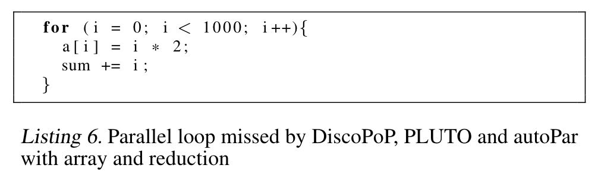

# LEARNING TO PARALLELIZE WITH OPENMP BY AUGMENTED HETEROGENEOUS AST REPRESENTATION

---

---

### Abstract
检测可并行化的代码区域是一项具有挑战性的任务，即使对经验丰富的开发人员而言也是如此。许多最近的研究探讨了在代码分析和程序合成方面利用机器学习的可能性，包括并行化，这是在自然语言处理取得成功的基础上的。然而，将机器学习技术应用于并行性检测面临诸多挑战，例如缺乏用于训练的充足数据集，有效的包含丰富信息的代码表示，以及适合学习代码潜在特征进行各种分析的机器学习模型。为了解决这些挑战，**我们提出了一种名为Graph2Par的新颖基于图的学习方法，它利用了一种异构的增强抽象语法树（Augmented-AST）表示来表示代码**。该方法主要专注于使用OpenMP进行循环级别的并行化。此外，我们创建了一个包含18598个可并行化循环和13972个不可并行化循环的OMP串行数据集，用于训练机器学习模型。我们的结果显示，我们提出的方法在可并行化代码区域检测准确性方面达到了85%的准确率，并且胜过了基于标记的机器学习方法的最新技术。这些结果表明，我们的方法在竞争激烈的工具中具有竞争力，并且能够处理其他工具可能忽略的具有复杂结构的循环。

 
 
 

### 1. Introduction
在过去的几十年里，对多核硬件系统的不断需求和普及要求开发高度并行的程序以最大程度地提高性能。已经创建了许多并行编程模型和框架（Chandra等人，2001年；Gabriel等人，2004年；Pheatt，2008年；Bik等人，2002年），以促进并行代码的开发，但开发人员对于使用这些框架和熟悉代码的专业知识对于实现更好的性能至关重要。循环级别的自动并行性有助于开发人员在循环内执行并行任务以加速处理过程。**现代编译器通常在编译时静态检测循环级别的并行性。这个过程是保守的，为了确保检测到的并行性机会的正确性而忽略了一些并行性**。另一方面，**动态自动并行性工具**在运行时检测循环级别的并行性。在执行程序后捕获的动态信息提高了准确性，**但存在开销问题**。此外，当前的自动并行化工具的应用受到需要对程序进行分析的编译或执行的限制。因此，需要一种更实用的自动检测并行性的方式。

机器学习（ML）技术通常通过将传统的软件工程问题重新定义为预测问题，更为可行和经济。最近许多尝试已经使用机器学习和自然语言处理（NLP）技术在软件工程领域进行性能优化和编译器中的传递，以解决复杂问题，如恶意代码检测、在CPU或GPU上的代码放置和性能预测。最近的研究也在使用ML技术进行自动并行化。陈等人（Chen等人，2022年）通过在多视图模型中训练代码的静态和动态信息来检测并行性。他们工作中的代码嵌入是对word2vec（Mikolov等人，2013年）的一种适应，这是一种现在经典的NLP技术。Ben-nun等人（Ben-Nun等人，2018年）通过使用在未标记数据上训练的图嵌入，引入了代码的神经代码理解（NCC）表示，然后用于简单代码理解任务。Brauckmann等人（Brauckmann等人，2020年）表明，**应用于抽象语法树（AST）或控制数据流图（CDFG）的图嵌入方法在下游任务上比最先进的（受NLP启发的）方法更有效**，并具有更好的泛化能力，能够推广到之前从未见过的示例。

尽管先前的研究取得了成功，但在应用机器学习和自然语言处理技术进行代码分析时存在共同的挑战。首先，在尝试使用机器学习解决任何问题时，构建相关数据集是一个主要的难点。仅有少数适用于并行性检测任务的使用OpenMP的公共基准测试。其次，代码表示对于机器学习模型理解程序至关重要。直观的解决方案是将代码视为自然语言，以便可以直接应用NLP模型（Dai等人，2019年）。然而，上下文或标记表示忽略了代码的结构信息，而这对于并行化分析是至关重要的（Blume等人，1994年；Chen等人，2022年）。最后，机器学习模型在不同任务上的性能变化较大。

在这项工作中，我们提出利用最先进的机器学习技术来检测循环并建议四种可能的OpenMP pragma，以帮助开发人员使用OpenMP实现并行化。我们通过以下方式应对上述挑战：（a）从基准测试、GitHub项目和合成数据中生成包含18598个可并行化循环和13972个不可并行化循环的数据集，（b）引入一种考虑到代码的文本和结构信息的循环的异构增强抽象语法树（aug-AST）表示，以及（c）使用异构图神经网络训练我们数据集中循环的异构aug-AST。

具体而言，本文作出了以下贡献：

- **Dataset** OMP_Serial：一个带有标签的C串行循环数据集，可用于并行化或其他代码分析目的。
- **Method** 引入一种适用于并行性检测和其他下游任务的异构增强抽象语法树（AST）代码表示。
- **Evaluation** 将所提出的基于图的方法与AST和基于标记的代码表示方法进行比较。
- **Application** 在所提出的数据集上实施异构图神经网络，并将结果与最先进的并行化工具进行比较。

 
 
 

### 2. Motivation Examples
本节演示并讨论了三种广泛使用的基于算法的自动并行化工具的局限性：DiscoPoP（Li等人，2016年），Pluto（Bondhugula等人，2008年）和autoPar（Quinlan和Liao，2011年）。这些非机器学习工具通常分为静态和动态（混合）方法。

动态或混合并行化工具如DiscoPoP（Li等人，2016年）使用通过执行程序生成的运行时动态信息来识别并行性。在时间和内存方面，分析和执行程序的成本很高。相反，静态分析工具如Pluto（Bondhugula等人，2008年）和autoPar（Quinlan和Liao，2011年）在没有执行的情况下静态地检查源代码。**然而，这些静态分析工具往往过于保守，经常忽略并行化的机会**。除了它们固有的限制之外，使用非机器学习工具受到它们需要编译或执行程序的限制。当应用于第4节介绍的OMP串行数据集时，autoPar（静态）和DiscoPoP（动态）只能分别处理C循环的10.3%和3.7%。

在我们的观察中，工具在四种类型的循环中经常犯错：带有约简的循环、带有函数调用的循环、带有约简和函数调用的循环以及嵌套循环。**清单1、2、3、4和5**展示了autoPar、Pluto和DiscoPoP所犯错误的示例。**图2说明**了我们关于这些工具未能检测并行性的循环数量和类型的统计结果。

我们受到的动力是探索最先进的机器学习技术，以寻找更可行和精确的解决方案。第6节中的评估表明，我们提出的方法在检测复杂结构循环内的并行性方面优于我们所检验的工具。

 
 
 

### 3. Background
源代码分析领域涵盖了广泛的主题，包括错误检测、优化和自动并行化。具体而言，串行程序的并行化构成了一个子领域，专注于识别并行性、分类并行化模式和实现并行化等任务。本节深入探讨了并行化分析的背景，并探讨了与该任务相关的机器学习方法。

 
 

#### 3.1 Auto-parallelization and Algorithm-based Tools
将顺序程序并行化面临着相当大的挑战，通常涉及两个阶段：并行性识别和并行化实施。并行性识别涉及对顺序程序片段的分析，以确定并行性的机会。并行化实施或执行则涉及利用检测到的并行性来充分利用硬件的能力。

**并行性**可以通过两个基本概念来表达：**任务级并行性和循环级并行性**。任务级并行性标志着应用程序中可以在多个核心或线程上同时执行的区域。任务级并行性方法需要程序中预定义的不同区域，这可能限制了细粒度的机会。循环级并行性将循环体视为并行区域，其中迭代可以分布在线程之间（Wism ̈ uller，2011）。本工作主要关注循环级并行性。

对于并行性的循环的识别通常依赖于程序作者，因为现代编译器无法充分利用并行循环分类。然而，这个过程给开发人员带来了很大的负担，特别是对于庞大的项目而言。**大多数动态方法利用依赖性分析记录指令之间的执行顺序约束，从而实现更准确的自动可并行化循环的识别**。相反，静态方法通过在编译期间保守地分析程序来推断依赖关系。

已经开发了不同的静态、动态和混合（即结合静态和动态）工具，用于自动识别并行化机会。Polly（Grosser等人，2012）是一种基于静态分析、LLVM（Lattner和Adve，2004）和多面体模型的自动并行性检测工具。Kremlin（Garcia等人，2012）使用依赖信息确定循环中的关键路径长度，并随后计算一种度量，即自并行性，用于并行性检测。Alchemist（Zhang等人，2009）通过比较由Valgrind（Nethercote和Seward，2007）在运行时生成的读写后依赖关系（RAW）的指令数量来识别并行化候选者。DiscoPoP（Li等人，2016年；Huda等人，2016年）从经过工具化的顺序程序中提取动态分析和指令依赖数据。从数据依赖图中提取依赖类型、传入和传出依赖的数量以及关键路径长度等信息，用于并行性检测。作为一种混合方法工具，DiscoPoP提供了与静态分析互补的全面动态分析统计信息，有助于更好地理解并发现并行机会。

 
 

#### 3.2 Machine Learning-based Auto-Parallelization
机器学习，如Alpaydin等人（Alpaydin，2020）所定义，涉及通过示例数据或过去的经验来编程计算机以优化性能标准。尽管机器学习技术具有巨大潜力，但在并行化分析任务中，这些技术往往被较少地探索和使用。Fried等人（Fried等人，2013年）研究了一种自动分类顺序程序区域的方法，该方法可以并行化，使用了手工注释的OpenMP指令的基准进行训练。Tournavitis等人（Tournavitis等人，2009年）应用支持向量机（SVM）结合从源代码中提取的静态和动态特征来识别程序中的并行区域。他们使用NAS并行基准（Jin等人，1999年）和SPEC OMP基准（Aslot等人，2001年）来评估他们的模型。自（Fried等人，2013年）和（Tournavitis等人，2009年）的工作以来，机器学习技术取得了显著的进展，最近的进展展示了深度神经网络在代码表示（Cummins等人，2021年；Ma等人，2021年）和并行化分析（Shen等人，2021年；Chen等人，2022年）方面的能力。

 
 

#### 3.3 Code Representations
代码的表示对于在代码分析领域应用机器学习技术至关重要。本小节讨论常用的代码表示及其对应的机器学习方法。

**Token.** 编程标记是构成程序源代码的基本元素。标记是一个字符串，根据编程语言的语法，可以被分类为常量、标识符、运算符、保留字或分隔符。受到自然语言处理中的词嵌入的启发，各种研究致力于生成基于标记的嵌入，可作为机器学习方法的输入。最先进的标记嵌入方法，code2vec（Alon等人，2019年），是在预测方法名的任务上进行训练的。

**ASTs.** 抽象语法树（AST）是代码的最可行表示之一。每种编程语言都有一个明确的上下文无关文法，允许将源代码解析为表示源代码的抽象语法树（AST）。AST中的每个非叶节点对应于上下文无关文法中传达结构信息的非终结符，而每个叶节点对应于上下文无关文法中编码程序文本的终结符。**图3展示**了**清单1**的AST示例。AST可以轻松转换回源代码。由于我们的工作关注循环级别的并行性，我们集中在表示所需循环的部分AST上。

**CFG.** 控制流图（CFG）描绘了代码语句的执行顺序以及必须满足的特定执行路径的要求。节点表示语句和谓词，而有向边连接它们并指示控制流的流向。尽管CFG的边不必遵循特定的顺序，如抽象语法树中的情况，但仍然有必要标识每个边为真、假或其他。CFG已被用于各种用途，如检测知名恶意应用程序的版本和引导模糊测试工具。它们现在也是逆向工程中常见的代码表示，以帮助程序理解。**然而，控制流图不显示数据流**，使其不适用于检测由攻击者修改的数据的语句，这对于漏洞分析等任务特别相关。

**最近的代码表示方面的工作已经集中在全面的图形表示上，以融合更多有关程序的信息**。Ben-Nun等人（Ben-Nun等人，2018年）旨在基于LLVM IR创建代码的嵌入表示，通过将NLP技术与代码依赖关系相结合，引入了程序的中间表示。

**Comprehensive graph representations.** Cummins等人（Cummins等人，2021年）在Ben-Nun等人的工作基础上进一步提出了一种称为PrograML的IR图表示，这种表示既全面又富有代码信息。下游任务的实验树立了一个新的最先进的标准。**然而，由于需要LLVM编译，使用PrograML的要求很严格**，我们的数据集中只有31.2%的数据可以使用PrograML处理。因此，我们采用AST作为代码的基本表示，以利用所有数据进行训练。

 
 

#### 3.4 Heterogeneous Graph Neural Networks (HGNN)
Graph Neural Networks (GNN) 模型在各个研究领域取得了成功，包括生物学（Zhang等人，2021年；Kim等人，2022年）、自然语言处理（Yao等人，2018年；Huang等人，2019年）、图像处理（Vasudevan等人，2022年；Shi等人，2019年）和软件工程（Allamanis等人，2017年；Kammoun等人，2022年；Huda等人，2016年；TehraniJamsaz等人，2022年）。**GNN 模型的应用依赖于将顺序数据或数据库表示为具有大规模节点和具有结构信息的边的复杂结构的能力**（Kipf＆Welling，2016年）。然而，这些 GNN 模型的**同质表示**阻碍了它们在预测中表示有意义信息的能力。异构图神经网络（HGNN）模型被提出以克服这一挑战（Zhang等人，2019年）。与原始的 GNN 相比，HGNN 具有以下优势。**首先**，HGNN 允许节点连接到所有类型的邻居节点。在 HGNN 中，我们可以定义任何类型节点之间的连接，没有任何限制，这克服了几个图数据集的缺点，这些数据集限制了每个边的源节点和目标节点的类型，例如在（Zhang等人，2019年）中。**其次**，HGNN 不仅可以接受不同类型的节点，还可以接受具有不同属性的节点。例如，在学术图中，HGNN 允许嵌入作者的简介图片和描述信息，以及 Paper 节点的文本内容嵌入信息，因为 Paper 没有像“简介图片”那样的信息。HGNN 提出了一种在节点之间处理这些信息的新机制，包括信息的串联和线性转换。**第三**，HGNN 为不同类型邻居节点之间的聚合邻域信息提供了解决方案，使其在每次训练/推理迭代中都能得到更有意义的嵌入。为了实现这一点，**HGNN 允许通过节点旁边的不同类型和权重来表示学习**。第一个完整的 HGNN 模型是由 Zhang 等人（Zhang等人，2019年）提出的 HetGNN。**Hu 等人（Hu等人，2020年）提出了 HGT，这是一种基于 Transformer 的 HGNN 模型**，通过分解交互和转换矩阵，更有效地利用图的属性，以捕捉节点和边类型之间的共同和特定模式的关系。此外，HGT 允许嵌入节点和边的时间轴等动态特征。根据 Hu 等人的工作，我们认为原始的 HGT 模型适用于并行性检测的训练和推理。

 
 
 

### 4 DATASET SELECTION AND ANALYSIS
在本研究中，我们提出了一个数据集，名为 OMP Serial，来自两个不同的来源：包含 OpenMP pragma 的开源项目和通过模板编程生成的具有特定并行化模式的合成代码。在本节中，我们将详细讨论这两种方法。

 
 

#### 4.1 Open-source code data
我们的主要数据来源是 GitHub，我们从超过 6000 个存储库中爬取了约 16000 个源代码文件。我们专注于包含带有和不带有 OpenMP pragma（pragma 可以是 "#pragma omp parallel for" 或 "#pragma omp for"）的 C 源代码文件，确保开发人员在其代码中有意地使用了 OpenMP 指令。为了验证数据，我们尝试使用 Clang 编译所有源代码以验证其正确性。在这 16000 个源代码文件中，我们成功编译并保留了 5731 个源代码文件供进一步分析和实验。最后，我们使用并行化工具（Pluto、autoPar 和 DiscoPoP）检查了所收集数据的标签，并观察到一小部分由开发人员遗漏的并行循环。

 
 

#### 4.2 Data Processing
对于爬取到的源代码，数据处理是必要的。源代码被解析以提取循环，并去除注释并提取 pragma。循环最初根据是否存在 OpenMP pragma 被标记为并行或非并行。没有 pragma 的循环被分类为非并行。带有 OpenMP pragma 的并行循环根据提取的 pragma 进一步分为四类，即 private、reduction、simd 和 target，并通过各种并行化工具进行验证。因此，OMP Serial 数据集包含了带有相应 pragma 子句（如果存在的话）的已标记循环。

 
 

#### 4.3 Synthetic data
为了确保 OMP Serial 数据集的模式多样性，我们使用合成数据来补充筛选后的爬取数据。爬取和合成数据都将按照第 4.2 节所述进行处理。我们使用 Jinja2（Ronacher，2008）生成完整的 C 程序。对于 do-all 和 reduction 模式，我们为每种模式创建了十个模板，并从每个模板生成了 20 个 C 源文件的变体。我们主要从知名的并行基准中获取这些模板，例如 NAS Parallel Benchmark（Jin等人，1999年）、PolyBench（Pouchet＆Yuki，2017年）、BOTS基准（Duran等人，2009年）和 Starbench 基准（Andersch等人，2013年）。为了创建完整的 C 程序，我们将随机生成的变量、常量和运算符插入模板中。变量名使用英语字母（a-z、A-Z）、数字（0-9）和下划线（_）的组合生成。对于 do-all 循环，我们考虑了运算符：+、−、∗、/。对于 reduction 循环，我们只考虑 + 和 ∗ 运算符，因为 reduction 操作需要对于并行化是可结合和可交换的。

我们使用 DiscoPoP 验证生成的 reduction 和 do-all 模板。通过 DiscoPoP 未被识别为 do-all 或 reduction 的循环进行了手动检查，以查找迭代间依赖或数据竞争条件。如果在循环体中存在这样的条件，它们被标记为非并行循环。关于合成数据生成的更多详细信息和示例，请参见附录 A。最终，包含开源数据和合成数据的 OMP Serial 数据集总结**在表1中**。

 
 
 

#### 5. APPROACH
代码的表示对于任何分析任务都至关重要。我们提出了一种增强的异构 AST 表示，以在语义和结构视图中理解代码。我们首先介绍**基于控制流图（CFG）和文本格式中的标记距离的增强 AST（aug-AST）表示**。接下来，我们附加 aug-AST 中节点和边的类型，并为我们的 OMP Serial 数据集中的每个数据点构建增强异构 AST 图。我们使用异构图变换器（HGT）模型（Hu等人，2020年）作为我们的基础模型，将增强异构 AST 图作为输入。

 
 

#### 5.1 Code representation
代码表示（如AST和CFG）为代码分析提供了关键的数据。然而，单一表示通常不足以捕捉所有的依赖关系和并行性。为了解决这个问题，**我们提出了一个增强的AST，它合并了来自CFG的边和节点，创建了一个单一的图，融合了每种不同表示的优势**。此外，我们通过引入遵循标记距离映射的纹理边来解决长期依赖问题。

 

##### 5.1.1 ***Transforming the Abstract Syntax Tree***
**为了构建一个联合表示，我们提出了一个增强的AST，同时融合了AST和CFG**。我们将AST表示为异构图 $\begin{aligned}HA=(V_A,E_A,\lambda_A,\mu_A)\end{aligned}$，其中节点 $V_A$ 表示AST树节点，边 $E_A$ 表示相应的树边，由标签函数 $λ_A$ 标记为AST边。每个节点使用 $μ_A$ 被分配一个属性，该属性对应于节点表示的运算符或操作数。此外，我们为每个节点分配一个属性，以反映树的有序结构（左或右）。**图3中**的彩色块表示异构节点属性，而黑色边表示来自AST的边。

 

##### 5.1.2 ***Merging the Control Flow Graph***
为了将CFG包含在联合表示中，我们将其表示为异构图 $GC=(V_C,E_C,\lambda_C,\cdot)$ 。节点 $V_C$ 表示循环AST中的语句和谓词。**我们还从AST和CFG共享的节点引入边到AST图中的节点**。**在图3中**，这些边由黄色虚线表示，其中节点 $f1$ 是AST和CFG共享的一个函数调用节点。这些边使得机器学习模型能够识别函数调用内部的潜在数据竞争并探索并行化机会。

 

##### 5.1.3 ***Texture token relations***
在（Zugner等人，2021年）的工作中，**Zugner等人揭示了仅使用AST可能会丢失重要的词法标记距离信息，从而在捕捉长距离依赖关系方面存在困难**。为了解决这个问题，我们添加了额外的边，将每个叶子与其在标记表示中的邻居连接起来，**如图3所示**。添加的词法边（由红色虚线表示）有助于aug-AST跟踪标记距离。

 
 

#### 5.2 Heterogeneous Graph Transformer
在这项研究中，异构图变换器（HGT）模型的输入是从原始AST生成的aug-AST图，加上增强的节点和边。aug-AST图表示为一个异构图，用 $G = (V，E，A，R)$ 表示。在这里，$V$ 表示节点的集合，$E$ 表示边的集合，$A$ 表示 $V$ 中节点的可能类型，$R$ 表示 $E$ 中边的可能类型。对于给定的边 $e = (s，t)$，其中 $s$ 表示源节点，$t$ 表示目标节点，边 $e$ 的元关系由 $s$ 的类型、$t$ 的类型和 $e$ 的边类型定义。在我们的工作中，**考虑了三种类型的边**：由原始AST和增强的CFG生成的父子边，以及添加的词法边，用于捕捉控制流信息和相邻叶节点之间的关系。在原始的GNN模型中，信息通过以下公式从第$（l-1）$层更新到第l层：

$$H^l[t]=\text{Aggregate}(\mathrm{Extract}(H^{l-1}[s];H^{l-1}[t];e))\quad\text{(1)}$$

在这里，$h^{(l)}_v$ 是第 $l$ 层节点 $v$ 的特征表示，σ是激活函数，$N_{r}^{out}(v)$ 是从 $v$ 出发类型为 $r$ 的边的节点集合，$W^{(l)}_r$ 是第l层边类型为 $r$ 的可训练权重矩阵，$d^{(l-1)}_v$ 是第 $(l-1) $层节点 $v$ 的度。

**在公式1中**，Extract运算符从源节点s中提取信息到目标节点t，而 $Aggregate()$ 则组合了所有具有目标节点t的源的信息。在HGT中，层之间传递信息的机制分为三个组件：异构互注意力、异构消息传递和目标特定聚合。

**Mutual Attention.** 这一步的输入是节点t和一组$N(t)$，表示关系r的所有源节点。异构互注意力机制通过计算源节点s（键向量）和节点t（查询向量）之间的点积来计算。接下来，使用线性投影将键向量投影到h个注意力头，其中每个头由一个维度为 $\frac dh$ 的向量表示。类似地，查询向量也被投影到h个查询向量。对于每个头h，使用不同的基于边的矩阵$W^{ATT}$比较查询向量与键向量的投影。最后，通过连接h个注意力头产生每对节点的注意力向量。从邻居节点集$N(t)$到目标节点t的所有注意力向量的收集如公式2所示。

$$\begin{aligned}\text{Attention}_{HGT}(s,e,t)=\underset{s\in N(t)}{\operatorname*{Softmax}}(\underset{i\in[1,h]}{\operatorname*{||}}ATT-head^i(s,e,t))\qquad(2)\end{aligned}$$

**Message Parsing.** 虽然互注意力机制在键向量和查询向量之间进行比较，目标节点和源节点，但消息传递机制是并行操作的。消息传递的输入不仅是边，还包括其元关系。消息运算符的公式**如公式3所示**，其中MSG-head函数由多个组件计算。

$$\mathrm{Message}_{HGT}(s,e,t)=\underset{i\in[1,h]}{\operatorname*{||}}MSG-head^i(s,e,t)\qquad(3)$$

**方程3**中的组件数量等于隐藏层的数量。与**公式2**类似，消息传递步骤还需要一个嵌入了边依赖信息的矩阵$W^{MSG}$。

**Target Specific Aggregation.** 目标特定聚合运算符将**公式2计算得到**的注意力运算符和**公式3计算得到**的消息运算符组合起来，生成每个头的更新向量，**如公式4所示**。

$$\bar{H}^{(l)}[t]=Aggregate(Attention(s,e,t).Message(s,e,t))\qquad(4)$$

在最后一步中，**由公式4计算得**到的每个头的输出与目标节点t的类型特定分布通过线性投影结合在一起：
$$\bar{H}^{(l)}[t]=A-Linear_{(type(t))}(\sigma(\bar{H}^{(l)}[t]))+H^{(l-1)}[t]\quad(5)$$

在Graph2Par中，$type(t)$ 的分布是aug-AST中不同节点类型的集合。在胡等人的工作中（胡等人，2020年），他们提供了归纳时间戳分配和相对时间编码来表示动态异构图。然而，由于Graph2Par处理AST的静态和结构信息，我们设置了相同的时间编码机制，并在我们的HGT模型中禁用了归纳时间戳分配。

 
 
 

### 6 RESULTS
在本节中，我们展示了我们实验的结果，旨在回答两个研究问题：1. 评估提出的异构增强AST代码表示的性能，2. 评估提出的Graph2Par方法对OpenMP pragma建议的有效性。附录中提供了额外的训练结果（见附录B）。

 
 

#### 6.1 Performance of the Heterogeneous aug-AST
我们通过评估异构增强AST表示在预测并行性方面的性能，证明了它优于基于标记和原始AST表示。我们通过将它们作为相同HGT模型的输入来比较原始AST和异构增强AST。此外，我们复现了Harel等人（Harel等人，2022年）的PragFormer，以比较基于标记的表示和异构增强AST表示的性能。PragFormer使用基于标记的表示作为并行性检测的输入到一个transformer模型中。**表2显示**了我们的异构增强AST在并行性检测方面优于PragFormer。

 
 

#### 6.2 Parallelism Discovery: Comparing with other tools
上述实验结果表明，所提出的异构增强AST表示在并行性检测方面优于原始AST和基于标记的表示。在这个小节中，我们通过将它**与著名的基于算法的并行性辅助工具**（PLUTO、autoPar和DiscoPoP）**进行比较**，继续评估aug-AST表示。PLUTO和autoPar是基于算法的静态分析工具，而DiscoPoP是基于算法的动态分析工具。所有三个自动并行工具都可以检测它们能处理的代码中的并行性。然而，**并非所有工具都支持并行化模式分类。例如，simd和target子句的预测目前都不受任何工具支持**。

因此，我们进行了并行性检测任务的性能比较。**如第4节所述**，OMP Serial数据集中的循环在存在OpenMP子句时标记为1，否则标记为0。**Graph2Par通过二进制分类在循环内预测并行性**。PLUTO直接报告循环内的并行性检测结果。autoPar向程序注入OpenMP子句，如"#pragma omp parallel for"，包括"private"子句和"reduction"子句。当注入的子句存在时，我们标记检测结果为并行。DiscoPoP可以检测循环内的reduction和do-all模式，我们将DiscoPoP检测到的循环视为并行循环。

由于不同的工具通常需要不同的代码信息，因此它们通常处理不同大小的数据。例如，DiscoPoP需要执行信息进行分析，因此与PLUTO等静态工具相比，它可以处理更小的数据集。因此，为了在Graph2Par和不同工具之间进行公平比较，我们将测试数据集划分为三个子集。**结果见表4**。我们的Graph2Par模型在检测顺序程序中的并行性方面表现出色，相比其他工具更具有效性。

- 子集PLUTO：该子集包含在我们的测试集中，也可以被PLUTO成功处理的循环。该集合包含4032个循环。
- 子集autoPar：该子集包含在我们的测试集中，也可以被autoPar成功处理的循环。该集合包含3356个循环。
- 子集DiscoPoP：该子集包含在我们的测试集中，也可以被DiscoPoP成功处理的源文件。该集合包含1226个循环。

我们分别针对上述三个子集训练我们的Graph2Par方法进行比较。在每次训练中，排除其中一个子集，以确保模型之前未见过这些样本。**结果见表3和表4**。对于这三个子集，我们的Graph2Par模型在精度、召回率、F1分数和准确度方面均优于所有其他工具。

 
 

#### 6.3 OpenMP Clause Classification
上述结果表明，Graph2Par具有学习代码潜在特征以进行并行性检测的能力。在这个小节中，我们评估了Graph2Par模型在预测OpenMP pragma（包括"private"、"reduction"、"simd"和"target"）方面的可扩展性。**我们采用了与并行性检测任务相同的标签策略**，其中相应的pragma的存在确定了循环的标签。我们在整个OMP Serial数据集上训练Graph2Par，并在一个单独的测试集上进行评估。**结果见表5**。我们观察到我们的Graph2Par模型在"private"和"reduction" pragma预测任务上表现良好，**但在"simd"和"target" pragma预测任务上存在困难。这是由于aug-AST对于某些pragma模式的表示受到了限制**，因为某些模式可能需要除了aug-AST表示的控制流图和词法边之外的额外信息。

值得注意的是，基于算法的工具无法预测所有这些pragma或处理我们数据集中的每个数据点。作为最先进的模型，PragFormer被用作比较Graph2Par结果的基线。**表5显示**我们的Graph2Par方法在"private"和"reduction" pragma预测任务中优于SOTA基于标记的方法。**总体而言，结果表明我们的Graph2Par模型有潜力扩展到其他OpenMP pragma预测任务，但可能需要额外的特征和表示来处理更复杂的模式**。

 
 

#### 6.4 Dealing with False Positives
**从表4可以看出**，我们提出的**Graph2Par存在一些假阳性**，这意味着它将一些实际上不是并行循环的循环预测为并行循环。相比之下，**传统工具**如PLUTO、autoPar和DiscoPoP的**假阳性为零**。然而，Graph2Par能够在Subset PLUTO、Subset autoPar和Subset DiscoPoP数据集中分别检测到1.8倍、5.2倍和1.2倍更多的并行循环（真阳性）。这表明，尽管Graph2Par可能错误地将一些循环预测为并行循环，但它能够发现比传统方法更多的并行化机会，传统方法通常较为保守，可能会错过这些机会。在采用机器学习技术时，假阳性是不可避免的，因为没有模型是完美的，可能会出错。将串行程序并行化是复杂的，即使使用基于算法的工具，也很难进行端到端的自动并行化。端到端方法需要考虑的不仅仅是代码中的并行化模式，还包括代码执行的平台特性，以及输入数据大小和数据依赖性等因素。这些因素可能会显著影响并行化代码的性能，因此在实现最佳加速比时考虑这些因素是至关重要的。因此，除了识别代码中的并行性机会之外，还需要仔细分析和调整这些因素。因此，**Graph2Par通过仅提供建议而不生成端到端并行代码的方式来处理假阳性**。Graph2Par提供的建议包括循环中是否存在并行性以及当存在并行性时该循环是否抑制任何并行模式。开发人员随后可以使用此信息使用他们喜欢的任何框架并行化循环。例如，如果开发人员发现某个循环是并行的，并且具有reduction模式，他们可以轻松使用OpenMP的"#pragma omp parallel for reduction"子句并行化该循环。然而，在某些情况下，假阳性可能很重要，需要减少以避免混淆并为开发人员节省时间。在这种情况下，开发人员可以使用其他工具手动验证Graph2Par提出的并行性建议。

 
 

#### 6.5 Overhead.
在为循环生成提议的aug-AST表示时，遵循了**第5节**中提到的步骤。创建aug-AST的开销来自两个步骤：使用Clang进行代码编译和使用treesitter进行AST遍历（Brunsfeld，2018）。然而，这两个步骤都引入了最小的开销。值得注意的是，对于较大的代码，创建aug-AST的开销可能会增加。然而，对于OMP序列数据集中的循环，其平均大小为6.9行，开销是最小的，大致在毫秒级别。

 
 

#### 6.6 Case Study
在评估中，观察到我们提出的模型成功地识别了三种基于算法的工具都未能发现的48个并行循环。其中一个示例**在清单6中呈现**，其他示例可以在动机示例中的清单1、2、3、4和5中找到。这些结果展示了我们的Graph2Par方法在检测传统基于算法的工具遗漏的并行性机会方面的有效性。

另一个示例**如清单7所示**。我们认为非人工智能的并行**辅助工具保守的性质可能是错过**这类机会的原因。在这个具体的示例中，尽管对变量sum进行了规约操作，并且对2D数组a进行了内存访问，**但只有j索引在变化，没有迭代间依赖关系**。因此，这个循环可以并行执行，并且被我们的Graph2Par模型成功检测到。

此外，我们提出的Graph2Par模型可以有效地处理嵌套循环中的并行性检测，这是一个具有挑战性的问题，因为循环之间存在复杂的依赖关系。例如，**在清单8中**，由于其**嵌套结构**，所有传统的并行性辅助工具都错过了外部并行循环。然而，我们的模型成功地检测到最外层的for循环可以并行化。通过观察3D数组a的每个单元最终都将具有相同的值，并且m只是一个常数，我们可以验证没有循环延迟依赖关系，因此可以安全地并行化该循环。

 
 
 

### 7. RELATED WORK
最近的研究表明，越来越多的使用机器学习技术进行并行化分析。这些研究可以根据它们的代码表示方式广泛分为两类。基于标记的代码分析研究（Fried et al., 2013; Harel et al., 2022）使用在原始代码文本数据上训练的自然语言处理（NLP）模型。相比之下，**最近的研究（如Shen等，2021; Chen等，2022）利用了具有代码结构表示的结构化图模型**，例如抽象语法树（AST）。与这些工作相比，我们提出的异构增强AST表示易于处理，并且包含有关节点和边缘的丰富信息，从而实现更准确和高效的并行化分析。

 
 
 

### 8 CONCLUSION
在本文中，我们提出了一种使用增强AST表示在顺序程序中发现并行性的静态方法。为了解决数据不足的问题，我们创建了OMP Serial数据集，该数据集也可用于其他并行化任务。我们使用基于GNN的模型评估了aug-AST表示，并且它在性能上优于传统的并行化工具以及基于标记的机器学习方法。然而，我们的模型仍有改进的空间。目前，Graph2Par只能检测循环是否适用于某个pragma，但未来的研究方向可以集中在开发一个能够为顺序循环生成完整OpenMP pragma的模型上。