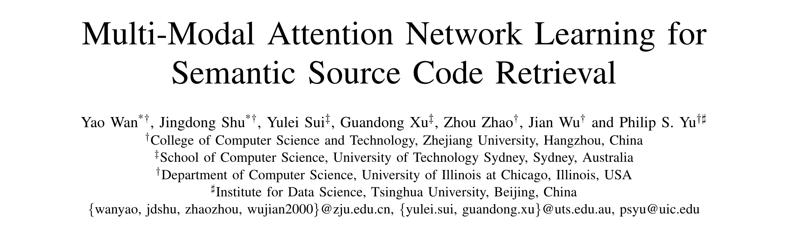
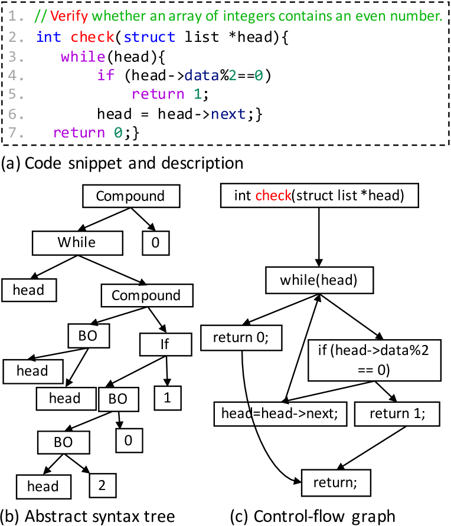
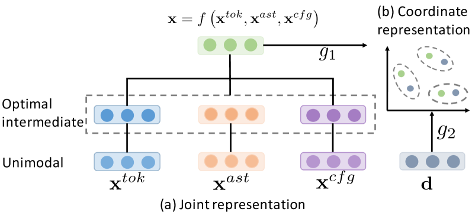
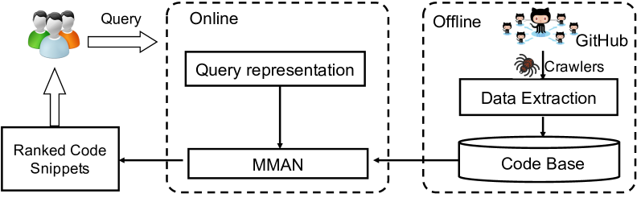
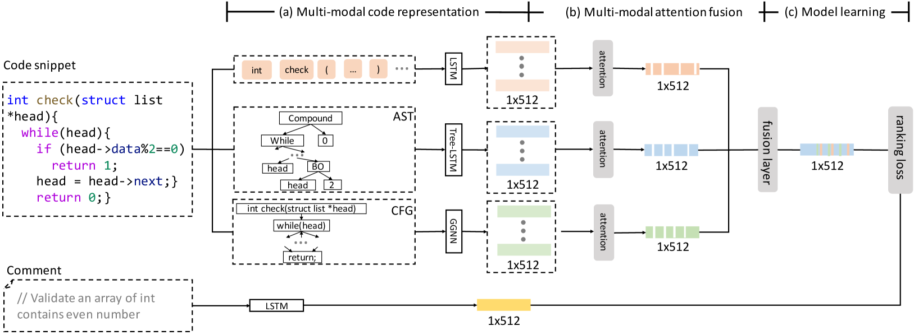
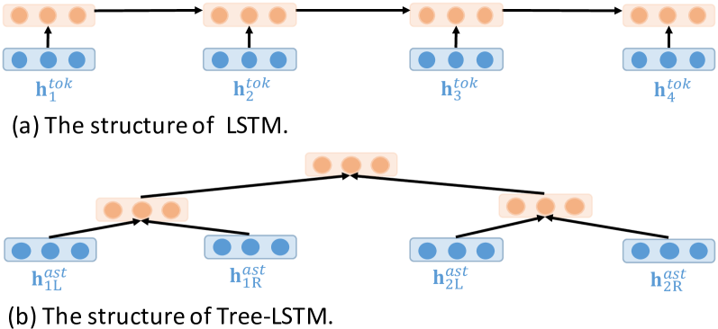
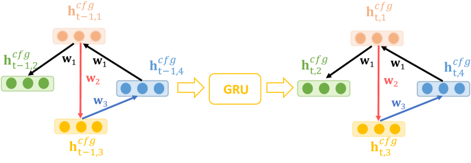
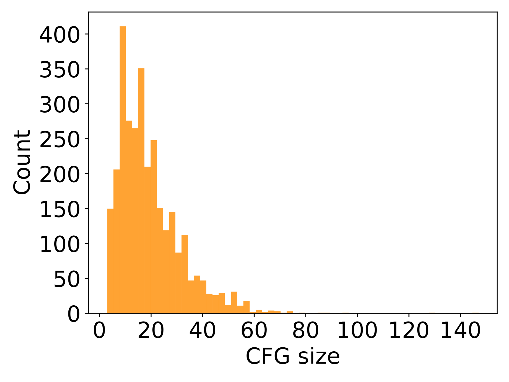

# Multi-Modal Attention Network Learning for Semantic Source Code Retrieval
---

---

### Abstract
代码检索技术和工具在促进软件开发人员根据用户查询（例如，描述检索特定代码片段的功能的简短自然语言文本）从可用开源存储库中检索现有代码片段方面发挥着关键作用。尽管现有的努力在提高代码检索的有效性，但仍然存在两个主要问题阻碍它们在回答复杂查询时从大规模存储库中准确检索令人满意的代码片段。首先，现有的方法仅考虑源代码的浅层特征，例如方法名称和代码标记，而忽略了源代码的抽象语法树（AST）和控制流图（CFG）等结构化特征，其中包含丰富且良好的信息。源代码的定义语义。其次，虽然基于深度学习的方法在源代码的表示上表现良好，但缺乏可解释性，使得检索结果难以解释，并且几乎不可能理解源代码的哪些特征对最终结果贡献更大。

为了解决上述两个问题，本文提出了 `MMAN`，一种用于语义源代码检索的新型多模态注意力网络。开发了**一种全面的多模态表示来表示源代码的非结构化和结构化特征，其中一个 LSTM 用于表示代码的顺序标记，一个 Tree-LSTM 用于表示代码的 AST，一个 GGNN（门控图神经网络）用于表示 CFG代码**。此外，应用多模态注意融合层为源代码每种模态的不同部分分配权重，然后将它们集成到单个混合表示中。对大规模现实世界数据集的综合实验和分析表明，我们提出的模型可以准确地检索代码片段，并且优于最先进的方法。

 
 
 

### 1. Introduction
随着 GitHub [1] 和 StackOverflow [2] 等巨大源代码存储库的出现，搜索具有相同功能的现有代码并尽可能多地重用这些代码正逐渐成为程序员的一项关键软件开发活动[ 3]。代码检索的目标是根据给定的用户规范（例如，描述代码片段功能的短文本）从可用的开源存储库中检索特定的代码片段。实现这种代码检索系统的关键挑战在于两个方面：（a）对源代码的深入语义理解和（b）测量跨模态（即输入自然语言和源代码）的相似性。

**Existing Efforts and Limitations.** 为了搜索自然语言查询的大量可用代码资源，已经做出了许多现有的努力，范围从关键字匹配 [4, 5] 到语义检索 [3, 6]。 Lu等人[4]使用从WordNet获得的同义词扩展查询，然后对方法签名进行关键字匹配。 Lv 等人 [5] 使用 API 扩展了查询，并考虑了文本相似性和潜在 API 对代码搜索的影响。 Reiss等人[3]开发了一种名为Sourcerer的代码检索系统，该系统通过概率主题模型学习源代码的语义表示。受深度学习在计算机视觉和自然语言处理任务中成功的启发，深度学习已被应用于更好地表示克隆检测[7]和代码摘要[8]等任务的源代码。

据我们所知，Gu 等人。 al., [6] 是第一个将深度学习网络应用于代码检索任务的人，它捕获中间语义空间中语义源代码和自然语言查询之间的相关性。然而，该方法仍然存在两个主要局限性：（a）源代码的深层结构化特征经常被忽略。该方法[6]捕获了浅层源代码信息，包括方法名称、代码标记和API序列，错过了捕获代码丰富的结构语义的机会。 (b) 缺乏可解释性。深度神经网络的最终结果通常很难解释，因为其内部工作对于输入数据和不同的应用程序始终是透明的。这也是应用深度学习模型时的常见问题。例如，在[6]中，代码及其自然语言描述被投影到中间语义空间中，并受到排名损失函数的约束。尽管学习了代码的语义表示，但很难推断哪些部分对最终结果贡献更大。

**Insights.** 上述这些限制促使我们设计一个模型，该模型可以学习源代码的更全面的表示以及可解释性的能力。一方面，对于**限制（a）**，除了代码的标记之外，我们还从代码的多个视图中提取更多的代码特征，例如抽象语法树（AST）和控制流图（CFG）$^1$ 。AST和CFG是两种类型的中间代码，其中一种代表程序的层次语法结构，另一种代表程序的计算和控制流程[9]。在本文中，**我们认为从源代码的多个视图聚合补充信息可以丰富其表示。** 在本文中，我们交替使用术语“视图”和“模态”。我们将从多种视图/模式中学习代码表示的方法称为多模式学习。为了解决**限制（b）**，因为不同的模式反映了源代码的不同特征。**因此，每种模态对最终代码表示的贡献可能不同**。对于给定的模态，它由许多元素（令牌、AST/CFG 中的节点）组成，通过表示学习将权重分配给不同的元素。因此，我们可以从最终的表示中推断出哪一部分对最终结果贡献更大，从而使可解释性成为可能。在本文中，我们设计了一种注意力机制，将多模态特征集成到单个混合代码表示中。

**A Motivating Example.** 我们**在图 1 中**给出了一个例子来更好地说明我们的想法。**图 1(a) 显示**了一个简单的 C 代码示例，旨在验证整数数组是否包含偶数。图 1(b) 和 (c) 分别表示图 1(a) 中代码的相应 AST 和过程间 CFG。从图1（a）中，我们可以看到突出显示的三个单词Verify、array、even的语义可以通过不同的代码表示来精确捕获，例如纯文本（用于检查）、类型增强的AST（用于BinaryOperator）和CFG（暂时）。**这些表示关注不同视图下代码的不同结构信息，例如 AST 上的每个节点代表一个 token，CFG 上的每个节点代表一个语句**。这表明有必要考虑各种模式以更好地表示源代码。有必要从多个视图，特别是从结构化信息来表示代码，因为根据不同的代码表示，两个视图上的标记和语句的顺序可能不同。例如，基于纯文本，图1(a)中“while”后面的标记是“()”，然后是“head”。**不同的是，在 AST 上**，“Compound”后面会有两个可能的标记，即分支测试“if”、“BinaryOperator”，**如图 1（b）所示**。同样，在第 6 行最后一个语句中的标记“}”之后，基于纯文本将不会留下任何标记。然而，基于CFG，下一个标记是基于CFG的循环函数开始处的“while”。**从图1中**我们还可以观察到代码片段之间存在对齐关系，并且是描述。例如，关键字“Verify”应与“check in code”一词紧密相连。 这意味着，在代码检索时，我们可以推断检索到的代码的哪一部分对输入查询词贡献最大。这对于模型的可解释性非常重要。

*图 1：一个激励示例，可以更好地说明我们的动机。 (a) 代码片段及其相应的描述。 (b) 代码片段的 AST。 (c) 代码片段的控制流图。*

**Our Solution and Contributions.** 为了解决上述两个问题，在本文中，我们提出了一种用于语义源代码检索的新模型，称为多模态注意网络（MMAN）。我们不仅考虑之前研究过的顺序特征（即方法名称和标记），还考虑结构特征（即从代码中提取的 AST 和 CFG）。我们探索了一种新颖的多模态神经网络来有效地同时捕获这些多模态特征。特别是，**我们使用 LSTM [10] 来表示代码片段的顺序标记，使用 Tree-LSTM [11] 网络来表示抽象语法树（AST），并使用门控图神经网络（GGNN）[12] 来表示CFG**。为了克服可解释性问题，我们设计了一种注意力机制，为源代码每种模态的不同部分分配不同的权重，并具有解释能力。总而言之，本文的主要贡献如下。

- 我们提出了一种**更全面的源代码多模态表示方法**，其中一个LSTM 用于源代码的顺序内容，一个Tree-LSTM 用于源代码的AST，一个GGNN 用于源代码的CFG。此外，应用多模态融合层来集成这三种表示。
- 据我们所知，这是我们第一次**提出一个注意力网络来为源代码的每种模态的不同部分分配不同的权重**，从而为我们的深度多模态神经网络的表示提供了可解释性。
- 为了验证我们提出的模型的有效性，我们在从 GitHub 爬取的真实数据集上验证了我们提出的模型，该数据集由 28,527 个 C 代码片段组成。综合实验和分析表明，与一些最先进的方法相比，我们提出的模型是有效的。

**Organization.** 本文的其余部分安排如下。第二部分重点介绍了与本文相关的一些工作。在第三节中，我们提供了一些有关多模式学习和注意力机制的背景知识。**在第四节中，我们首先概述我们提出的框架，然后详细介绍我们提出的框架的每个模块**。第五节描述了我们实验中使用的数据集并显示了实验结果和分析。第六节对我们提出的模型进行了讨论，包括我们模型的优势以及对有效性的一些威胁和局限性。最后，我们总结本文并在第七节给出一些未来的研究方向。

 
 
 

### 2. Related Work 
在本节中，我们从深度代码表示、多模态学习和注意力机制三个角度简要回顾相关研究。

 
 

#### 2.1 Deep Code Representation
随着深度学习的成功发展，在软件工程研究领域中表示源代码也变得越来越普遍。在[13]中，Mou 等人。使用树结构卷积神经网络 (Tree-CNN) 学习分布式向量表示，以表示程序分类的代码片段。同样，Wan 等人。 **[8]应用树结构递归神经网络（Tree-LSTM）来表示源代码的AST以完成代码摘要任务**。皮耶希等人。 [14] 和帕里索托等人。 [15]学习源代码输入/输出对的分布式表示，并使用它们来指导示例中的程序合成。在[12]中，Li等人。将堆状态表示为图，并提出了门控图神经网络来直接学习其表示，以数学方式描述堆的形状。 Maddison 和 Tarlow [16] 以及其他神经语言模型（例如 Dam 等人 [17] 中的 LSTM）描述了上下文分布式表示，同时顺序生成代码。凌等人。 [18] 和 Allamanis 等人。 [19]将代码上下文分布式表示与其他模态（例如自然语言）的分布式表示相结合来合成代码。

上述方法的一个局限性是这些方法忽略了源代码的CFG，而源代码也传达了丰富的语义信息。此外，没有提出统一的网络来有效地融合这些多种模式。为了缓解这个问题，本文提出了一种多模态网络来学习更全面的源代码表示。

 
 

#### 2.2 Multi-Modal Learning
多模态学习的一个流行方向是**联合表示**，它已应用于许多应用，例如图像字幕[20]、摘要[21]、视觉问答[22]和对话系统[23]。在[20]中，陈等人。提出一种注意力分层神经网络来同时总结文本文档及其随附图像。在[21]中，Zhang等人。提出一种多模式（即产品的图像和长描述）生成对抗网络，用于移动电子商务中的产品标题细化。在[22]中，Kim 等人。提出一个双重注意网络，通过学习视频输入的潜在变量（即帧和字幕）来捕获完整视频内容的高级抽象。类似地，在[23]中，Hori 等人。使用学习的音频特征、图像特征和视频描述回答有关图像的问题，用于视听场景感知对话。**多模态学习的另一个方向是用于信息检索的跨模态表示学习**，这与我们的任务类似。**跨模态表示学习旨在通过将每种模态的表示投影到具有约束的中间语义空间来学习每种模态的表示**。在[24]中，Carvalho 等人。提出一种跨模式检索模型，在共享表示空间中对齐视觉和文本数据（例如菜肴及其食谱的图片）以进行收据检索。在[25]Ma等人中。提出了一种用于跨模态检索的神经架构，它结合了一个用于图像表示的 CNN 和一个用于计算图像和句子之间的单词级、短语级和句子级匹配分数的 CNN。 [26, 27]，作者学习了哈希函数，将原始空间中的图像和文本映射到二进制代码的汉明空间中，使得原始空间中的对象之间的相似性保留在汉明空间中。

在本文中，我们从多模态学习中汲取见解，但不仅限于此。我们不仅设计了一个多模态神经网络来表示代码，还应用了注意力机制来学习代码的哪一部分对最终语义表示贡献更大。

 
 

#### 2.3 Attention Mechanism
注意力机制在神经机器翻译[28]、图像字幕[29]、图像分类[30]和视觉问答[31]等许多人工智能领域取得了显着的成功。注意力机制允许模型在任务的每个步骤中关注视觉或文本输入的必要部分。视觉注意力模型有选择地关注图像中的小区域以提取核心特征并减少要处理的信息量。最近，许多方法采用视觉注意力来有益于图像分类 [32, 33]、图像生成 [34]、图像字幕 [35]、视觉问答 [36, 37, 38] 等。注意机制通常旨在在编码器-解码器框架下找到语义或句法输入输出对齐，这在处理长期依赖方面特别有效。这种方法已成功应用于各种任务，包括机器翻译 [28]、文本生成 [39]、句子摘要 [8, 40] 和问答 [41]。在[31]中，Lu等人。提出一个共同注意学习框架，交替学习视觉问答的图像注意和问题注意。在[42]中，Nam 等人。提出了一个多阶段共同注意力学习框架，以基于先前注意力的记忆来细化注意力。在[43]中，保卢斯等人。在深度强化学习设置中结合内部和内部注意机制，以提高抽象文本摘要的性能。在[44]中，Zhang等人。将自注意力机制引入卷积生成对抗网络。

据我们所知，还没有研究尝试学习用于代码检索任务的多模态注意力模型。

 
 
 

### 3. Preliminaries
在本节中，我们首先使用一些基本符号和术语在数学上形式化代码检索问题。然后我们介绍多模态学习和注意力机制的一些背景知识。

 
 

#### 3.1 Problem Formulation
首先，我们介绍一些基本符号。假设我们有一组集合 $\mathcal{D}$ 含有 $N$ 代码片段，以及相应的描述，即 $\mathcal{D}=\{<x_1,d_1>,<x_2,d_1>,...,<x_N,d_N>\}.$ 每个代码片段和描述都可以看作是一系列tokens。**令 $x_i=(x_{i1},x_{i2},...,x_{i|x_i|})$ 为源代码片段序列**. **$d_i=(d_{i1},d_{d2},...,d_{i|d_i|})$ 为描述序列**，其中 $\left|\cdot\right|$ 表示序列的长度。正如我们之前声明的，我们用三种模式（即 token、AST 和 CFG）来表示源代码。我们将代码片段 $x_i$ 的语义表示为 $\mathbf{x}_{i}=<\mathbf{x}_{i}^{tok},\mathbf{x}_{i}^{ast},\mathbf{x}_{i}^{cfg}>$ , 其中 $x_{i}^{tok}$ 、${x}_{i}^{ast}$、${x}_{i}^{cfg}$ 表示 分别代表三种模式。

**由于代码片段及其描述是异构的，本文的目标是训练一个模型以同时学习它们在中间语义空间中的表示**。然后，在测试阶段，模型可以返回给定查询的每个候选代码片段的相似度向量。

 
 

#### 3.2 Multi-Modal Learning
多模态学习旨在构建可以处理和聚合来自**多种模态的信息的模型[45]**。多模态学习的一项重要任务是多模态表示学习，**它大致分为两类：联合学习和协调学习**。联合表示将单峰信号组合到同一表示空间中，**而协调表示则单独处理单峰信号，但对它们施加某些相似性约束，将它们带到我们所说的中间语义空间**。我们在问题设置中引入了这两种技术。**图2说明了**联合表示和协调表示之间的区别和联系。

*图 2：联合表示和协调表示之间的区别和联系（改编自[45]）。*

对于代码片段 $x$，我们提取其多种模式，例如  $x_{i}^{tok}$ 、${x}_{i}^{ast}$、${x}_{i}^{cfg}$。==**由于这些模态是同一代码的互补表示，因此我们可以应用联合表示**==，其公式化如下：

$$\mathbf{x}=f\left(\mathbf{x}^{tok},\mathbf{x}^{ast},\mathbf{x}^{cfg}\right),$$

其中多模态表示$x$ 是使用依赖于单模态表示$x_{i}^{tok}$ 、${x}_{i}^{ast}$、${x}_{i}^{cfg}$ 的函数 $f$（例如深度神经网络）计算的。

**在考虑代码片段 $x$ 和描述 $d$ 时，由于这两种模态来自不同的来源，因此我们希望对它们应用协调表示**[6]，其定义为如下：

$$g_1(\mathbf{x})\sim g_2(\mathbf{d}),$$

其中每个模态都有一个相应的投影函数（上面的 $g_1$ 和 $g_2$），将其投影到具有相似性约束/协调的中间语义空间中。这种协调的示例包括最小化余弦距离或最大化相关性。本文采用余弦相似度函数。

 
 

#### 3.3 Attention Mechanism
注意力网络学习对输入或内部特征进行加权的函数，以引导网络其他部分可见的信息。在某种程度上，这是由于我们的视网膜对图像的不同区域或句子中的相关单词进行视觉注意这一事实而产生的生物学动机。迄今为止，注意力机制的许多变体已经发展出来。从另一个角度来看，注意力机制可以看作是记忆单元中软寻址的过程。源由键 $k$ 和值 $v$ 组成，可以看作是内存的内容。给定一个输入查询，注意力机制的目标是返回一个注意力值。形式上，我们可以如下定义查询、键和值之间的注意力值。

$$\mathfrak{\alpha}(\mathbf{q},\mathbf{k})=\text{softmax}(\mathcal{g}(\mathbf{q},\mathbf{k})),$$

其中 $q$ 是查询， $k$ 是键， $g$ 是注意力评分函数，用于衡量查询和键之间的相似度。通常， **$g$ 有很多选项，例如多层感知器[28]、点积[46]和缩放点积[47]。我们将这种注意力称为交互注意力（inter-attention）**。然而，存在一个条件，即查询本身就是键。在这种情况下，我们将其称为内部注意力（也称为自注意力）[48, 49]，它在建模远程依赖关系的能力与计算和统计效率之间表现出更好的平衡。获得注意力分数后，最终的注意力向量可以表示为内存中每个值的加权和：

$$\mathbf{v}=\sum_i\alpha_i(\mathbf{q},\mathbf{k})\mathbf{v}_i,$$

其中 $v_i$ 是内存中的第 $i$ 个值。**在本文中，我们采用了相互注意力机制**。此外，键是 AST/CFG 中令牌或节点的隐藏状态，值是相应的上下文向量（参见第 IV-C 节）。

 
 
 

### 4. Multi-Modal Attention Network

#### 4.1 An Overview

*图 3：MMAN 的工作流程。*

在本节中，我们首先给出如何获得经过训练的代码检索模型的总体工作流程。然后我们概述了我们提出的 MMAN 模型的网络架构。

**图3展示了**如何获得经过训练的模型的整体工作流程，其中包括离线训练阶段和在线检索阶段。在训练阶段，我们准备了一个大规模的带注释的 <代码、描述 > 对的语料库。然后将带注释的对输入到我们提出的 MMAN 模型中进行训练。经过训练，我们可以得到一个经过训练的检索网络。然后，给定自然语言查询，经过训练的网络可以检索相关的源代码片段

**图 4 是**我们提出的 MMAN 模型的网络架构的概述。我们将框架分为三个子模块。 **(a) 多模式代码表示**（参见第 IV-B 节）。该模块用于将源代码表示到隐藏空间中。 **(b) 多模态注意力融合**（参见第 IV-C 节）。该注意模块旨在为每种模态的不同部分分配不同的权重，然后将注意向量融合为单个向量。 **(c) 模型学习**（参见第 IV-E 节）。该注意力模块旨在通过排名损失函数学习公共空间中的评论描述表示和代码表示。我们将在以下部分详细阐述该框架中的每个组件。

*图 4：我们提出的 MMAN 模型的网络架构。我们首先从训练语料库中提取 <代码、描述 >对。然后，我们将代码片段解析为树模式，即标记、AST、CFG。然后将训练样本作为输入送入网络。 (a) 多模式代码表示。我们首先分别通过 LSTM、Tree-LSTM 和 GGNN 学习每种模态的表示。 (b)多模态注意力融合。我们设计了一个注意力层，为每种模态的不同部分分配不同的权重，然后将关注向量融合为单个向量。 (c) 模型学习。我们将评论描述表示和代码表示映射到中间语义公共空间，并设计排名损失函数来学习它们的相似性。*

 
 

#### 4.2 Multi-Modal Code Representation
与以前仅利用顺序标记来表示代码的方法不同，我们还考虑了源代码的结构信息，在本节中，**我们提出了一种用于代码表示的混合嵌入方法。我们使用 LSTM 来表示代码的 token，使用 Tree-LSTM 来表示代码的 AST，使用 GGNN 来表示代码的 CFG**.

 

##### 4.2.1 Lexical Level - Tokens
对源代码的词法级别表示的关键见解是，注释始终是从代码的词法中提取的，例如方法名称、变量名称等。在本文中，我们应用 LSTM 网络来表示顺序标记。

$$\mathbf{h}_{i}^{tok}=\mathrm{LSTM}\big(\mathbf{h}_{i-1}^{tok},w(x_{i})\big),$$

其中 $i=1,...,|x|\text{、}w$ 是将每个单词嵌入到向量中的单词嵌入层。代码最后一个标记的最终隐藏状态 $\mathbf{h}_{|x|}^{tok}$ 是 $x$ 的标记模态表示。

 

##### 4.2.2 Syntactic Level - AST
我们从 AST 嵌入的角度来表示源代码的语法级别。与传统的 LSTM 单元类似，我们提出 Tree-LSTM，其中 LSTM 单元还包含输入门、存储单元和输出门。然而，**与标准 LSTM 单元（其前一个单元只有一个遗忘门）不同，Tree-LSTM 单元包含多个遗忘门**。特别是，考虑一个节点 $N$ 在其 $one-hot$ 编码表示中具有值 $x_i$, 并且它有两个子节点 $N_L$ 和 $N_R$, 分别是其左子节点和右子节点。 Tree-LSTM **自下而上**递归地计算 $N$ 的嵌入。假设左子节点和右子节点分别保持 LSTM 状态 $(h_L, c_L)$ 和 $(h_R, c_R)$, 然后 $N$ 的 LSTM 状态 $(h, c)$ 计算为

$$(\mathbf{h}_{i}^{ast},\mathbf{c}_{i}^{ast})=\text{LSTM}\Big(\Big(\left[\mathbf{h}_{iL}^{ast};\mathbf{h}_{iR}^{ast}\right],\Big[\mathbf{c}_{iL}^{ast};\mathbf{c}_{iR}^{ast}\Big]\Big),w(x_{i})\Big) \qquad (6)$$

其中$i=1,...,|x|$ 和 $[\cdot;\cdot]$ 表示两个向量的串联。**请注意，一个节点可能缺少一个或两个子节点。在这种情况下，编码器将丢失子项的 LSTM 状态设置为零**。在本文中，我们采用根节点的隐藏状态作为 AST 模态表示。值得一提的是，当树只是一条链，即 $N = 1$ 时， Tree-LSTM 简化为 vallina LSTM。**图5展示了**LSTM和Tree-LSTM的结构。

 

##### 4.2.3 Syntactic Level - CFG
由于CFG是有向图，因此我们应用门控图神经网络（GGNN）来表示CFG，它是为图开发的神经网络架构。我们首先将图定义为 $\mathcal{G}=\{\mathcal{V},\mathcal{E}\}$ ， 其中$\mathcal{V}$ 是一组顶点 $(v,\ell_v)$ ， $\varepsilon$ 是一组边 $(v_i,v_j,\ell_e)$ 。 $\ell_v$ 和 $\ell_e'$ 分别是顶点和边的标签。在我们的代码检索场景中，每个顶点都是CFG的节点，每条边代表代码的控制流，它有多种类型。 GGNN 通过以下过程直接学习图表示：首先，我们将每个顶点 $v\in\mathcal{V}$  的隐藏状态初始化为 $\mathbf{h}_{v,0}^{\mathrm{cfg}}=w(\ell_v)$, 其中 $w$ 是 $one$-$hot$ 嵌入函数。然后，对于每一轮 $t$ 每个顶点 $v\in\mathcal{V}$ 都会接收向量 $m_{v, t+1}$, 这是从其邻居聚合的 “消息”。向量 $m_{v, t+1}$ 可以表述如下：

$$\boldsymbol{m}_{v,t+1}=\sum_{v^{'}\in\mathcal{N}(v)}\mathbf{W}_{\ell_{e}}\mathbf{h}_{v^{'},t},$$

其中 $\mathcal{N}$ 是顶点 $v$ 的邻居。对于回合 $t$ ，来自每个邻居的消息通过 $W_{\ell_e}$ 映射到共享空间。

对于每个顶点 $v\in\mathcal{V}$ ，GGNN 使用遗忘门更新其隐藏状态。在本文中，我们采用门控循环单元（GRU）[50]来更新每个顶点的隐藏状态，其可以表述如下。

$$\mathbf{h}_{v,t+1}^{cfg}=\mathrm{GRU}(\mathbf{h}_{v,t}^{cfg},\mathbf{m}_{v,t+1}).$$

最后，通过 $T$ 轮迭代，我们通过求和聚合所有顶点的隐藏状态，以获得 CFG 的嵌入表示。**图6说明了**GGNN的结构。

*图 6：GGNN 的图示。*

 
 

#### 4.3 Multi-Modal Attention Fusion
在获得每种模态的语义表示后，我们需要将它们融合成单个表示。正如我们之前声明的，对于单模态，由于它由许多元素组成，因此最好为每个元素分配不同的权重。

***Token Attention.***  对于令牌来说，**并非所有令牌都对代码片段的最终语义表示有同等的贡献**。因此，我们引入了标记上的注意力机制来提取对代码标记序列的表示更重要的标记。标记 $\alpha^{tok}$ 的注意力分数计算如下：

$$\alpha_i^{tok}=\frac{\exp(g^{tok}(f^{tok}(\mathbf{h}_i^{tok}),\mathbf{u}^{tok}))}{\sum_j\exp(g^{tok}(f^{tok}(\mathbf{h}_j^{tok}),\mathbf{u}^{tok}))},$$

其中 $h_{i}^{tok}$ 表示代码中第 $i$ 个标记的隐藏状态。$f^{tok}$ 表示线性层，$g^{tok}$ 是点积运算符。$u^{tok}$ 是标记模态的上下文向量，可以将其视为代码的顺序标记的高级表示。单词上下文向量 $u^{tok}$ 是在训练过程中随机初始化和联合学习的。

***AST Attention.*** 对于 AST，并非所有节点都对代码片段的最终语义表示做出同样的贡献，这表明源代码中出现的不同构造（例如 if-condition-then）也应该被区别对待。与Token注意力类似，AST节点 $\alpha ^{ast}$ 的注意力得分计算如下：

$$\alpha_{i}^{ast}=\frac{\exp(g^{ast}(f^{ast}(\mathbf{h}_{i}^{ast}),\mathbf{u}^{ast}))}{\sum_{j}\exp(g^{ast}(f^{ast}(\mathbf{h}_{j}^{ast}),\mathbf{u}^{ast}))},\quad(10)$$

其中 $h_i^{ast}$ 表示 AST 中第 $i$ 个节点的隐藏状态。$f^{ast}$ 表示线性层，$g^{ast}$ 是点积运算符。 $u^{ast}$ 是 AST模态的上下文向量，可以看作代码 AST 节点的高级表示。

 
***CFG Attention.***  对于CFG，源代码中的不同语句也应该为最终表示分配不同的权重。因此，我们为每个CFG节点分配权重 $\alpha ^{cfg}$ 为：

$$\alpha_i^{cfg}=\text{sigmoid}(g^{cfg}(f^{cfg}(\mathbf{h}_i^{cfg}),\mathbf{u}^{cfg}),\quad\quad\quad\quad\quad\quad\quad(11)$$

其中 $h_i^{ast}$ 表示 CFG 中第 $i$ 个节点的隐藏状态。$f^{cfg}$ 表示线性层，$g^{cfg}$ 是点积运算符。 $u^{cfg}$ 是 CFG模态的上下文向量，可以看作代码 CFG 节点的高级表示。值得一提的是，从实验结果来看，sigmoid函数加权的CFG注意力比softmax函数获得了更好的性能.

***Multi-Modal Fusion.***  然后，我们通过相应的注意力分数将多模态表示集成为单个表示。我们首先将它们连接起来，然后将它们输入到单层线性网络中，该网络可以公式化如下。

$$\mathbf{x}=\mathbf{W}\bigg[\sum_ix_i^{tok}\mathbf{h}_i^{tok};\sum_ia_i^{ast}\mathbf{h}_i^{ast};\sum_ia_i^{cfg}\mathbf{h}_i^{cfg}\bigg],$$

其中 x 是代码片段 $x$ 的最终语义表示，$[\cdot ; \cdot]$ 是串联操作，$W$ 是每种模态的注意力权重。

 
 

#### 4.4 Description Representation
在训练阶段，描述是从代码注释中提取的，而在测试阶段，描述被视为输入查询。在本文中，我们应用 vallina LSTM 来表示描述。

$$\mathbf{h}_{i}^{des}=\mathrm{LSTM}\big(\mathbf{h}_{i-1}^{des},w(d_{i})\big)$$

其中 $i=1, ..., |d|$ 和 $w$ 是将每个单词嵌入到向量中的单词嵌入层。最后一步的隐藏状态 $h^{des}_{|d|}$ 可以用作 $d$ 的向量表示。

 
 

#### 4.5 Model Learning
现在我们介绍如何训练MMAN模型，将代码和描述嵌入到一个中间语义空间中，并进行相似性协调。这种联合表示的基本假设是，如果一个代码片段和一个描述具有相似的语义，它们的嵌入向量应该彼此接近。换句话说，给定一个任意的代码片段x和一个任意的描述d，我们希望它预测出高相似性，如果d是x的正确描述，否则是一个较小的相似性。在训练阶段，我们将每个训练实例构造为一个三元组<x, d+, d−>：对于每个代码片段x，都有一个正描述d+（x的正确描述），以及一个从所有d+中随机选择的负描述（x的不正确描述）d−。当在一组<x, d+, d−>三元组上训练时，MMAN预测< x, d+ >和< x, d− >对的余弦相似度，并最小化铰链范围损失[6, 51]。

$$\mathcal{L}(\theta)=\sum_{<x,d^{+},d^{-}>\in\mathcal{D}}\max(0,\beta-sim(\mathbf{x},\mathbf{d}^{+})+sim(\mathbf{x},\mathbf{d}^{-})),$$

其中，θ表示模型参数，D表示训练数据集，sim表示代码和描述之间的相似性分数，β是一个小的常数边距。x，d+和d−分别是x，d+和d−的嵌入向量。在我们的实验中，我们采用余弦相似性函数（见IV-F）并将固定的β值设为0.05。直观地说，排名损失鼓励代码片段与其正确描述之间的相似性上升，以及代码片段与不正确描述之间的相似性下降。

模型训练完成后，我们可以将其在线部署为服务。给定一个代码库X，对于给定的查询q，目标是通过它们与查询q的相似性对所有这些代码片段进行排名。我们首先将代码片段x输入到多模型表示模块，并将查询q作为描述输入到LSTM模块中，以获取它们对应的表示，分别表示为x和q。然后我们计算排名分数如下：

$$sim(x,q)=\cos(\mathbf{x},\mathbf{q})=\frac{\mathbf{x}^T\mathbf{q}}{\|\mathbf{x}\|\|\mathbf{q}\|},$$

其中 x 和 q 分别是代码和查询的向量。相似度越高，代码与给定查询的相关性越强。

### 5. Experiments and Analysis
为了评估我们提出的方法，在本节中，我们进行实验来回答以下问题：
- RQ1. 与一些最先进的方法相比，我们提出的方法是否提高了代码检索的性能？
- RQ2. 源代码的每种模式（例如源代码的顺序标记、AST、CFG）对最终检索性能的有效性和贡献是什么，它们的组合又如何？
- RQ3. 当改变代码长度、代码长度、代码 AST 节点数量、代码 CFG 节点数量和注释长度时，我们提出的模型的性能如何？
- RQ4. 我们提出的注意力机制的性能如何？注意力可视化的可解释性是什么？

我们要求 RQ1 与一些最先进的基线相比来评估我们基于深度学习的模型，这将在下一小节中进行描述。我们询问 RQ2 是为了评估从源代码中提取的每种模态的性能。我们要求 RQ3 分析我们提出的模型在改变代码长度、代码 AST 节点数量、代码 CFG 节点数量和注释长度时的敏感性。我们要求 RQ4 来验证我们提出的注意力机制的可解释性。在下面的小节中，我们首先描述数据集、一些评估指标和训练细节。然后，我们介绍 RQ1 的基线。最后，我们报告了四个研究问题的结果和分析。

 
 

#### 5.1 Dataset Collection
如第四节所述，我们提出的模型需要一个包含代码片段及其相应描述的大规模训练语料库。与[6]不同的是，我们在从 GitHub（一个流行的开源项目托管平台）收集的 C 代码片段语料库上评估了我们提出的模型的性能。实际上，我们考虑了[6]发布的数据集，而该数据集仅包含清理后的Java片段，没有原始数据，无法生成CFG。因此，我们求助于构建更复杂的C语言数据集，这也可能为我们的进一步研究提供更多的挑战和机遇。

为了构建代码库，我们通过其 API 2 爬取所有 C 语言存储库.然后，我们排除星星数小于 2 的存储库。我们仅从爬取的项目中选择有文档注释的方法。最后，我们获得一个由 28,527注释的 C 方法组成的 C 语料库。

**图 7 显示了**测试数据上代码和注释的长度分布。从**图6（a）中**，我们可以发现大多数代码片段的长度都在20到40之间。这在[52]“函数不应该是20行长”的引用中也观察到了。**从图 6(b) 中**，我们可以注意到几乎所有注释的长度都小于 10。这也证实了捕获短文本与其相应代码片段之间的相关性的挑战。

*图 7：我们实验中数据集的直方图。 (a) CFG节点数分布。 (b) 评论长度分布。*

收集了注释代码片段的语料库后，我们提取多模态代码特征及其相应的描述，即 <方法名称、标记、AST、CFG、描述 >，如下如下：

***Method Name Extraction.*** 对于每个 C 方法，我们提取其名称，并根据驼峰大小写将名称解析为标记序列，如果它包含 _，则通过 _ 对其进行标记化。

***Token Extraction.***  为了从 C 方法收集标记，我们通过 标记代码 {. , " ; ) ( ! (space)}。在我们标记函数体、函数名之后，我们将它们的最大长度分别限制为 100 和 50。

***AST Extraction.***  为了构建代码的树形结构，我们通过名为 Clang (http://clang.llvm.org/) 的开源工具将 C 代码解析为抽象语法树。为了简化，**我们通过[8]中采用的以下两个步骤将生成的AST转换为二叉树**：a）分割具有超过2个子节点的节点，生成一个新的右子节点，并将旧的左子节点作为其子节点，然后将除了最左边的所有子节点作为这个新节点的子节点。自上而下重复此操作，直到只剩下有0、1、2个子节点的节点； b) 将具有 1 个子节点的节点与其子节点合并。

***CFG Extraction.*** 为了构建代码的CFG，我们首先通过一个名为SVF的开源工具将C函数解析为CFG[53]（ https://github.com/SVF-tools/SVF ），该工具已广泛应用于价值流分析[54, 55]。然后我们删除具有相同语句或没有语句的节点。对于具有相同语句的节点，我们首先保留在 SVF 的输出中出现的节点并删除其子节点，并将其子节点的子节点链接到它们。对于没有声明的节点，我们删除它们并将它们的子节点链接到它们的父节点。我们将 CFG 节点的最大大小设置为 512。

***Description Extraction.*** 为了提取文档注释，我们通过正则表达式 /**/ 提取描述。我们检查每个函数之前的最后一个句子，如果它满足我们通过正则表达式定义的条件，那么我们从句子中提取描述。

我们对数据集进行重组，并将其分为两部分，即 27,527 个用于训练的样本和 1,000 个用于评估的样本。值得一提的是我们的数据处理与[6]中的数据处理之间的差异。在[6]中，所提出的方法在另一个孤立的数据集上进行了验证以避免偏差。**由于评估数据集没有真实数据，因此他们手动标记搜索结果。我们认为这种方法可能会引入人为偏见**。因此，在我们的论文中，我们采用自动评估。

 
 

#### 5.2 Evaluation Metrics
为了进行自动评估，我们采用了两个常见的度量标准来衡量代码检索的有效性，即SuccessRate@k和平均倒数排名（MRR），这两个指标在信息检索领域被广泛使用。为了衡量我们搜索结果的相关性，我们使用了排名k处的成功率。SuccessRate@k度量的是在前k个排名结果中可能存在多个正确结果的查询的百分比[6]，[43]，计算方法如下：

$$\text{SuccessRate @}k=\Bigg(\frac{1}{|Q|}\sum\limits_{q=1}^{Q}\delta\big(\text{FRank}_q\leq k\big)\Bigg),$$

其中，Q是一组查询，$\delta(\cdot)$ 是一个函数，如果输入为真则返回1，否则返回0。SuccessRate@k很重要，因为一个更好的代码搜索引擎应该允许开发者通过检查更少的返回结果来发现所需的代码。SuccessRate值越高，代码搜索性能越好。我们还使用平均倒数排名（MRR）来评估我们搜索结果的排名。MRR是一组查询Q的结果的倒数排名的平均值。一个查询的倒数排名是第一个命中结果的排名的倒数。MRR的定义如下：

$$\mathrm{MRR}=\frac{1}{|Q|}\sum_{q=1}^{|Q|}\frac{1}{\mathrm{FRank}_{q}},$$

其中 $|Q|$ 是查询集的大小。 MRR值越高，代码检索性能越好。

 
 

#### 5.3 Implementation Details
我们将词嵌入大小设置为300。对于LSTM和Tree-LSTM单元，我们将隐藏大小设置为512。对于GGNN，我们将隐藏大小设置为512。边距β设置为0.05。我们将小批量大小设置为32。我们使用学习率为0.0001的ADAM优化器更新参数。为了防止过拟合，我们使用了0.1的dropout。本文中的所有模型均经过100个epochs的训练。所有实验均使用PyTorch 1.2框架和Python 3.7进行实现，并在一台配备了Nvidia Quadro RTX 8000 GPU和48 GB内存的计算机上运行Ubuntu 18.04。为了检查我们的模型是否训练充分，我们绘制了我们提出的带/不带注意力的MMAN模型在不同模态组合下的训练损失曲线。独立查看图8a和图8b，我们注意到我们的多模态MMAN模型（即Tok+AST+CFG）收敛到更小的损失（见蓝线），这证实了我们的多模态解决方案的有效性。比较图8a和图8b中的蓝曲线，我们的带注意力的MMAN模型收敛速度更快，同时达到更低的损失，这清楚地显示了我们注意力机制的有效性。