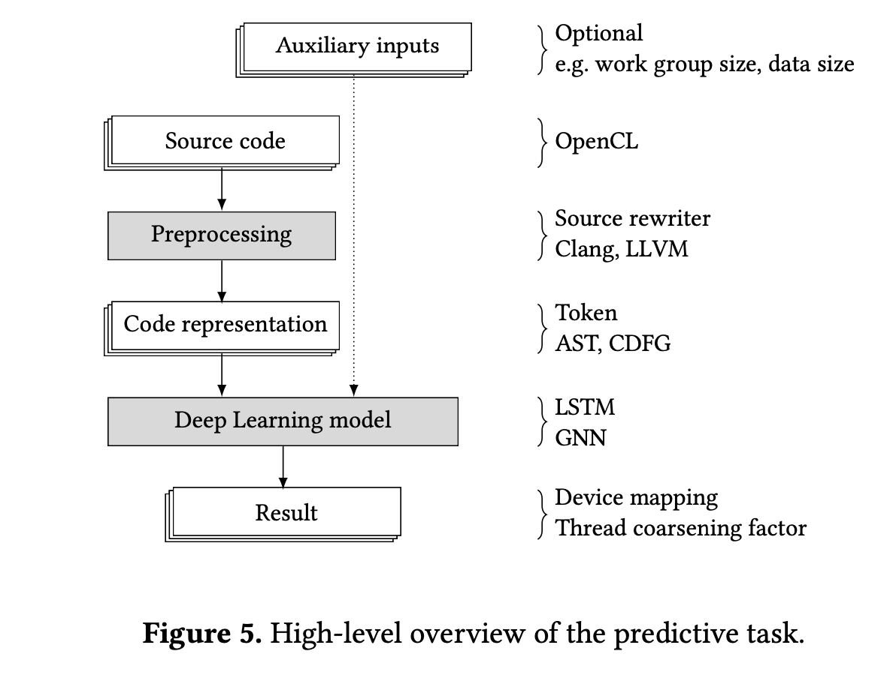

# Compiler-Based Graph Representations for Deep Learning Models of Code
---

---

###Abstract

在自然语言处理领域，深度学习中的新方法，如对单词序列使用循环神经网络（RNNs），取得了很大成功。与自然语言不同，编程语言通常具有明确定义的结构。借助这种结构，编译器可以使用抽象语法树（ASTs）或控制数据流图（CDFGs）等图形进行程序推理。在本文中，我们认为在学习编译器优化任务时，应该使用这些图形结构而不是序列。**为此，我们使用基于ASTs和CDFGs的两种表示，利用图神经网络（GNNs）来学习预测性的编译器任务**。实验证明，在异构OpenCL映射任务中，这一方法优于现有技术，同时提供了数量级更快的推理时间，这对于编译器优化至关重要。在对未用于训练的基准套件进行测试时，我们基于AST的模型在准确性方面显著优于现有技术，超过12个百分点。它是唯一一个明显优于随机映射的模型。在预测线程粗化因子的任务上，我们展示所有方法均未能产生总体加速。


<br>
<br>
<br>


### 1. Introduction
过去十年在机器学习领域取得了巨大的进展，特别是由于深度学习方法的应用。深度学习方法不依赖于数据的手动指定特征，而是能够自行学习数据中哪些特征是重要的。深度学习方法已经彻底改变了诸如图像识别或自然语言处理等领域。虽然在编译器优化和与编程语言相关的任务方面已经取得了一些进展，但深度学习在这些领域中的作用仍然相对较小。

在编译器优化中，大多数深度学习方法[21]都借鉴了自然语言处理中成功的深度学习方法的思想。这是非常合理的，因为自然语言和编程语言之间的相似性多年来一直推动着这两个领域的交叉交流。突出的例子包括在标记序列上使用长短时记忆（LSTM）架构[5]，或者像 $word2vec$ 方法[16]一样，通过类比学习指令的向量嵌入，该方法也基于序列模型和LSTM。有关深入的调查可以在[1]中找到。然而，用于编译器优化所需的分析性质表明，这些方法的顺序性可能会忽视非常具体的结构属性。例如，多面体模型研究了数组索引格子的几何结构，以找到嵌套循环的最佳重新排序。该模型在优化这类嵌套循环方面已经被证明非常成功[20]。更普遍地说，**编译器大多数分析都基于抽象语法树（ASTs）和控制数据流图（CDFGs）等非顺序数据结构。** 我们认为这些结构与组成自然语言的单词序列非常不同。数据依赖关系可能对代码字符串中相隔甚远的代码部分至关重要，而源代码中的一个小部分细节，**例如循环中精确的数组索引，可能对某些优化产生巨大影响。** 因此，专注于深度学习在编译器中与自然语言处理的相似性可能不明智。


在本文中，我们提出重新评估用于编译器深度学习的代码表示。我们相信在编译器领域几十年的研究已经确定了暴露优化重要方面的数据结构（**参见图1**），这些结构比类似于自然语言中的单词序列的标记序列更好。因此，我们提议使用基于图的神经网络，以明确捕捉代码的这些图表示。图神经网络已经在推理任务中表现出显著优势，即使这些任务以自然语言的方式表达[9]。我们认为这些推理任务，如从一系列逻辑语句中推断，结构上类似于编译器优化所需的分析。**我们研究了两种具体的基于图的架构（第4节），使用 `ASTs` 或 `CDFGs` 作为输入（第3节）**。我们在两个复杂的任务上（第5节）与传统方法进行比较，决定OpenCL内核应该在CPU还是GPU上执行，以及预测最佳的线程粗化因子。在推理时间数量级更小的情况下，我们的方法在这个任务中明显优于两个不同的最先进模型（[5, 16]），其中CDFG模型在整体上获得了最佳准确性。此外，我们考虑了一个替代性的实验设置，以测试学到的启发式方法的普遍性。我们确保这些集合包含来自不同基准套件的内核，而不是随机选择可用池中的训练和测试内核。通过这个设置，我们展示了我们基于AST的模型是唯一一个在横跨基准套件时明显优于硬币抛掷的等效模型的模型。

最后，我们还测试了第二个任务，即预测线程粗化因子。由于数据较少且只有有限的加速机会，这个任务展示了深度学习在编译器中的当前局限性。我们的基于图的模型没有超越最先进技术。然而，考虑到所有模型都无法通过预测实现整体加速（>1），这个任务突显了深度学习在编译器中的现有限制。


<br>
<br>
<br>


### 2. Related Work
最近出现了一种名为图神经网络（GNNs）的深度学习模型类别，它能够从图结构化数据中提取特定任务的特征。在许多任务中，其中信息可以表示为图的情况下，基于GNN的模型已被证明优于在图的序列化表示上操作的基于序列的模型[10, 13]。**通过将各种已建立的序列和欧几里德数据的架构应用于GNN模型，提出了基于循环和卷积的GNN变体**，并显示支持集成到复杂架构中以实现区分性和生成性任务，其中它们是端到端优化过程的一部分[22]。

最近的一种方法将图神经网络和代码表示学习结合，用于软件工程领域的节点级别预测任务。在基于AST图表示的变量名称和误用预测任务中，他们表现出优于循环神经网络的性能[2]。

在编译器优化的研究领域，概率模型已成功用于解决源代码的各种任务[21]。虽然优化本身是通过形式化的算法方法进行的，但概率模型用于选择和调整它们以实现更好的性能[6]。在邻近的研究领域中，概率模型解决了需要源代码的统计特性的任务，例如自动完成[19]和变量命名[18]。同样，它们已被用于为由于其巨大复杂性而难以通过形式方法解决的问题提供近似解，例如软件缺陷预测[14]和调整编译器启发式方法[3, 5, 15, 17]，尽管并非没有注意到一些缺点[7]。

早期用于预测编译器优化的模型依赖于由专家手动设计的特征[6, 15, 17]，这些特征还可以从一组候选项中自动选择[11]。这些特征通常是编译器中间表示（IRs）中的指令数量。**为了提取捕捉复杂依赖关系的特征，提出了一些基于深度学习的模型[12]** ：Cummins等人[5]训练了一个LSTM循环神经网络模型，根据以C编程语言标记的原始序列表示的程序，预测编译器内部优化启发式方法。Ben-nun等人[3]采用了分布假设的概念，这通常被称为$word2vec$[16]，以**在基于LLVM IR的图形表示上生成`embeddings`，即映射到实数向量。这导致在已训练`embeddings`的大量开源软件项目中共享类似上下文的代码的`embeddings`非常接近。** 随后，这些`embeddings`用作更复杂的下游任务的输入，输入到LSTM循环神经网络模型中。然而，编译器IR的语义信息仅在第一阶段用于生成`embeddings`，并不是下游任务优化的一部分。因此，这些嵌入并未针对具体任务进行优化。**图1展示**了这些模型在概念上与我们的工作相比较。

据我们所知，在端到端环境中使用编译器内部分析的语义信息的机器学习模型尚未得到研究。


<br>
<br>
<br>


### 3. Compiler-Based Representations
编译器通常在不同阶段使用代码的多个表示形式，以便进行不同的分析和优化。在本节中，我们将讨论不同阶段最常见的三种表示形式以及我们期望它们的特性如何影响机器学习任务。

以以下OpenCL内核作为本节的运行示例：
```cpp{.line-numbers}
__kernel void Add(__global const int* x, 
                  __global const int* y,
                  __global int* z, const int d) { 
    const int id = get_global_id(0);
    if (id < d)
        z[id] = x[id] + y[id];
}
```

该内核的代码包含非常明显的信息，例如内核的输入变量的数字和类型，但也包含非常微妙的信息，**例如代码的缩进风格，尽管在语义上与编译器无关，但可以反映编写程序的人。在本文中，我们采用编译器的视角，因此不会考虑不改变程序语义的信息，比如缩进风格，或者更重要的是代码中的标识符。** 因此，我们将考虑对标识符进行规范化的代码，使用了[5]中描述的方法。该方法**标准化了所有标识符并移除了空格**。上述内核变为：

```cpp{.line-numbers}
__kernel void A(__global const int* a, __global const int* b, __global int* c, const int d) {const int e = get_global_id (0); if (e < d) c[e] = a[e] + b[e];}
```

在编译这个内核时，一个典型的编译器会将这个输入字符的字符串转换成多个不同的表示形式，分别是作为一系列标记，一个抽象语法树和一个控制和数据流图。我们将考虑这三种表示形式，并强调对于代码的机器学习而言，表示形式是允许ML模型收集相关信息的关键。如果某个信息在表示中未包含，模型就无法学到它。另一方面，如果某种特定类型的信息在表示中非常显著，ML模型更有可能基于这些信息学到模式。


<br>
<br>
<br>


#### 3.1 Sequence of Token
从概念上说，编译器首先将一个字符字符串转换成一系列标记。**图2展示**了示例内核作为一系列标记。图中使用方框表示标记，箭头指向序列中的下一个标记。这说明了标记字符串的顺序性，特别是它与字符字符串的结构相似性。在机器学习方面，这种顺序性既可能是一个优势，也可能是一个缺点。以顺序方式组织的数据在机器学习中已经得到了广泛研究，存在着在顺序数据上取得良好结果的强大方法。标记序列的排序也忠实地表示了程序员编写代码的顺序。这个排序包含了有关程序员思维过程的信息，这对于分析和描述代码可能是有价值的。然而，这种排序可能过于限制了表示，对代码片段强加了人为的顺序，而这些代码片段本来可以按照不同的顺序执行。


<br>
<br>
<br>


#### 3.2 Abstract Syntax-Tree
**在解析之后，抽象语法树（AST）本身失去了一些信息**。特别是，如果AST不包括标识符字符串，那么就无法确定两个标识符何时引用相同的数据。为了解决这个问题，我们不是嵌入标识符，而是用带标签的数据流边增强了AST，这些边连接了AST中引用相同数据的两个节点。


**图3显示**了我们的示例内核作为一个AST。我们可以看到内核的前两个参数（原始代码中的x和y）在AST中是无法区分的。因为加法是可交换的，交换这两个 参数会得到相同的结果。在标记序列中，因为标记必须有顺序，通过将x置于y之前，这种对称性被打破。**然而，AST消除了这种合成依赖关系：交换参数是AST和我们增强的带数据流的版本的同构**。这是AST如何抽象掉不是语法相关的结构的例子，而这些结构通常是由字符串的顺序性强加的。正如之前讨论过的，对于机器学习而言，这种差异既可能是优势也可能是劣势，例如，因为顺序可能间接地编码程序员的一些思考过程。AST的结构反映了语言的语法，有理由认为这更直接地暴露了代码的语义，尽管这并不明显。基于AST，我们定义以下表示形式：

**定义1（AST+DF）**。*一个带有数据流增强的AST图是一个带有标签的有向图，其中节点被标记为$Declarations$（声明）、$Statements$（语句）和 $Types$（类型），就像Clang AST中一样。边被标记为AST类型，表示AST内的子关系，和数据流类型，表示变量的使用-定义关系*。

要创建带有数据流增强的AST图，我们首先使用Clang库中的一个工具提取原始的Clang AST。作为第二步，我们通过消除那些不提供额外结构关键信息的普通节点来减小图。通常，小图直径是一个令人满意的属性，因为信息在图模型的传播方案中具有有限的影响范围，该模型在第4节中介绍。**具体来说，我们通过将它们与它们的AST边的后继节点合并来消除类型为DeclRefExpr和ImplicitCastExpr的节点**。


<br>
<br>
<br>


#### 3.3 Control- and Dataflow Graph
最后，**控制和数据流图（CDFG）**。这个图组织了代码中的语句，不是根据它们的语法，而是**根据程序中可能的控制流的语义**。CDFG的基本结构是一个图。这个图通常会包含循环，例如，如果代码包含循环。与AST+DF类似，我们定义以下表示形式：

**定义2（CDFG+CALL+MEM）**。*一个以LLVM为基础的、带有调用和内存节点的控制和数据流图是一个带有标签的有向图，其中节点用LLVM IR指令标记。类型为控制和数据流的边定义了CDFG的基础。==数据流边表示LLVM IR中的运算符关系==。基于对函数返回值的依赖性添加了CALL边。MEM边表示对特定内存位置的存储-加载依赖关系*。

我们通过使用一个自定义的LLVM pass来创建CDFG，该pass提取所有LLVM IR指令、操作数和内存访问。在运行我们的pass之前，我们使用优化级别0禁用了所有优化pass。


**图4显示**了示例内核的CDFG表示。请注意，图中的语句不是C语言，而是LLVM IR。**正如图中所示，这个表示包括许多新的低级操作，比如内存管理。它具有不同的结构，更接近计算的执行方式，而不是计算的内容**。因此，这是最接近程序执行语义的表示，距离程序员表达计算的方式最远。同样，对于机器学习而言，这带来了一个权衡：**虽然更直接地暴露语义可能有助于学习这些语义，但可能会阻碍学习编码在代码的人为组成部分中编码的微妙之处**。


<br>
<br>
<br>


### 4. Machine Learning Architectures
为了利用**第3节中**概述的基于编译器的表示，我们需要适用于它们结构的深度学习模型。**在本节中，我们介绍了一种具体的架构，以利用CDFG和AST表示**。由于本文侧重于预测模型，我们首先解释了编译器任务中ML驱动的预测模型的一些核心原则。之后，我们深入探讨了在预测模型的上下文中利用图模型所需的ML架构的具体细节。


<br>
<br>


#### 4.1 Predictive Models
预测模型围绕着一个简单的原则：基于一些输入数据X，预测一些输出数据Y。**在编译器优化的背景下，输入数据X是程序代码，可能还包括有关任务的其他信息**。例如，决定内核应该在CPU还是GPU上执行的任务取决于问题的大小，这不是内核代码的一部分，应该作为额外的输入考虑。

在[5]中提出了一个基于代码的端到端优化流程，我们基于这个流程提出了我们的方案，通过用基于图的深度学习模型替换表示特定的部分。**图5描述**了这些预测模型中的一般流程。正如图中所示，输入源代码通过使用成熟的编译器技术转换为适用于机器学习的适当表示。这包括在第3节中讨论的代码规范化、生成标记字符串、产生（增强的）AST的语法分析，或者创建CDFG的通行证等。流程的输出取决于具体的预测任务。它可以是一个简单的二进制决策，如CPU或GPU，或者是输入程序的转换版本。在本文中，我们将输出限制为n个可能结果的选择，例如硬件映射（{CPU，GPU}）或线程粗化因子（{2，4，...，32}）。

对于顺序模型中的深度学习组件，就像在[5]中使用的基于标记的模型，可以使用诸如LSTM [8]之类的众所周知的递归神经网络架构作为表示模型。然而，对于基于图的模型，我们需要替换流程中使用的ML架构。在接下来的部分中，我们描述了基于图神经网络的深度学习组件的架构。我们使用这个架构在AST和CDFG结构上执行预测任务。


<br>
<br>


#### 4.2 Graph Neural Networks
**图6说明**了我们用于图的预测模型的深度学习部分及其相应的组件及其关系。如上所述，我们基于[5]中描述的模型提出了我们的架构，并通过[13]中提出的GNN进行了扩展。我们的架构包括一个用于创建初始嵌入的嵌入层，一个用于用结构信息丰富初始嵌入的传播层，以及一个聚合传播嵌入并执行预测的预测层。

模型的输入结构是一个带标签的图G = (V，E)。模型的输出是一个表示概率分布的大小为n的向量，其中n是类别的数量。对于所有v ∈ V，都分配了一个节点嵌入向量hv ∈ Rd，其中d ∈ N是其维度。

我们通过考虑**整个数据集的图来将代码的图表示转换为模型的输入结构，生成带标签的类型**。对于基于AST的表示，节点类型是(Clang AST节点类型，属性)的元组，而考虑的属性是
- Clang AST节点类型为Function、FunctionArg和DeclStmt的数据类型，
- Clang AST节点类型为BinaryOperator的运算符，
- 以及Clang AST节点类型为CallExpr的函数名。

对于CDFG图，节点类型可以直接映射到LLVM IR节点类型。此外，我们将函数名视为节点类型。

AST图的每个不同的元组，或者对于CDFG图分别的每个节点类型，在图模型的范围内都会产生不同的节点类型 $v_t\in\mathbb{N}$。对于每个边，我们还添加一个具有相反方向的边，以改善模型的传播能力。

***Initial Embedding Layer***  输入图中的节点表示为独热编码向量，即$vectors (e_j)_i=\delta_{i,j}$，其中$\delta_{i,j}$是Kronecker Delta，如果$i=j$则为1，否则为0。由于在实践中可能存在大量可能的节点类型，我们引入这个嵌入层以减小这些独热编码节点向量的维度，减小到上述较小的大小 $d\in\mathbb{N}$。节点嵌入向量 $h_v$ 是通过将一个可学习的函数 $f_{init}(v_t)$ 应用于节点注释向量 $v_t$ 来计算的。可学习的函数实现为多层感知器（MLP）神经网络。

$$h_{\upsilon}=f_{\mathrm{init}}(v_{t})$$

***Embedding Propagation Layer*** 基于节点类型的初始编码只包含图的结构信息，即通过边表达的信息。通过应用迭代的信息传播方案，由嵌入层生成的初始节点嵌入向量将被结构图信息丰富。对于固定的迭代步骤T，节点将其嵌入传播到其直接相邻的邻居，并最终得到包含有关T大小邻域的信息的嵌入。这**在图7中**进行了说明，其中彩色单元格表示在嵌入向量中编码的节点的信息。

在每次迭代中，通过使用一个可学习的函数 $f_{msg}(h_v, e_t)$ 形成每个节点和每条边的消息，**其中包括嵌入信息 $h_v$ 和边类型信息 $e_t$**。它包含每个边类型 $e_t$ 的可学习参数 A 和 b。当一个迭代的所有消息都传递到它们的目标节点时，它们按目标节点进行聚合，并通过应用一个可学习的函数 $f_{prop}(a_v, h_v)$ 形成新的中间节点嵌入向量$h_v'$。这个函数被实现为门控循环单元（GRU），这是一种与LSTM性能相似但可学习参数较少的递归神经网络变体[4]。在方案的T次迭代后，节点嵌入向量达到最终状态。如图所示，然后它们被聚合到单一的图嵌入 $h_G$ 中，这在预测层中进行。


$$f_{\mathrm{msg}}(h_\upsilon,e_t)=A_{e_t}\cdot h_\upsilon+b_{e_t},$$

$$a_\upsilon=\sum_{u:(u,v)\in E}f_{\mathrm{msg}}(h_\upsilon,e_t),\quad h_\upsilon^{\prime}=f_{\mathrm{prop}}(a_\upsilon,h_\upsilon)\mathrm{~}\forall\upsilon\in V$$


***Prediction Layer*** 该层将最终的节点嵌入向量映射到概率分布。为了实现这一点，通过聚合最终的节点嵌入向量，然后将图嵌入向量映射到输出来计算一个固定大小的图嵌入向量。

聚合是通过对所有最终的节点嵌入向量求和实现的，之后通过可学习的函数 $f_m(h_v)$ 和 $d_m(h_v)$ 将它们映射到更高的尺寸。一个注意机制通过 $f_m(h_v)⊙d_m(h_v)$ 的元素积来决定当前任务中各个节点的相关性。这些函数被实现为带有双曲正切和 $sigmoid$ 激活的MLP。 $sigmoid$ 激活函数是注意机制的自然选择，因为它输出(0, 1)范围，与$f_m(h_v)$的输出向量进行元素级乘法。另一方面，双曲正切函数在模型内将值标准化到(-1, 1)范围，提供更好的性能。

最终的可学习函数$f_{out}(h_G)$基于图嵌入向量 $h_G$ 计算输出，该向量可以选择与辅助输入aux连接。它被实现为具有softmax激活函数的MLP。

$$h_\upsilon^G=f_m(h_\upsilon),\quad g_\upsilon^G=g_m(h_\upsilon),$$

$$h_G=\sum_{\upsilon\in V}g_v^G\odot h_v^G,\quad\mathrm{out}=f_{\mathrm{out}}(h_G,\mathrm{aux})$$


<br>
<br>
<br>


### 5.Evaluation
在本节中，我们使用代码的不同表示方法对我们的方法进行评估。我们通过在OpenCL内核上执行两个不同的复杂任务来完成这一点。这些任务需要对整个内核的理解，包括其不同部分之间的交互以及它们与不同目标平台的内存层次结构和SIMD能力的微妙相互作用。因此，这些任务作为表示能够捕捉这些复杂性的有效性的初步评估，我们期望只有能够捕捉这些复杂性的表示才能在这些任务上表现良好。

对于这两个任务，我们重现了[5]和[3]的结果，并将我们的方法整合到实验设置中。在这个设置中，数据集被分成k个部分，用于创建不同的训练和测试集，采用k折交叉验证方案。在这个方案中，模型使用k-1个数据集部分进行训练，然后在训练时剩下的一个部分上进行测试。这对所有k-1, 1个分区都进行了重复。

在这些实验中，我们观察到所有模型的结果存在差异，因为它们的权重初始化是随机的，并且模型会收敛到不同的最小值。因此，我们重复每个实验的执行10次并报告聚合结果。


<br>
<br>


#### 5.1 CPU/GPU Mapping
CPU/GPU映射问题考虑了OpenCL内核，并旨在将它们分类为CPU或GPU，具体取决于它们在哪个平台上运行得更快。这个问题已经得到了广泛研究，提出了几种解决方法。例如，**Grewe等人[17]提出了一种基于决策树的启发式方法来解决这个问题**。另一方面，Cummins等人[5]采用了基于LSTM和令牌表示的机器学习方法来改进这个问题。更近期，**Ben-Nun等人[3]使用了一种基于为LLVM指令找到良好嵌入的模型来进一步改进这个问题。我们将我们基于编译器图的模型与这些方法进行比较。**

为了评估模型，我们希望评估它们的泛化性能。在我们使用的任务中，我们使用准确性作为指标，它是正确预测的设备映射与所有预测设备映射的比例。作为评估方法带来的性能优势的额外指标，我们使用速度提升。对样本的正确预测映射会导致更快的执行，从而在静态映射上获得速度提升。在静态映射中，选择一个平台（CPU/GPU），并将所有内核映射到该平台。为了选择在大多数训练样本中为所有测试基准提供最快速度的平台。

此外，我们比较模型的可训练参数数量，描述它们的大小，以及它们的训练和推理时间。对于与编译器相关的任务，推理时间尤其重要，因为它直接影响终端用户的编译时间。

***Experimental Setup*** 数据集包括七个基准套件，即AMD SDK、NPB、NVIDIA SDK、Parboil、Polybench、Rodinia和SHOC，以及在两个不同异构系统上的CPU和GPU的执行时间，一个系统配备有AMD Tahi 7970 GPU，另一个系统配备有NVIDIA GTX 970 GPU。

**为整个数据集构建代码表示图导致GNN模型使用AST+DF（在这里称为GNN-AST）具有92种节点类型，而使用CDFG+CALL+MEM（在这里称为GNN-CDFG）的GNN模型具有140种节点类型**。为了计算初始节点嵌入，我们将使用包含2个大小为64的隐藏层的MLP finit的独热编码向量映射到大小为32的向量。对于传播大小T，我们选择4个迭代，这产生包括个体节点的4邻域的嵌入。大小为64的图嵌入向量hG通过使用两个大小为64的隐藏层的MLP fm和дm聚合节点嵌入来创建。图嵌入被映射到大小为32的维度的MLP，然后作为输入提供给在[5]和[3]中使用的预测模型，该模型是一个大小为32的隐藏层的MLP。

我们将我们的两种方法与最先进的方法DeepTune [5]和inst2vec [3]进行比较。我们还将其与Grewe等人的基于决策树的模型[17]进行比较。此外，我们将其与静态映射模型以及随机选择CPU或GPU的模型进行比较。

**表格1**比较了网络大小，即可训练参数的数量，以及训练和推理时间。我们可以看到，Grewe等人的模型在训练和推理方面要快得多，并且具有最少的可训练参数。深度学习模型的大小大几个数量级。值得注意的是，基于AST的模型在推理速度方面比其他基于深度学习的模型快一个数量级。


**图8显示**了不同基准测试上的总体准确性结果。我们看到我们的基于图的模型表现比inst2vec更好，尽管有限。虽然DeepTune的准确性略高于GNN-AST，但GNN-CDFG在整体上产生了最高的准确性。类似地，**图9显示**了速度提升（所有执行的几何平均值）4。我们看到速度提升结果的趋势与准确性结果相当，这是可以预期的，因为这两个指标的定义是相互关联的。
虽然[3, 5]使用的设置对于与最新技术进行比较很有用，但该设置使用来自相同基准测试的内核来训练模型，然后使用该启发式评估内核。我们认为，使用这些基准套件作为k-分组分割方法中的组，可以更好地了解模型的泛化能力。通过这种方式，它们被测试在它们没有接受过培训的基准套件的内核上。为此，我们将数据集分成7个部分，每个7个部分都是不同的基准套件，而不是从所有基准套件的内核集中随机选择的10个部分。这样，模型在基本上不同于其训练过的基准测试的数据上进行测试。


**图10显示**了这种替代设置的实验结果。由于我们按基准测试将训练集和测试集分开，我们可以看到模型在每个基准测试上的表现，这些模型在其他六个基准测试上进行了训练。值得注意的是，不同的方法在不同的基准测试上可能会有截然不同的结果。每个平台的最终条目显示了对所有基准测试的聚合结果（算术平均值）。


我们可以看到，**GNN-AST不仅是整体结果最好的模型，而且一致性最好**。它的整体准确性为60.6％，比DeepTune的47.9％高出超过12个百分点，甚至比inst2vec获得的44.9％的整体准确性更好。在这种情况下，GNN-CDFG的性能相似，准确性为48.5％，比DeepTune高出不到一个百分点。事实上，我们看到，当在与它们进行训练的不同基准测试套件上进行测试时，我们在这里进行比较的所有最新方法的性能都不如抛硬币（50.9％的准确性）。这表明当代码变得足够不同时，模型可能无法学习代码语义与最佳计算设备之间的关系，从而无法进行泛化。


<br>
<br>


#### 5.2 Thread Coarsening
在并行架构中，通过在某些情况下合并多个并行线程可以实现更快的执行。线程粗化因子是OpenCL中控制这种行为的参数。各种预测模型已被提出来解决这个任务，例如Magni等人的模型[15]，它使用基于LLVM IR上的静态代码特征的MLP神经网络，如特定指令的数量。更近期，Cummins等人[5]和Ben-Nun等人[3]提出使用基于源代码和LLVM IR级别的令牌序列的LSTM的深度学习模型。该问题的数据集包含来自AMD SDK、NVIDIA SDK和Parboil基准测试套件的17个选定的内核。对于每个内核，流产生6个类别的输出，对应于粗化因子1、2、4、8、16、32。我们复制了这些模型和相应的结果，并将其用作比较我们方法的基线。

对于这个数据集，GNN-AST有46个不同的节点类型，而GNN-CDFG有54个节点类型。在这个任务中，由于训练数据的数量相当有限，我们将模型的维度保持在最小值。我们对表示为节点类型的节点进行了一热编码，并使用MLP finit将结果向量映射到4的大小。这个MLP只包含输入和输出层，没有隐藏层。经过4个传播时间步长T后，我们使用没有隐藏层的两个MLP fm和fд将节点嵌入向量聚合到大小为8的图嵌入向量hG。我们使用了[5]和[3]中使用的预测模型，它包含一个隐藏层，但维度减小到4，而不是32。我们在报告的配置中训练了所有基线模型。

同样，我们比较了不同模型的模型大小以及训练和推断时间。结果**如表2所示**。同样，我们在这里看到了基于GNN的模型推断速度比基于LSTM的顺序模型快几个数量级。


**图11展示**了线程粗化实验的结果。在图中，我们添加了一个'Oracle'用于参考，它描绘了最佳可能的加速比。正如我们在图中所见，基于序列的模型在三个平台中的性能优于基于图的模型。然而，值得注意的是，在大多数情况下，预测的线程粗化因子导致了总体放缓。总体而言，DeepTune在所有平台上产生了约0.97的总体加速（几何平均），GNN-AST稍微好一些，为0.98，而GNN-CDFG稍差一些，为0.93。Magni等人的模型产生了总体加速0.87。在这个任务中取得的最佳结果是inst2vec，它的总体加速为1.00，即与不做任何操作一样好。总的来说，所有的深度学习方法在这个任务中的表现都相对较差。这可能部分地可以解释为最大可能的加速比相对较低，总体上为1.28。然而，这也可能表明目前的代码深度学习模型还无法胜任这项任务。


<br>
<br>


#### 5.3 Comparison of Graph-Based Models
在这篇论文中，我们使用了用于深度学习的基于图的表示，其中包含了一些增强功能，比如丰富AST的数据流边缘。同样，对于CDFG，我们包括了连接函数调用相应指令以及加载和存储指令中的数据的边缘。在这一部分中，我们希望使用上述三种实验设置来比较我们的模型在有这些增强功能和没有这些增强功能的情况下的表现。为此，我们使用了两个AST-based表示的版本，一个包含数据流边缘（AST+DF），一个不包含数据流边缘（AST）。类似地，对于CDFG表示，我们考虑了四种不同的版本：仅有控制流边缘（CFG），有控制和数据流边缘（CDFG），带有调用边缘的CDFG+CALL，以及带有调用和内存边缘的CDFG+CALL+MEM。
我们使用类似于先前实验的配置来训练模型。**图12显示**了我们的基于图的表示的不同版本的结果。在设备映射的随机设置中，所有CDFG-based表示的变体表现都相似，总体上产生了最好的结果。在分组设置中，我们看到AST-based表示产生了更好的结果。所有的实验，尤其是分组分割映射，都显示了在AST中添加数据流边缘是有益的。最后，正如上面讨论的那样，线程粗化任务的结果在所有深度学习模型中都相当适度。
从这些实验中，我们不能得出结论说有一个单一的最佳的用于深度学习模型的编译器-based的代码表示。在映射任务的随机拆分中，其中训练数据更像测试数据，更接近执行语义的模型（CDFG）具有最佳性能。另一方面，在需要更高程度泛化的分组分割中，更接近程序员的抽象语义的AST表现得更好。对于线程粗化任务，可用数据点非常有限，inst2vec的非端到端方法效果最好，尽管效果也不是特别好，总体上没有获得加速。


<br>
<br>
<br>


### 6. Conclusion
在这篇论文中，我们比较了基于编译器使用的表示的深度学习代码表示：令牌序列、抽象语法树和控制与数据流图。我们展示了不同的基于图的方法更适合于复杂的分类任务，即识别OpenCL内核的最佳CPU/GPU映射。特别是，我们在基于令牌序列的顺序模型上胜过了最先进的方法。我们还通过将训练和测试数据拆分为来自不同基准套件的集合而不是所有内核的随机子集，展示了更广泛的泛化能力。在这种替代设置中，我们的基于图的模型GNN+AST的性能明显优于它们的顺序对应物，后者未能超过抛硬币的随机猜测。
从我们的实验中，我们**不能得出结论说**有一个单一的最佳的基于编译器的代码表示适用于深度学习模型。在映射任务的随机拆分中，其中训练数据更像测试数据，更接近执行语义的模型（CDFG）具有最佳性能。另一方面，在需要更高程度泛化的分组拆分中，更接近程序员的抽象语义的AST表现得更好。对于线程粗化任务，可用数据点非常有限，inst2vec的非端到端方法效果最好，尽管效果也不是特别好，总体上没有获得加速。
CPU/GPU分类任务是一个复杂的任务，其中代码的不同部分和目标架构之间的交互都起到作用。因此，这个任务作为编译器分析方法的一个很好的首要挑战。然而，寻找OpenCL内核的最佳线程粗化因子的相关预测任务对于顺序模型和基于图的模型来说都太具有挑战性。这个任务的结果表明，尽管有用，深度学习方法在复杂的与编译器相关的任务上仍然面临困难。请注意，这个任务的数据集很小，这给深度学习模型带来了额外的挑战。
我们相信我们的结果鼓励对基于编译器的代码表示进行进一步研究。由于编程语言和机器语义本身严格而结构化，这也应该是学习的一个优势，我们可以利用几十年的编译器方法研究来改进该领域的机器学习方法。此外，OpenCL内核相对较小。在未来的工作中，我们计划在更大的代码片段上研究这些方法，在那里我们认为图结构应该更适合跟踪代码部分之间的长程依赖关系。