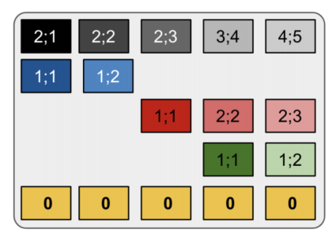
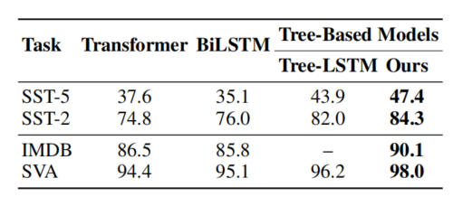

# TREE-STRUCTURED ATTENTION WITH HIERARCHICAL ACCUMULATION
---

---

###Abstract

在 NLP 任务中，成分树(constituency) 等分层结构已经证明了很有效。但是呢，**`transformer`这种基于序列的模型处理树结构就显得力不从心了**
其中，`Tree-LSTM` 可以实现层次结构建模，但是性能不如 `transformer`。

**本文采用 `Hierarchical Accumulation` 来解决这个问题, 目的是，在恒定时间复杂度内将 解析树结构 encode 到self-attention中**

本文的模型更喜欢 `phrase-level` 的注意力，而不是 `token-level` 的注意力。 

 
 
 

### 1. Introduction
**尽管自然语言在表面形式上呈线性结构，但其底层构建过程被认为是层次结构的（Frege, 1892）。** 因此，已经提出了不同的类似树状结构来表示文本的构成语法和含义，如成分树和依赖树。利用语言的层次结构为模型提供更多有关数据的结构信息，并提高在下游任务中的性能（Tai et al., 2015; Eriguchi et al., 2016）。**尽管如此，先进的神经模型如Transformer仍更倾向于自然语言的线性（顺序）形式（Vaswani et al., 2017; Ott et al., 2018; Devlin et al., 2018）**。==这是因为线性形式使我们能够开发简单而高效且可扩展的技术==（如自注意力，其在常数并行时间复杂度1下运行）以大规模训练模型。**然而，仍然没有确凿的证据表明这些模型隐含地学到了语法和成分结构。然而，临时的树状模型（Socher et al., 2013; Tai et al., 2015; Shi et al., 2018）通常使用递归或循环机制，这些机制无法并行化**，因此阻碍了它们在大规模训练中的应用。此外，这些模型设计仅在句子级别（即单一树）上运行，限制了它们在文档级别处理上的应用。

我们提出了一种新颖的基于注意力的方法，以**自底向上**的方式编码树，并在常数并行时间复杂度下与Transformer竞争。**具体而言，我们的注意力层以一段文本的成分树作为输入，然后根据树结构对所有节点（叶子和非终结符）的底层表示建模。由于注意力通常具有查询、键和值组件，我们的模型使用层次累积通过聚合所有后代的隐藏状态来编码每个非终结符节点的值组件**。累积过程分为三个阶段。**首先**，我们通过 $hierarchical \;embeddings$ 诱导非终结符的值状态，这有助于模型意识到节点之间的层次和兄弟关系。**其次**，我们对每个目标节点执行 $upward\;cumulative-average$ 操作，将源自目标节点到其后代叶子的所有元素累积。**第三**，通过 $weighted\; aggregation$，这些分支级表示被组合成目标节点的新值表示。**最后**，模型继续使用 $subtree\; masking$ 进行注意力，其中仅当键是查询的后代时，非终结符查询和键之间的==注意力分数==才被激活。

我们的贡献有三个方面。首先，我们提出了基于注意力的层次编码方法。我们的方法克服了Tree-LSTM（Tai et al., 2015）的线性并行时间复杂度，并提供了可扩展性。其次，我们在Transformer架构中采用了我们的方法，并在各种NLP任务中显示出对强基线的改进。特别是，我们的模型利用基于树的先验在IWSLT’14英德和德英，IWSLT’13英法和法英，以及WMT’14英德翻译任务中提高了翻译质量。此外，我们的模型在包括斯坦福情感分析（SST）（Socher et al., 2013），IMDB情感分析和主谓一致性（Linzen et al., 2016）的分类任务中也表现出优势。最后，对结果的分析表明，在机器翻译的背景下，使用我们的方法引入层次先验可以弥补数据不足。我们还证明模型在短语级别关注上自然而一致地优于标记级别的关注。我们的源代码可在 https://github.com/nxphi47/tree-transformer 找到。

 
 
 

### 2. Related Work
Transformer框架已成为近期自然语言处理（NLP）研究的推动力。例如，在机器翻译任务（Vaswani et al., 2017; Shaw et al., 2018; Ott et al., 2018; Wu et al., 2019）和自监督表示学习方面，它已经在性能上取得了最先进的成果（Devlin et al., 2018; Radford et al., 2018; Lample & Conneau, 2019; Yang et al., 2019）。Transformer中的自注意力层以常数并行时间复杂度编码序列，使其具有并行化和可扩展性。**另一方面，已经有许多提案使用解析树作为架构先验，以促进不同的下游任务**。Socher等人（2013）**采用了递归的构成方法，通过成分树自底向上**解决情感分析问题。Tree-LSTM（Tai et al., 2015）通过**使用LSTM结构对树进行递归编码**来提高任务性能。虽然这两种方法都是有效的，但在并行时间复杂度上是顺序操作的。树结构还被用作架构偏好以提高机器翻译的性能（Eriguchi et al., 2016; Shi et al., 2018; Yang et al., 2017）。成分树也可以采用自顶向下的方式解码，正如（Alvarez-Melis & Jaakkola, 2017; G¯u et al., 2018）中所提出的。此外，它们也可以以无监督的方式学习（Kim et al., 2019; Shen et al., 2018; 2019; Yaushian Wang & Chen, 2019）。同时，Strubell等人（2018）; Hao等人（2019）; **Harer等人（2019）试图将树结构整合到自注意力中**。Hewitt & Manning（2019）表明依赖语义已经内在地嵌入在BERT（Devlin et al., 2018）中。与此同时，Yaushian Wang & Chen（2019）提出BERT可能并不自然地嵌入成分语义。

我们的方法以Tai等人（2015）和Socher等人（2013）为例，自底向上编码树，但与它们不同之处在于，我们利用注意力机制实现高效性能。此外，它适用于Transformer序列到序列（Seq2Seq）骨架中的==自注意力和交叉注意力层==。与先前的方法不同，我们的模型能够无缝处理多句文档（多树）。我们的模型还不同于Strubell等人（2018）; Hao等人（2019）; Harer等人（2019），因为他们的方法仅使用树结构来引导和屏蔽标记级别的注意力，而我们的方法以分层方式处理树的所有节点。在本文中，虽然我们的方法适用于依赖树，但我们主要关注成分树，因为（1）成分树在短语结构方面包含更丰富的语法信息，以及（2）据我们所知，尚没有证据表明在标准的自监督模型中隐含地学到了成分结构。

 
 
 

### 3. Background-Transformer Framework
Transformer（Vaswani et al., 2017）是一个序列到序列（Seq2Seq）网络，通过堆叠的自注意力和交叉注意力层对序列信息进行建模。每个注意力子层的输出O是通过==缩放的乘法形式==计算的，定义如下：
$\quad$
$$A=(QW^Q)(KW^K)^T/\sqrt{d};\quad\operatorname{Att}(Q,K,V)=\operatorname{softmax}(A)(VW^V)\quad(1)$$

$\quad$
$$O=\operatorname{Att}(Q,K,V)\boldsymbol{W}^O$$

$\quad$
其中，softmax是 $softmax$ 函数，$\boldsymbol{Q}=(\boldsymbol{q}_{1},...,\boldsymbol{q}_{l_{q}})\in\mathbb{R}^{l_{q}\times d},\boldsymbol{K}=(\boldsymbol{k}_{1},...,\boldsymbol{k}_{l_{k}})\in\mathbb{R}^{l_{k}\times d},$，$\begin{aligned}\boldsymbol{V}&=&(\boldsymbol{v}_1,...,\boldsymbol{v}_{l_k})&\in&\mathbb{R}^{l_k\times d}\end{aligned}$分别是查询、键和值向量的矩阵，而 $W^{Q},W^{K},W^{V},\boldsymbol{W}^{O}\in\mathbb{R}^{d\times d}$ 是相关的可训练权重矩阵。$A$ 表示查询和键之间的关联得分（注意力得分），而 $Att(Q, K, V)$ 是注意力向量。然后，Transformer层的最终输出计算如下：

$$\phi(\boldsymbol{A},\boldsymbol{Q})=\mathrm{LN}(\mathrm{FFN}(\mathrm{LN}(\boldsymbol{O}+\boldsymbol{Q}))+\mathrm{LN}(\boldsymbol{O}+\boldsymbol{Q}))$$

其中，$\phi$ 代表具有层归一化（LN）和前馈（FFN）层的Transformer层的典型串行计算。为简单起见，我们省略了多头结构和其他细节，建议读者查阅Vaswani等人（2017）获取完整描述。

 
 
 

### 4. Tree-based attention
#### 4.1 Encoding Tree With Hierarchical Accumulation

为了以并行方式编码层次结构，我们**需要使用可以并行化的数据结构来表示树**。==给定长度为n的句子 $X$==，**让 $\mathcal{G}(X)$ 是由解析器生成的表示 $X$ 的解析树的有向生成树**。我们定义一个**变换 $\mathcal{H}$**，使得 $\mathcal H(\mathcal G(X))=\mathcal T(X)\triangleq(\mathcal L,\mathcal N,\mathcal R).$ 在这个公式中，$\mathcal L$ 表示树的n个终端节点（或叶子）的有序序列（==即$\mathcal L = X$==），而 $\mathcal N$ 表示m个非终端节点（或简称节点）的集合，每个节点都有一个短语标签（例如NP，VP）并跨越一系列终端节点。$\mathcal R$ 包含由 $\mathcal{N}$ 中的**非终端节点索引**的一组规则，使得对于 $\mathcal N$ 中的每个节点 $x$，$\mathcal{R}(x)$ 表示属于以 $x$ 为根的子树的所有节点的集合。例如，**在图1中**，对于非终端节点 $g$ 和 $h$，$\mathcal{R}(g)=\{g,c,h,d,e\}$ 和 $\mathcal{R}(h)=\{h,d,e\}$。

**可能有多种方法来转换树$\mathcal{G}(X)$。对于树编码过程，只有在结果数据结构仅表示$\mathcal{G}(X)$而不表示任何其他结构的情况下，特定的转换才是合法的**。 否则，编码过程可能会将$\mathcal{G}(X)$ 与另一个结构混淆。换句话说，该转换应该是一对一映射。我们的转换符合以下命题（见附录7.1进行证明）。

 

***图1** 树结构的层次累积过程（最好以颜色显示）。给定一个解析树，它被插值成一个张量S，然后从底部到顶部垂直累积，产生 $\hat{S}$。接下来，非终结符节点的（分支级别）组件表示通过加权聚合组合成一个表示$\overline{N}$。多色块表示相应颜色的节点的累积。在公式5中，S的行是从底部开始计数的。*

 
 

**命题1** 假设 $\mathcal{G}(X)$ 是一棵解析树，存在一个逆转换 $\mathcal{I}$，将 $\mathcal{T}(X)$ 转换为图 $\mathcal{I}(\mathcal{T}(X))$ ，那么 $\mathcal{I}$ 只能将$\mathcal{T}(X)$转换回$\mathcal{G}(X)$，或者说：
$$\mathcal{I}(\mathcal{H}(\mathcal{G}(X)))=\mathcal{G}(X)\quad or\quad\mathcal{I}=\mathcal{H}^{-1}$$

 

我们现在描述使用 $\mathcal{T}(X)$ 的树累积方法。**图1** 展示了整个过程。令$\boldsymbol{L}=(\boldsymbol{l}_{1},...,\boldsymbol{l}_{n})\in\mathbb{R}^{n\times d}$ 和 $\boldsymbol{N}=(\boldsymbol{n}_{1},...,\boldsymbol{n}_{m})\in\mathbb{R}^{m\times d}\boldsymbol{l}$ 分别是叶子节点 $\mathcal{L}=(x_{1}^{\mathcal{L}},...,x_{n}^{\mathcal{L}})$ 和节点 $\mathcal{N}=(x_{1}^{\mathcal{N}},...,x_{m}^{\mathcal{N}})$ 的隐藏表示。**我们定义一个插值函数 $\mathcal{F}:(\mathbb{R}^{n\times d},\mathbb{R}^{m\times d})\to\mathbb{R}^{(m+1)\times n\times d}$** ，它接受L、N和 $\mathcal{R}$ 作为输入，并返回一个张量 $\mathbf{S}\in\mathbb{R}^{(m+1)\times n\times d}$。S的第i行和第j列向量，或者$\mathbf{S}_{i,j}\in\mathbb{R}^d,$，被定义为：

$$\left.\mathbf{S}_{i,j}=\mathcal{F}(\boldsymbol{L},\boldsymbol{N},\mathcal{R})_{i,j}=\left\{\begin{array}{ll}\boldsymbol{l}_j&\text{if\;} i=1\\\boldsymbol{n}_{i-1}&\text{else if\;}x_j^\mathcal{L}\in\mathcal{R}(x_{i-1}^\mathcal{N})\\\boldsymbol{0}&\text{otherwise}.\end{array}\right.\right.$$

 
 

其中0表示长度为d的零向量。注意，S中的行和列排列反映了树结构（**见图1**）。接下来，我们对S执行向上累积平均（upward-CA）操作U，以自底向上的方式组合在诱导树结构上的节点表示。此操作的结果是一个张量 $\hat{\mathbf{S}}\in\mathbb{R}^{m\times n\times d}$，**其中每个非终端节点表示与其特定分支中的所有后代一起进行平均**。更正式地说，

$\quad$
$$\left.\mathcal{U}(\mathbf{S})_{i,j}=\hat{\mathbf{S}}_{i,j}=\left\{\begin{array}{ll}\mathbf{0}&\mathrm{if}\mathbf{S}_{i+1,j}=\mathbf{0}\\\sum_{\mathbf{S}_{t,j}\in C_j^i}\mathbf{S}_{t,j}/|C_j^i|&\mathrm{otherwise}.\end{array}\right.\right.\quad\text{(6)}$$

其中 $C_{j}^{i}=\{\mathbf{S}_{1,j}\}\cup\{\mathbf{S}_{t,j}|x_{t}^{\mathcal{N}}\in\mathcal{R}(x_{i}^{\mathcal{N}})\}$ 是S中表示以 $x_i^{\mathcal{N}}$ 开始且以 $x_j^{\mathcal{L}}$ 结束的分支中的叶子和节点的向量集合。请注意，我们在 $\hat{S}$ 中舍弃了叶子节点。**如图1所示**，$\hat{S}$ 的每一行i代表一个非终端节点$x_i^{\mathcal{N}}$，每个条目 $\hat{\mathbf{S}}_{i,j}$ 代表其向量表示，反映了从$x_i^{\mathcal{N}}$到叶子节点$x_j^{\mathcal{L}}$的树分支。**这给出了表示以 $x_i^{\mathcal{N}}$ 为根的分支的 $|\mathcal{R}(x_i^\mathcal{N})\cap\mathcal{L}|$ 个不同的成分。**

接下来的任务是**将非终端节点 $x_i^{\mathcal{N}}$ 的分支级别累积表示组合成一个单一的向量 $\overline{n}_i$**，该向量包含以 $x_i^{\mathcal{N}}$ 为根的子树中的所有元素。我们的方法使用加权聚合操作来实现这一点。聚合函数 $\mathcal{V}$ 以 $\hat{\mathbf{S}}$ 作为输入和一个权重向量 $w\in\mathbb{R}^n$，并计算最终的节点表示 $\overline{\boldsymbol{N}}=(\overline{\boldsymbol{n}}_{1},...,\overline{\boldsymbol{n}}_{m})\in\mathbb{R}^{m\times d}$，其中 $\overline{N}$ 中的每个行向量 $\overline{n}_i$ 都计算为：

$\quad$
$$\mathcal{V}(\hat{\mathbf{S}},\boldsymbol{w})_i=\overline{\boldsymbol{n}}_i=\frac{1}{|\mathcal{L}\cap\mathcal{R}(x_i^{\mathcal{N}})|}\sum_{j:x_j^{\mathcal{L}}\in\mathcal{R}(x_i^{\mathcal{N}})}w_j\odot\hat{\boldsymbol{s}}_{i,j}\quad\quad(7)$$

其中∘表示逐元素乘法。具体而言，聚合函数 $\mathcal{V}$ 计算分支级别表示的加权平均值。总体而言，层次累积过程可以表示为以下方程：

$$\overline{N}=\mathcal{V}(\mathcal{U}(\mathbf{S}),\boldsymbol{w})=\mathcal{V}(\mathcal{U}(\mathcal{F}(\boldsymbol{L},\boldsymbol{N},\mathcal{R})),\boldsymbol{w})$$

 
 

#### 4.2 Hierarchical Embeddings

    *图2: 层次嵌入。每个块 $E{i,j}$都是一个嵌入向量[$e_x^v$; $e_y^h$]，其索引x, y遵循语法“x; y”，其中$x = |V_j^i|$，$y = |H_j^i|$。“0”表示没有嵌入。*

尽管上述技术能够将非终端节点的状态建模为其各自后代的封装，但由于对这些后代没有加以任何偏见，它们会被平等地处理。换句话说，**尽管来自节点的每个分支包括一组独特的后代，但在分支内元素的层次结构和分支之间的兄弟关系并没有得到显式表示。因此，引入能够反映这种底层子树级别层次结构的偏见可能是有益的**。我们提出了层次嵌入，将可区分的树结构引入张量S中，并在经过 $\mathcal{U}$ 和 $\mathcal{V}$ 的累积之前进行。我们还通过第5节的实验证明了这些嵌入的有效性。**图2展示**了**图1**中节点的层次嵌入。在第4.1节中定义了L、N和 $\mathcal{R}$ 后，我们构建了一个具有以下定义的层次嵌入 $\mathbf{E}\in\mathbb{R}^{(m+1)\times n\times d}$ 的张量：

$\quad$
$$\left.\mathbf{E}_{i,j}=\left\{\begin{array}{ll}[e_{|V_j^i|}^{v};e_{|H_j^i|}^{h}]&\text{if\;}i>1\text{\;and\;}x_j^{\mathcal{L}}\in\mathcal{R}(x_i^{\mathcal{N}})\\\mathbf{0}&\text{otherwise}.\end{array}\right.\right.\quad\quad(9)$$

其中 $V_{j}^{i}=\{x_{t}^{\mathcal{N}}|x_{t}^{\mathcal{N}}\in\mathcal{R}(x_{i}^{\mathcal{N}})\mathrm{\;and\;}x_{j}^{\mathcal{L}}\in\mathcal{R}(x_{t}^{\mathcal{N}})\}$ 是 $x_j^\mathcal{L}$ 的祖先直到 $x_i^\mathcal{N}$ 的集合，$H_{j}^{i}=\{x_{t}^{\mathcal{L}}|t\leq j\mathrm{\;and\; }x_{t}^{\mathcal{L}}\in\mathcal{L}\cap\mathcal{R}(x_{i}^{\mathcal{N}})\}$ 是 $x_i^\mathcal{N}$ 根子树的最左边叶子到 $x_j^\mathcal{L}$ 的叶子集；$e_i^v$ 和 $e_i^h$ 是相应的可训练垂直和水平嵌入矩阵 $\mathbf{E}^v$，$\boldsymbol{E}^h\in\mathbb{R}^{|E|\times\frac d2}$ 的嵌入行向量，**[• ; •] 表示在隐藏维度上的连接操作**。**垂直嵌入表示节点到叶子的路径长度，表达了分支内的层次顺序，而水平嵌入展示了子树中分支兄弟之间的关系**。层次编码后的结果节点表示定义为：

$$\overline{N}'=\mathcal{V}(\mathcal{U}(\mathbf{S}+\mathbf{E}),\boldsymbol{w})\quad(10)$$

请注意，我们跨多个注意力头共享这些嵌入，使其仅占总参数的0.1%（详见附录7.3了解更多信息）。

 
 

#### 4.3 Subtree Masking
屏蔽注意力是一种常见的做法，用于过滤掉无关的信号。例如，在Transformer的解码器自注意力层中，将查询qi和键kj之间的关联值关闭，以避免在推理过程中关注未来的键，因为它们在推理期间不可用。这可以通过向 $\boldsymbol{q}_{i}^{T}\boldsymbol{k}_{j}$ 添加一个负无穷大的值（-∞）来实现，从而使得softmax后的注意力权重变为零。

在基于树的注意力的背景下（接下来将描述），**我们通过引入编码器自注意力的子树掩码来提升自下而上的结构**。也就是说，如果一个节点查询 $q_i^\mathcal{N}\in \mathcal{N}$ 正在关注一组节点键 $k_j^\mathcal{N}$ ∈ $\mathcal{N}$ 和叶子键 $k_j^\mathcal{L}$ ∈ $\mathcal{L}$，那么只有关键对的关联键属于以$q_i^\mathcal{N}$为根的子树时，注意力才会打开。**换句话说，每个节点查询只能访问其自己的子树后代，而不能访问其祖先和兄弟**。另一方面，如果一个叶子查询$q_i^\mathcal{L}$ ∈ $\mathcal{L}$ 正在进行关注，那么只有叶子键会被打开，就像在Transformer中一样。**图3**用一个例子说明了子树掩码。更正式地说，给定$a_{ij}$作为节点/叶子查询 $q_i$ ∈ N ∪ L和节点/叶子键 $k_j$ ∈ N ∪ L之间的关联值，掩码函数µ定义为：

$\quad$
$$\left.\mu(a_{ij})=\left\{\begin{array}{ll}a_{ij}&\text{if}\left(q_i\in\mathcal{N}\text{and}k_j\in\mathcal{R}(q_i)\right)\text{or}\left(q_i,k_j\in\mathcal{L}\right)\\a_{ij}-\infty&\text{otherwise}.\end{array}\right.\right.$$

  *图3: 子树掩码。给定在位置g的查询，注意力仅包括在以g为根的子树内的元素，而其余元素被掩码（阴影部分）。*

 
 

#### 4.4 Integrating Into Transformer Framework
在这一节中，我们将描述上述提出的方法如何适应Transformer框架的自注意力和交叉注意力中，从而使其能够有效地编码解析树。

*图4: 所提出的基于树的注意力的示意图: (a) 编码器自注意力, (b) 解码器交叉注意力。带圆圈的箭头表示层次累积发生的位置。完整的Transformer架构见图6（附录7.3）。*

**Encoding Self-Attention**。**图4a**可视化了编码器自注意力过程。不失一般性，让 $L\in\mathbb{R}^{n\times d}$ 和 ${\boldsymbol{N}}\in\mathbb{R}^{m\times d}$ 分别表示叶子和节点的表示，它们是Transformer编码器层从前一层接收到的，同时给定解析树 $\mathcal{T}(X)=(\mathcal{L},\mathcal{N},\mathcal{R})$。基于树的自注意层然后计算相应的输出表示$\hat{L}$和$\hat{N}$。具体而言，首先，我们将节点和叶子的表示相互比较，以生成查询-键亲和矩阵 $A_{NL}\in\mathbb{R}^{m\times n}$，$A_{NN}\in\mathbb{R}^{m\times m}$，$A_{LL}\in\mathbb{R}^{n\times n}$和 $A_{LN}\in\mathbb{R}^{n\times m}$，用于节点-叶子（即，以节点表示为查询和以叶子表示为键）、节点-节点、叶子-叶子和叶子-节点对，如下所示：

$$\begin{aligned}A_{NL}&=(NW^Q)(LW^K)^T/\sqrt{d}\quad&(12)\quad&A_{LL}&=(LW^Q)(LW^K)^T/\sqrt{d}\quad&(13)\\\\A_{NN}&=(NW^Q)(NW^K)^T/\sqrt{d}\quad&(14)\quad&A_{LN}&=(LW^Q)(NW^K)^T/\sqrt{d}\quad&(15)\end{aligned}$$

然后，通过线性层计算叶子L的值表示$\overline{L}$，而通过使用层次累积过程（第4.1-4.2节）对节点N进行树结构编码，计算节点N的值表示$\overline{\boldsymbol{N}}^{\prime}$，如下所示：

$$\overline{\boldsymbol{N}}^{\prime}=\mathcal{V}(\mathcal{U}(\mathcal{F}(\boldsymbol{L}\boldsymbol{W}^{V},\boldsymbol{N}\boldsymbol{W}^{V},\mathcal{R})+\boldsymbol{E}),\boldsymbol{w})\quad;\quad\overline{\boldsymbol{L}}=\boldsymbol{L}\boldsymbol{W}^{V}\quad\quad\quad(16)$$

其中 $\boldsymbol{w}=\boldsymbol{Lu}_{s} $，$u_s\in\mathbb{R}^d$ 是一个可训练的向量，而权重矩阵$W^Q$、$W^K$、$W^V$ 和 $W^O$ 的定义方式与第3节中类似。在此之后，对于叶子和节点的最终关联分数被连接起来，然后通过子树掩码（第4.3节）进行掩码，以促进自下而上的编码。然后通过对 $\overline{\boldsymbol{N}}^{\prime}$ 和 $\overline{\boldsymbol{L}}^{\prime}$ 中的值向量进行加权平均来计算节点和叶子的最终注意力：

$$\operatorname{Att}_N=\operatorname{softmax}(\mu([\boldsymbol{A}_{NN};\boldsymbol{A}_{NL}]))[\overline{\boldsymbol{N}}^{\prime};\overline{\boldsymbol{L}}]~(17)~\operatorname{Att}_L=\operatorname{softmax}(\mu([\boldsymbol{A}_{LN};\boldsymbol{A}_{LL}]))[\overline{\boldsymbol{N}}^{\prime};\overline{\boldsymbol{L}}]~(18)$$

然后，AttN和AttL都通过Transformer的串行计算函数φ（第3节中的Eq. 3）进行处理，从而得到最终的输出表示ˆN和ˆL，如下所示：

$$\hat{\boldsymbol{N}}=\phi(\operatorname{Att}_N\boldsymbol{W}^O,\boldsymbol{N})\quad\quad\quad\quad\quad\quad\quad\hat{\boldsymbol{L}}=\phi(\operatorname{Att}_L\boldsymbol{W}^O,\boldsymbol{L})\qquad(20)$$

 

**Decoder Cross-attention**. 对于涉及生成的任务（例如，神经机器翻译NMT），我们还在解码器中使用基于树的编码器-解码器注意力（或交叉注意力），以便目标侧查询可以利用源侧的层次结构（tree2seq）。**图4b**显示了交叉注意力的过程。具体而言，给定目标侧查询矩阵$Q\in\mathbb{R}^{t\times d}$和源侧叶子和节点矩阵L和N，计算亲和分数$A_{QN}\in\mathbb{R}^{t \times m} $ 和 $A_{QL}\in\mathbb{R}^{t \times n}$，如下所示：

$$A_{QN}=(Q^tW^Q)(NW^K)^T/\sqrt{d}\quad(21)\quad A_{QL}=(Q^tW^Q)(LW^K)^T/\sqrt{d}\quad(22)$$

与编码器自注意力类似，节点表示N使用树结构进行编码，解码器交叉注意力的注意力输出AttQ计算如下：

$$\begin{aligned}\overline{\boldsymbol{N}}'&=\mathcal{V}(\mathcal{U}(\mathcal{F}(\boldsymbol{L}\boldsymbol{W}^{V},\boldsymbol{N}\boldsymbol{W}^{V},\mathcal{R})+\boldsymbol{E}),\boldsymbol{w});\overline{\boldsymbol{L}}=\boldsymbol{L}\boldsymbol{W}^{V};\quad&(23)\\\mathrm{Att}_Q&=\mathrm{softmax}([\boldsymbol{A}_{QN};\boldsymbol{A}_{QL}])[\overline{\boldsymbol{N}}';\overline{\boldsymbol{L}}]\quad&(24)\end{aligned}$$

其中$w=Lu_c\,, \;u_c\in\mathbb{R}^d.$。注意，交叉注意力不采用子树掩码，因为查询来自另一个领域，并且不是源树的元素。

**Remark on Speed**。由于我们的模型具有恒定的并行时间复杂度，因此在性能上与Transformer相媲美。在顺序（单CPU）计算方面，层次累积过程需要O(N log(N))的时间，我们整个模型的时间复杂度与Transformer相同，即O(N2)；详见附录7.2以获取证明。

 
 
 

### 5 Experiments

We conduct our experiments on two types of tasks: Machine Translation and Text Classification.

#### 5.1 Neural Machine Translation

**Setup.** 我们在五个翻译任务上进行实验：IWSLT’14英德翻译（En-De）、德英翻译（De-En）、IWSLT’13英法翻译（En-Fr）、法英翻译（Fr-En）和WMT’14英德翻译。我们复制了Ott等人（2018）在模型中的大部分训练设置，以便与基于Transformer的方法（Vaswani等人，2017；Wu等人，2019）进行公平比较。对于IWSLT实验，我们使用d = 512的基础模型进行了60K更新，批量大小为4K令牌。对于WMT，我们使用了200K更新和32K令牌的基础模型（d = 512），以及使用了20K更新和512K令牌的大模型（d = 1024）。我们使用Stanford CoreNLP解析器（Manning等人，2014）解析文本。我们使用了字节对编码（Byte Pair Encoding，Sennrich等人，2016），其中单词的子词形成一个子树。附录7.4提供了更多详细信息。

 

**Result.**  **表1显示**了翻译任务的BLEU分数。我们的模型在所有测试任务中一致优于基线。结果表明了使用解析树作为先验的影响，以及我们的方法在整合这种结构先验方面的有效性。具体而言，我们的模型在所有IWSLT任务中的BLEU分数均超过了Transformer超过1个BLEU。我们的大模型还在动态卷积（Wu等人，2019）方面超过了0.25 BLEU。

 

#### 5.2 Text Classification

**Setup.** 我们还将我们的基于注意力的树编码方法与Tree-LSTM（Tai等人，2015）以及其他基于序列的基线模型在Stanford Sentiment Analysis（SST）（Socher等人，2013）、IMDB情感分析和主谓一致性（SVA）（Linzen等人，2016）任务上进行了比较。我们采用了我们的树模型的微小版本和Transformer基线。模型有2个Transformer层，在每个层中有4个头，维度为d = 64。我们对模型进行了15K次更新，批处理大小为2K个令牌。词嵌入采用随机初始化。我们在附录7.4中提供了设置的进一步细节。对于Stanford Sentiment Analysis任务（SST），我们在二元（SST-2）和细粒度（SST-5）子任务上进行了测试，遵循Tai等人的方法（2015）。

 

**Result.** **表2显示**了分类任务的准确性结果。我们的Tree Transformer在所有任务中均明显优于基于序列的Transformer和BiLSTM基线。这表明，对于小型数据集，相对于基础的Transformer，我们的模型具有更适当的结构偏差，可以提供显著的改进。此外，我们的模型在所有测试任务中也明显优于Tree-LSTM，这也证明了我们的方法相对于现有最佳的树编码方法的有效性。
  
*表2：在Stanford Sentiment Analysis fine-grained (SST-5) 和 binary (SST-2)、IMDB情感分析以及主谓一致性（SVA）任务中的分类准确性结果（百分比）。*

 

#### 5.3 Analysis

**Model Variations.**  **在表3中**，我们对我们的Tree Transformer在IWSLT’14英德翻译任务和Stanford Sentiment Analysis（细粒度）任务中的每个组件的贡献进行了分析。我们看到，删除层次嵌入和子树掩码方法中的任何一个或两个都会对模型性能产生负面影响。

 

**Effectiveness on Small Datasets.** **图5a**显示了我们的模型在WMT’14英德翻译任务上与基线模型相比在不同数量的训练数据下的表现。显然，当训练数据小于100万对（< WMT’14的20%）时，我们的模型取得了显著的改进（3.3到1.6 BLEU）。随着训练数据的增加，增益的幅度逐渐减小（1.0到1.1 BLEU）。我们在分类任务中观察到类似的趋势 **（表2）**，在准确性方面，我们的模型相对于基于序列的方法提高了约10个百分点。这表明，利用分层架构偏差可以弥补低资源场景中标记数据不足的问题。

 

**Training Time Analysis.**  **图5b显示**了相对于输入序列长度的Transformer、Tree-LSTM和我们的Tree Transformer的经验训练时间和推断时间。所有模型都在单个GPU上对情感分类任务进行了1000次迭代的训练，批处理大小为1。我们可以看到，对于Tree-LSTM，训练时间随着序列长度的增加而线性增长。与Tree-LSTM相比，普通Transformer和Tree Transformer的训练时间要少得多，并且在序列长度方面保持相对稳定。这证明了我们的模型相对于Tree-LSTM或其他递归/循环方法的速度效率。在推断时，我们考虑了Stanford解析器的解析时间（O(N)），这在总体时间上是相当大的。

 

**Phrase- vs. Token-level Attentions.** **表4**显示了目标语言标记在源树中短语（节点）与标记（叶子）上的关注频率。我们看到，尽管源树的60-66%是叶子，但在所有翻译任务中，对节点的关注始终压倒对叶子的关注（约为59%到66%），这意味着模型略微偏向于短语关注。结果还表明，关注的集中度与叶子/节点比率不相关；相反，它们取决于语言对。叶子/节点比率可能是这种现象的一个平凡解释，但结果表明，可能存在某些与语言相关的因素。

 
 
 

### 6 Conclusion
我们提出了一种新颖的方法，将短语结构分析树作为Transformer网络注意机制的架构偏差进行整合。我们的方法以自下而上的方式对树进行编码，具有恒定的并行时间复杂性。我们已经展示了我们的方法在涉及机器翻译和文本分类的各种NLP任务上的有效性。在机器翻译方面，我们的模型在IWSLT和WMT翻译任务上取得了显著的改进。在文本分类方面，它还在斯坦福和IMDB情感分析以及主谓一致性任务上显示出改进。

