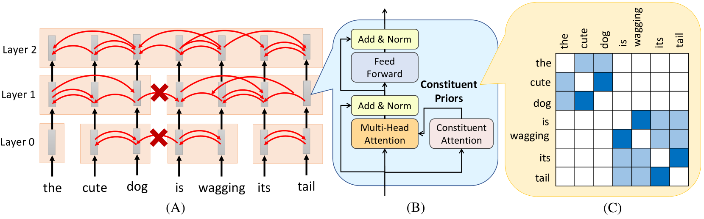

# Tree Transformer: Integrating Tree Structures into Self-Attention
---

---

附有代码: https://github.com/yaushian/Tree-Transformer

# Abstract
从大规模原始文本中预训练 Transformer 并对所需任务进行微调，在各种 NLP 任务上取得了最先进的结果。然而，目前尚不清楚习得的注意力捕捉到了什么。注意力头计算出的注意力似乎与人类对等级结构的直觉不符。**本文提出了树形变压器，该模型为双向变压器编码器的注意头增加了一个额外的约束，以鼓励注意头遵循树形结构**。树结构可以通过我们提出的 **"成分注意力(*Constituent Attention*)"** 模块从原始文本中自动诱导出来，该模块只需通过两个相邻单词之间的自注意力来实现。在与BERT相同的训练程序下，实验证明了Tree Transformer在诱导树结构、更好的语言建模和进一步学习更多可解释的注意力分数方面的有效性。

 
 
 

# 1. Induction
因此，在没有人工注释数据的情况下学习潜在树结构的任务称为语法归纳(*grammar induction*)（Carroll and Charniak， 1992;Klein 和 Manning，2002 年;Smith和Eisner，2005）已成为一个重要问题，最近引起了研究人员的更多关注。之前的工作主要集中在从递归神经网络（Shen et al.， 2018a， b）或递归神经网络（Yogatama et al.， 2017;Drozdov 等人，2019 年），而将树结构集成到 Transformer 中仍然是一个未探索的方向。

从大规模原始文本中预训练 Transformer 可以成功学习高质量的语言表示。通过在所需任务上进一步微调预训练的 Transformer，广泛的 NLP 任务获得了最先进的结果（Radford 等人，2019 年;Devlin 等人，2018 年;Dong等人，2019）。然而，预先训练的 Transformer 自注意力头捕获了什么仍然未知。虽然通过观察单词如何相互关注可以很容易地解释注意力，但只有一些不同的模式，例如参与先前的单词或命名实体，才能找到信息（Vig，2019）。注意力矩阵与我们对层次结构的直觉不符。

为了让 Transformer 学习到的注意力更易于解释，让 Transformer 能够分层理解语言，我们提出了 Tree Transformer，它**将树结构集成到双向 Transformer 编码器中。在每一层中，单词都被约束为关注相同成分中的其他单词**。这种约束在以前的工作中已被证明是有效的（Wu et al.， 2018）。与之前需要监督解析器的工作不同，在 Tree Transformer 中，选区树结构(*constituency tree*)是由我们提出的“成分注意力”模块从原始文本中自动诱导出来的，该模块只是通过自我注意力来实现的。在 Tree-RNN 的激励下，Tree Transformer 将几个较小的成分逐渐附加到从较低层到较高层的较大成分中。

本文的贡献有三方面：
- 我们提出的 Tree Transformer 易于实现，**只需在原始 Transformer 编码器上插入一个额外的自注意力实现的“成分注意力”模块**，即可在无监督解析任务上取得良好的性能。
- 由于诱导树结构引导单词分层组成较长短语的含义，因此与原始 Transformer 相比，Tree Transformer **改善了掩码语言建模的困惑性**。
- Tree Transformer 学习的注意力头的行为表达了更好的可解释性，因为它们被约束为遵循诱导的树结构。通过可视化自注意力矩阵，我们的模型提供了比原始 Transformer 更符合人类对分层结构的直觉的信息。

 
 
 

# 2. Related Work
本节回顾了语法归纳的最新进展。**语法归纳是从没有人工注释数据的原始文本中归纳出潜在树结构的任务**。语法归纳模型通常针对其他目标任务（例如语言建模）进行训练。为了在目标任务上获得更好的性能，模型必须诱导出合理的树结构，并利用诱导的树结构来引导文本编码的分层顺序。之前的一次尝试将这个问题表述为强化学习（RL）问题（Yogatama et al.， 2017），其中无监督解析器是RL中的参与者，解析操作被视为其操作。参与者设法最大化总奖励，即下游任务的性能。

PRPN（Shen等人，2018a）和 On-LSTM（Shen等人，2018b）通过引入对循环神经网络的偏倚来诱导树结构。PRPN提出了一个解析网络来计算所有词对的句法距离，而阅读网络则利用句法结构来参与相关记忆。On-LSTM允许隐藏的神经元通过提出的新门控机制和新的激活函数来学习长期或短期信息。在URNNG（Kim等人，2019b）中，他们在递归神经网络语法（RNNG）（Dyer等人，2016）解码器和树结构推理网络之间应用了摊销变分推理，这鼓励解码器生成合理的树结构。DIORA（Drozdov 等人，2019 年）提议使用内外动态规划来组合所有可能的二叉树的潜在表示。来自同一句子的内侧和外侧传递的表示形式经过优化，使其彼此接近。复合 PCFG （Kim et al.， 2019a） 通过最大化语料库中概率上下文无关语法 （PCFG） 生成的句子的边际可能性来实现语法归纳。

 
 
 

# 3. Tree Transformer

*图 1：（A） 一个 3 层树形变压器，其中块是从输入句子中感应出来的成分。两个相邻的成分可能会在下一层合并在一起，因此成分的大小会逐层逐渐增长。红色箭头表示自我注意。（B） Tree Transformer 的构建块。（C） 层 1的成分先验C*

给定一个句子作为输入，Tree Transformer 会诱导出树结构。图 1（A） 显示了 3 层树形变压器。Tree Transformer 的构建模块如图 1（B） 所示，除了建议的 Constituent Attention 模块外，它与双向 Transformer 编码器中使用的模块相同。图1（A）中的块是从输入句子中诱导出来的成分。**红色箭头表示自我注意。不同成分中的单词被限制为不相互关注**。在第 0 层中，一些相邻的单词被合并为成分;例如，给定“可爱的狗在摇尾巴”这句话，树变形金刚会自动确定“可爱”和“狗”形成一个成分，而“它的”和“尾巴”也形成一个成分。**两个相邻的成分可能会在下一层合并在一起，因此成分的大小会逐层逐渐增长**。在顶层，即层2， 所有单词都分组到同一个成分中。因为所有单词都属于同一个成分，所以注意力头可以自由地关注任何其他单词，在这一层中，Tree Transformer 的行为与典型的 Transformer 编码器相同。Tree Transformer 可以使用“掩码 LM”以端到端的方式进行训练，这是用于 BERT 训练的无监督训练任务之一

**两个词是否属于同一成分，是由引导自我注意的“成分先验”决定的**。**第 4 节**详细介绍了成分先验，该成分先验由**第 5 节**中建议的成分注意力模块计算得出。通过使用BERT掩码语言模型作为训练，从成分先验中出现潜在的树结构，从而实现无监督解析。第 6 节介绍了从 Tree Transformer 中提取选区解析树的方法。

 
 
 

# 4. Constituent Prior
在 Transformer 的每一层中，都有一个由具有 $d_k$ 维度的查询向量组成的查询矩阵 $Q$ 和一个由具有 $d_k$ 维度的关键向量组成的键矩阵 $K$ 。注意力概率矩阵表示为 $E$，这是一个 $N\,by\,N$ 矩阵，其中 $N$是输入句子中的单词数。 $E_{i,j}$ 是位置 $i$ 注意位置 $j$ 的概率。Scaled Dot-Product Attention 的计算公式为 $E$：

$$E=\operatorname{softmax}(\frac{QK^T}{d}) \qquad\qquad (1)$$

其中点积按 $1/d$ 缩放。在 Transformer 中，缩放因子 $d$ 设置为 $\sqrt{d_{k}}$

在 Tree Transformer 中，不仅由查询矩阵 Q 和键矩阵 K 决定，**E 还由 $Constituent Attention$ 模块生成的 Constituent Prior C引导**。与 E 相同，成分先验C也是一个 $N\,by\,N$ 矩阵，其中 $C_{i,j}$是单词和单词 $w_i \, w_j$属于同一选区的概率。此矩阵是对称的，$C_{i,j}$ 和 $C_{j,i}$相同。每一层都有自己的成分先验 C。**图 1（C）** 说明了成分先验C的一个例子，这表明在**图层1**中，“可爱的狗”和“正在摇尾巴”是两个成分。

为了使每个位置不参与不同成分中的位置，Tree Transformer E按成分先验C约束注意力概率矩阵，如下所示：

$$E=C\odot\operatorname{softmax}(\frac{QK^T}d) \qquad\qquad (2)$$

其中 ⊙ 是元素乘法。**因此，如果 $C_{i,j}$ 具有很小的值，表明位置 i 和 j 属于不同的成分，其中注意力权重 $E_{i,j}$ 会很小**。由于transformer使用 h 个不同头部的多头注意力，因此每个位置都有 h 不同的查询矩阵 Q 和关键矩阵 K，但在同一层中，多头注意力的所有注意力头共享相同的C。多头注意力模块产生维度的输出 $d_{model} = h \times d_k$ 。

 
 
 

# 5. Constituent Attention
所提出的**成分注意力模块**是生成成分先验C。我们不是直接生成C，而是讲问题分解为估计成分之间的断点，或两个相邻单词属于同一成分的概率。在每一层中，成分注意模块生成一个序列 $a=\{a_1,...,a_i,...,a_N\}$ ，其中 $a_i$ 是该词 $w_i$ 及相邻词 $w_{i+1}$ 在同一成分中的概率。**$a_i$ 的值小，意味着 $w_i$ 和 $w_{i+1}$ 之间有一个断点**，因此组成先验C由序列 a 获得。a 如下所示，$C_{i,j}$ 是单词 $w_i$ 和单词 $w_j$之间的所有$a_{i\leqslant k<j}$乘法：

$$C_{i,j}=\prod_{k=i}^{j-1}a_k.    \quad\quad\quad\quad\quad\quad (3)$$

在（3）中，我们选择使用乘法而不是求和，因为如果两个单词$w_i$ 和 $w_j$之间的$a_{i\leqslant k<j}$有一个很小，那么乘法值 $C_{i,j}$ 也会变小。在现实中，为了避免概率小时，我们使用 $log-sum$ 而不是直接乘以所有的 a：

$$C_{i,j}=e^{\sum_{k=i}^{j-1}\log(a_{k})} \quad\quad\quad\quad\quad\quad (4)$$

该序列 a 基于以下两种机制获得：相邻注意力和分层约束

 
 

### 5.1 Neighboring Attention

*图 2：关于相邻注意力如何工作的示例图示。*

我们计算分数$s_{i, i+1}$ , 表明 $w_i$ 通过缩放的点积注意力链接到 $w_{i+1}$ : 

$$s_{i,i+1}=\frac{q_i\cdot k_{i+1}}{d}  \qquad\qquad（5）$$

其中 $q_i$ 是具有 $d_{model}$ 维度的 $w_i$ 的链接query向量，$k_{i+1}$ 是具有 $d_{model}$ 维度的 $w_{i+1}$ 的链接key向量。我们用 $q_{i}\cdot k_{i+1}$ 表示 $w_i$ 和 $w_{i+1}$ 属于同一成分的趋势。在这里，我们将比例因子 $d$ 设置为 $\frac{d_{model}}2$ 。**（5） 中的查询和键向量与 （1） 不同。它们由相同的网络架构计算，但使用不同的网络参数集**。

对于每个单词，我们将其限制为链接到其右邻或左邻，**如图 2 所示**。此约束是通过将 softmax 函数应用于以下两个注意链接来实现 $w_i$ 的：

$$p_{i,i+1},p_{i,i-1}=\text{softmax}(s_{i,i+1},s_{i,i-1}) \qquad\qquad(6)$$ 

其中 $p_{i,i+1}$ 是 $w_i$ 注意 $w_{i+1}$ 的概率，并且 $(p_{i,i+1},p_{i,i-1}) =1$。 我们发现，**在没有（6）中softmax操作的约束的情况下，该模型倾向于将所有单词链接在一起，并将所有单词分配给同一选区**。==也就是说，同时给出 $s_{i,\,i+1}$ 和 $s_{i,\,i-1}$ 的最大值，因此注意力头可以自由地关注任何位置，而不受成分先验的限制==，这与原始Transformer相同。因此，$softmax$ 函数是将注意力约束为稀疏的。

由于 $p_{i,i+1},p_{i,i-1}$ 可能具有不同的值，因此我们平均其两个注意力链接为:

$$\hat{a}_i=\sqrt{p_{i,i+1}\times p_{i+1,i}} \qquad\qquad (7)$$

只有当两个单词相互连接时，$\hat{a_i}$ 才会链接两个相邻的单词。$\hat{a_i}$ 在下一小节中用于获取 $a_i$。

 
 

### 5.2 Hierarchical Constraint
**如第 3 节所述**，下层的成分合并为上层中的较大成分。也就是说，一旦两个词在下层属于同一成分，它们仍然属于上层的同一成分。为了将分层约束应用于树 Transformer，我们将限制 $a_k^l$ 中 层 $l$ 和索引 $k$ 始终大于 $a_k^{l-1}$。因此，在层 $l$ 上，链接概率 $a^l_k$ 设置为:

$$a_{k}^{l}=a_{k}^{l-1}+(1-a_{k}^{l-1})\hat{a}_l^k \qquad\qquad(8)$$

其中 $a_k^{l-1}$ 是来自前一层 $l-1$ 的链接概率，$\hat{a}_l^k$ 是从当前层 $l$ 的相邻注意力 (第5.1节) 获得。最后，在层 $l$ 上，我们应用 （4）从 $a^l$ 中进行 $C^l$ 的计算。最初，不同的单词被视为不同的成分，因此我们初始化 $a_k^{-l}$ 为零。

 
 
 

# 6. Unsupervised Parsing from Tree Transformer

训练完成后，**邻接链接概率 a 可用于进行无监督的解析。较小的 a 值表明该链接可作为两个成分之间的断点**。通过自上而下的贪婪解析（Shen等人，2018a），该方法递归地使用最小的 a 将句子分割成两个成分，从而形成解析树。

然而，由于每一层都有一组 a，我们需要决定使用哪一层进行解析。与使用特定层的 a 进行解析不同（Shen等人，2018b），我们提出了一种新的解析算法，该算法利用所有层的 a 进行无监督解析。正如在**第5.2节**中提到的，**a 的值是严格递增的，这表明 a 直接学习了从层到层的层次结构**。**算法1**详细说明了我们如何利用 a 的层次信息进行无监督解析。

无监督解析从顶层开始，递归地向下移动，找到断点后一直移动到底层 m。**底层 m 是一个需要调整的超参数**，通常设置为2或3。我们舍弃了底层 m 以下的 a，因为我们发现最底层几层没有学到好的表示（Liu等人，2019），因此解析结果较差（Shen等人，2018b）。顶层的所有 a 值都非常接近于1，表明它们不是好的断点。因此，我们设定了一个用于确定断点的阈值，其中仅当最小的 a 值低于阈值时，才将其视为有效的断点。我们发现我们的模型对阈值值不太敏感，因此我们在所有实验中将其设置为0.8。

 
 
 

# 7. Experiment
为了评估我们提出的模型的性能，我们进行了以下详细的实验。

 
 

### 7.1 Model Architecture
我们的模型基于一个双向Transformer编码器。我们的Transformer编码器的实现与原始Transformer编码器相同。对于所有实验，我们将Constituent Attention和Transformer的隐藏大小dmodel设置为512，自注意力头数h设置为8，前馈大小设置为2048，丢弃率设置为0.1。在以下实验中，我们分析并讨论层数（用L表示）的敏感性。

 

### 7.2 Grammar Induction
在本节中，**我们评估了我们的模型在无监督成分解析上的性能**。我们的模型是通过使用BERT Masked LM（Devlin等人，2018）作为无监督训练任务，在WSJ训练集和WSJ-all（即包括测试和验证集）上训练的。我们使用BERT的WordPiece（Wu等人，2016）分词器对单词进行分词，词汇表大小为16k。我们的最佳结果是通过Adam优化的，学习率为0.0001，β1 = 0.9和β2 = 0.98。遵循先前研究的评估设置（Htut等人，2018；Shen等人，2018b），我们在Penn Treebank（PTB）的WSJ-test和WSJ-10上评估我们模型的F1分数。WSJ-10包括来自整个PTB的7422个句子，经过标点符号去除后，句子长度限制为10；而WSJ-test包括来自PTB测试集的2416个句子，句子长度不受限制。

WSJ-test上的结果见 **表1**。我们主要将我们的模型与PRPN（Shen等人，2018a）、On-lstm（Shen等人，2018b）和Compound PCFG（C-PCFG）（Kim等人，2019a）进行比较，其中评估设置和训练数据与我们的模型相同。DIORA（Drozdov等人，2019）和URNNG（Kim等人，2019b）使用相对较大的训练数据，评估设置与我们的模型略有不同。我们的模型表现远好于平凡的树（即右分支和左分支的树）和随机树，这表明我们提出的模型成功地学习了有意义的树结构。我们还发现增加层数会导致更好的性能，因为它允许Tree Transformer建模更深层次的树。然而，当深度超过10时，性能停止增长。特定层以上的层中的单词都被分组到同一成分中，因此增加层数将不再有助于模型发现有用的树结构。在**表2**中，我们报告了WSJ-10上的结果。其中包括CCM（Klein和Manning，2002）、DMV+CCM（Klein和Manning，2005）和UML-DOP（Bod，2006）在内的一些基线与我们的模型不直接可比，因为它们是使用我们的模型不考虑的POS标签进行训练的。

此外，我们进一步研究了我们的模型诱导出的树的类型。按照URNNG的做法，我们通过**表3**中的标签评估成分的性能。不同方法诱导出的树是相当不同的。我们的模型更倾向于发现名词短语（NP）和副词短语（ADVP），但不容易发现动词短语（VP）或形容词短语（ADJP）。我们在**图8中展示**了一棵诱导出的解析树，更多的诱导出的解析树可以在附录中找到。

 

### 7.3 Analysis of Induced Structures
在本节中，我们研究Tree Transformer是否能够从一层到另一层学习层次结构。首先，我们在**表1**中分析了在WSJ-all上训练的模型中给定算法1中的最小层m的超参数的影响。**如图4(a)所示**，将m设置为3会产生最佳性能。先前的研究发现Transformer的较低层的表示不具信息性（Liu等人，2019）。**因此，使用来自较低层的句法结构会降低解析树的质量**。另一方面，当来自顶层的a接近1时，大m也会降低性能，因为大m时大部分句法信息缺失。为了进一步分析哪一层包含更丰富的句法结构信息，我们评估了从特定层获取解析树的性能。我们使用来自层l的al进行解析，采用自上而下的贪婪解析算法（Shen等人，2018a）。**如图4(b)所示**，使用来自第3层的a3进行解析获得最佳F1分数，为49.07。这个结果与最佳的m值一致。然而，与通过算法1获得的最佳结果（52.0）相比，F1分数减少了3（52.0 → 49.07）。这证明了Tree Transformer在学习层次结构方面的有效性。较高层确实捕捉到更高层次的句法结构，如从句模式。

 

### 7.4 Interpretable Self-Attention
本节讨论Tree Transformer中的注意力头是否学习了层次结构。考虑到解释注意力头学习的最直接方式是可视化注意力分数，我们在**图5中**绘制了每层Constituent Attention prior C的热力图。

在第一层的成分先验热力图中（**图5(a)**），由于成分的大小较小，单词只关注其相邻的单词。我们可以观察到模型捕捉了一些子短语结构，例如名词短语“delta air line”或“american airlines unit”。在 **图5(b)-(d)** 中，成分相互附着并变得更大。在第6层，从“involved”到最后一个单词“lines”的单词形成了一个高层次的形容词短语（ADJP）。在第9层，除了第一个单词“but”外，所有单词都被分组成一个大的成分。通过可视化每一层成分先验的热力图，我们可以轻松了解每一层学到了哪些类型的句法结构。此示例的解析树可在附录的图8中找到。我们还在附录A中可视化了原始Transformer层和Tree Transformer层中的自注意力热力图。由于我们模型的自注意力头受到成分先验的限制，与原始Transformer相比，我们可以更轻松地发现层次结构。

这些注意力热力图表明：（1）成分的大小逐层递增，（2）在每一层中，注意力头倾向于关注该层中提出的成分内的其他单词。这两点证据支持了所提出的Tree Transformer在学习类似树结构方面的成功。

 

### 7.5 Masked Language Modeling

为了调查Tree Transformer在捕捉抽象概念和句法知识方面的能力，我们在语言建模上评估了其性能。由于我们的模型是一个双向编码器，可以看到其后续单词，因此我们不能以从左到右的方式评估语言模型。我们通过测量被掩码单词的困惑度来评估掩码语言建模的性能。为了进行无随机性的推理，对于测试集中的每个句子，我们会逐个掩码句子中的所有单词。在每个被掩码的测试数据中，只有一个单词被替换为“[MASK]”标记。因此，每个句子创建的测试样本数量等于其长度。

**在表4中**，模型是在WSJ-train上通过BERT Masked LM进行训练，并在WSJ-test上进行评估。除了Tree Transformer和Transformer中的层数之外，所有超参数都被设置为相同，并由相同的优化器进行优化。我们使用adam作为优化器，学习率为0.0001，β1 = 0.9，β2 = 0.999。我们提出的Constituent Attention模块相对于原始Transformer编码器增加了约10%的超参数，但计算速度较慢，慢了1.2倍。我们报告了在验证集上表现最佳的结果。与原始Transformer相比，Tree Transformer在掩码语言建模上取得了更好的性能。由于性能提升可能是由于更多参数导致的，我们调整了Transformer中的层数或增加了隐藏层的数量L = 10 - B。即使参数比Transformer少，Tree Transformer仍然表现更好。

性能提升是因为诱导出的树结构以更直观和人类化的方式引导了自注意力过程，因此知识可以更好地从训练数据泛化到测试数据。此外，Tree Transformer不仅从位置编码中获取位置信息，还从诱导出的树结构中获取位置信息，其中单词从近到远（从较低层到较高层）关注其他单词。

 

### 7.6 Limitations and Discussion
值得一提的是，我们曾尝试使用预训练的BERT初始化我们的Transformer模型，然后在WSJ-train上进行微调。然而，在这种设置中，即使训练损失降低到低于从头开始训练的损失，解析结果仍然远远不及我们的最佳结果。**这表明预训练的BERT中的注意力头学到的结构与Tree Transformer中的类树结构相差很远**。此外，对于训练良好的Transformer，Constituency Attention模块无需诱导合理的树结构，因为训练损失仍然会降低。

 
 
 

# 8. Conclusion
本文提出了Tree Transformer，这是将树结构首次整合到Transformer中的尝试，通过限制注意力头只关注成分内部。树结构是通过我们提出的Constituent Attention模块从原始文本中自动诱导出来的，该模块通过自注意力将成分相互连接。在无监督解析方面的性能表明，我们的模型在诱导与人类专家注释一致的树结构方面是有效的。我们认为将树结构纳入Transformer是一个重要且值得探索的方向，因为它使Transformer能够学习更具解释性的注意力头，并实现更好的语言建模。可解释的注意力可以更好地解释模型如何处理自然语言，并引导未来的改进。