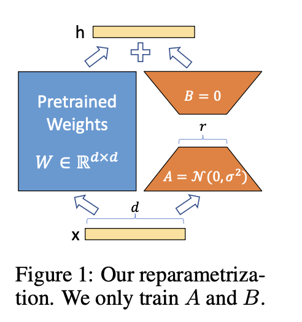

# LoRA: Low-Rank Adaptation of Large Language Models

---

### Abstract

LoRA 冻结了预训练的模型权重，并将可训练的 **秩分解矩阵** 注入（inject）到 Transformer 架构的每一层中，大大减少了下游任务的可训练参数的数量。与使用 Adam 微调的 GPT-3 175B 相比，LoRA 可以将可训练参数数量减少 10,000 倍，GPU 内存需求减少 3 倍.

https://github.com/microsoft/LoRA 上提供 RoBERTa、DeBERTa 和 GPT-2 的实现和模型检查点

 
 
 

### Introduction

1. 在 LoRA之前，适应新的下游任务通过调整学习参数或者学习新任务的外部模块来缓解fine-tuned 全参数的问题。虽然提高了部署时的运行效率，但这会引入推理延迟(inference latency), 并且效果不好
2. [研究1](http://arxiv.org/abs/1804.08838) [研究2](http://arxiv.org/abs/2012.13255) 表明，学习到的过参数化（over-learningover-learned）模型实际上存在于较低的内在维度上。受这些研究启发，**假设模型适应期间权重的变化也具有较低的“内在等级（intrinsic rank）”** 。
3. LoRA 允许我们通过优化适应过程中密集层变化的秩分解矩阵来间接训练神经网络中的一些密集层，同时保持预训练权重冻结，如**图 1 所示**。

LoRA的几个优点：
- 预训练模型可以共享并用于构建许多用于不同任务的小型LoRA 模块。我们可以通过替换**图 1** 中的矩阵 𝐴 和 𝐵 来冻结共享模型并高效地切换任务，从而显着降低存储要求和任务切换开销。
- 使用自适应优化器时，LoRA 使训练更加高效，并将硬件进入门槛降低了多达 3 倍，因为我们不需要计算梯度或维护大多数参数的优化器状态。相反，我们只优化注入的、小得多的低秩矩阵。
- 我们简单的线性设计使我们能够在部署时将可训练矩阵与冻结权重合并，通过构造，与完全微调的模型相比，**不会引入推理延迟**。
- 