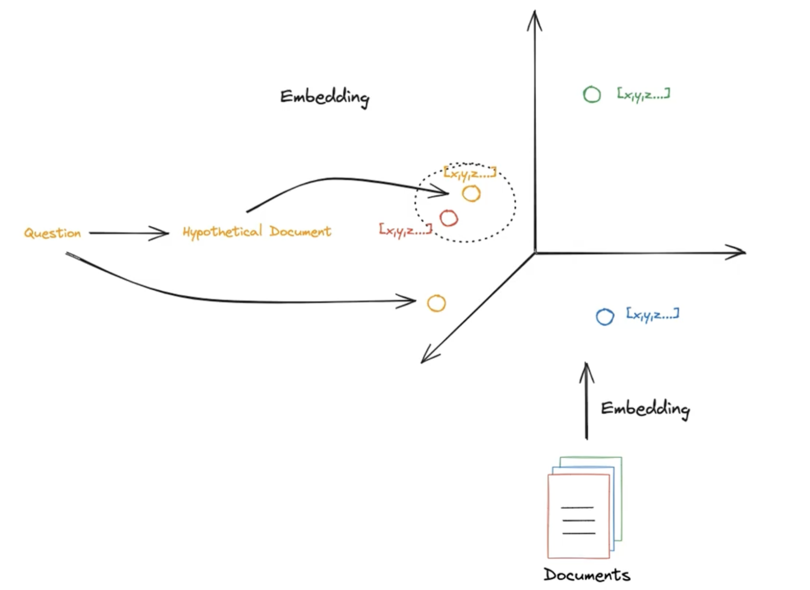

# HyDE 虚拟文档嵌入(Hypothetical Document Embedder)

---

这个笔记本介绍了如何使用虚拟文档嵌入（HyDE），如 [Precise Zero-Shot Dense Retrieval without Relevance Labels](https://arxiv.org/abs/2212.10496) 所述。

在高层次上，HyDE是一种嵌入技术，它接受查询，生成一个虚拟答案，然后嵌入该生成的文档并将其用作最终示例。

为了使用HyDE，我们需要提供一个基本的嵌入模型，以及一个用于生成这些文档的LLMChain。默认情况下，HyDE类带有一些默认的提示（有关详细信息，请参阅论文），但我们也可以创建自己的提示。

- [langchain 文档提到的 HyDE](https://python.langchain.com.cn/docs/modules/chains/additional/hyde)

 
 
 

### HyDE paper 涉及到的内容
这篇论文提出了一个新的无监督密集检索模型HyDE，其主要思路如下：
1. **无监督检索难点**：密集检索需要学习查询和文档的语义表示，并计算它们之间的相似度。无监督情况下，无法获得相关文档的监督信号，这使得表示学习变得困难。
2. **HyDE模型**：作者将检索分解为两个子任务。**首先**，利用指令遵循的语言模型，根据查询生成一个假设的文档。**然后**，利用无监督对比学习的编码器，将假设文档编码为向量表示。这个向量用于在语料库中搜索最相似的文档。
3. **实现**：具体来说，作者使用InstructGPT生成假设文档，并使用Contriever编码假设文档。生成的文档虽然可能包含错误细节，但能捕捉相关性。Contriever的密集瓶颈结构可以过滤错误细节。
4. **实验结果**：在11个查询集上，HyDE在web搜索、问答、事实核查等任务上均优于仅使用Contriever的基线系统。与微调后的检索系统相比，HyDE也展现出较强性能。
5. **分析**：作者分析了不同生成模型和微调编码器的影响。发现更大规模的生成模型效果更好，而微调编码器对HyDE影响较小。
6. **结论**：该论文提出了利用生成模型和编码器实现无监督密集检索的新思路，并证明了其有效性。为无需相关监督的密集检索系统提供了有效途径。

 

#### 什么是Contriever?
Contriever是一种通过无监督对比学习训练的文本编码器，旨在学习文本之间的语义表示，使其在向量空间中能够反映文本内容的相关性。具体来说，Contriever的训练不依赖于人工标注的相关性数据，而是利用大规模文本语料库进行自监督训练。**在训练过程中，Contriever将每个文本编码为固定维度的向量，并通过对比学习的方式学习文本表示，即拉近正样本对的表示并推开负样本对的表示**。通过这种方式，Contriever学习到可以反映文本语义相关性的表示。Contriever的名称来源于其结合了Contrastive和Retrieval两个概念，旨在通过对比学习的方式学习文本表示，以支持检索任务。在本文中，Contriever编码器被应用于HyDE模型中，利用其学习到的文本表示进行无监督的文档检索。
(补充： 参考文章：[Unsupervised Dense Information Retrieval with Contrastive Learning](https://arxiv.org/abs/2112.09118))