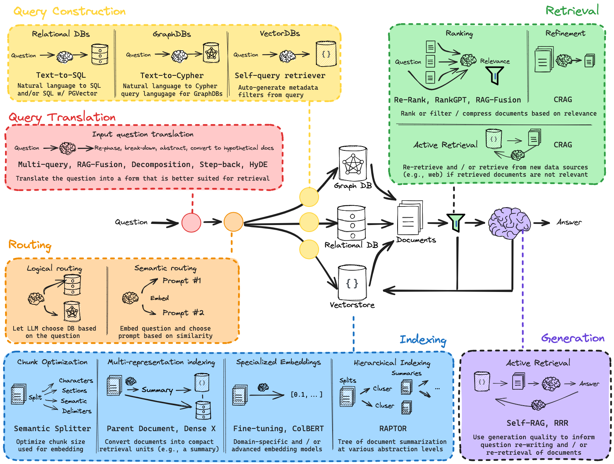

# RAG

---

标准的 RAG 流程简介：将文本分块，然后使用一些 Transformer Encoder 模型将这些块嵌入到向量中，将所有向量放入索引中，最后创建一个 LLM 提示，告诉模型根据我们在搜索步骤中找到的上下文回答用户的查询。

在运行时，我们使用同一编码器模型对用户的查询进行向量化，然后搜索该查询向量的索引，找到 top-k 个结果，从我们的数据库中检索相应的文本块，并将它们作为上下文输入到 LLM 提示中。

 
 

# Advanced RAG
---

**上图中绿色部分**是我们接下来详细探讨的核心 RAG 技术。一张图并不能全部展示所有的高级 RAG 技术，比如我们这里省略了上文扩展技术。   

---

 
 

# RAG系统性流程

[Learn RAG from Scratch – Python AI Tutorial from a LangChain Engineer](https://www.freecodecamp.org/news/mastering-rag-from-scratch)

### the entire process of implementing a RAG system from the ground up:

- **Indexing:** Learners will start by understanding how to create efficient indexing systems to store and retrieve data, which is fundamental for any retrieval-based model.

- **Retrieval:** This section dives into the mechanics of retrieving the most relevant documents in response to a query.

- **Generation:** After retrieval, the focus shifts to generating coherent text from the retrieved data, using advanced natural language processing techniques.

- **Query Translation:** Multiple strategies for translating and refining queries are discussed, including Multi-Query techniques, RAG Fusion, Decomposition, Step Back, and HyDE approaches, each offering unique benefits depending on the application.

- **Routing, Query Construction, and Advanced Indexing Techniques:** These segments explore more sophisticated elements of RAG systems, such as routing queries to appropriate models, constructing effective queries, and advanced indexing techniques like RAPTOR and ColBERT.

- **CRAG and Adaptive RAG:** The course also introduces CRAG (Conditional RAG) and Adaptive RAG, enhancements that provide even more flexibility and power to the standard RAG framework.

- **Is RAG Really Dead?:** Finally, a discussion on the current and future relevance of RAG in research and practical applications, stimulating critical thinking and exploration beyond the course.
