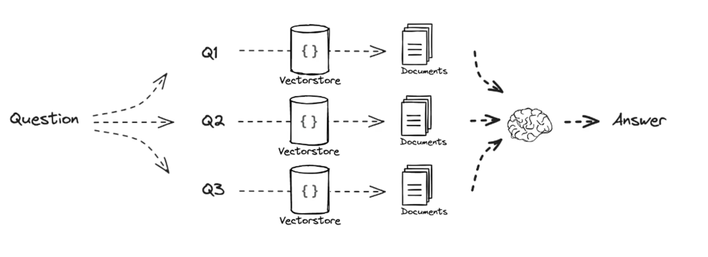

# Retrival-Augmented Generation

---

 

### 多重查询（Multi-Query）

在 RAG 中，multi-query 是指能够处理多个查询（即多个问题）的能力。传统的信息检索系统通常只能处理一个查询，并返回与该查询最相关的文档。然而，**在实际应用中，用户可能会提出一系列相关但不完全相同的问题，或者在一个对话中提出多个相关问题**。为了更好地满足这种需求，RAG 引入了 multi-query 的概念。

在 RAG 中，**multi-query 的实现方式通常是通过扩展检索过程来实现的。具体来说，当有多个查询时，系统会将这些查询作为一个批次同时发送给检索模型**。检索模型会返回一组与这些查询相关的文档集合，然后再进行后续的再排名和生成步骤。

通过支持 multi-query，RAG 能够更好地处理多个相关查询，提高了系统的灵活性和适用性。例如，在问答系统中，如果用户提出了一系列相关问题，系统可以在一个批次内处理这些问题，提高了用户体验和系统的效率。

**也就说，用户输入不准确，用户不知道正确的问题是什么，怎么办？**

这时候就需要用到多重查询，找 语义 相同的句子，经过大模型去拓展多个问题

- 多重查询

 

- 搜索过程

 

- 流程图

（这里我有个问题，Q1～Q3 对应的索引 加上 文档 内容不会太多了吗？大模型的上下文窗口是有限制的，这不会涉及到一个 截断的问题吗？ ）