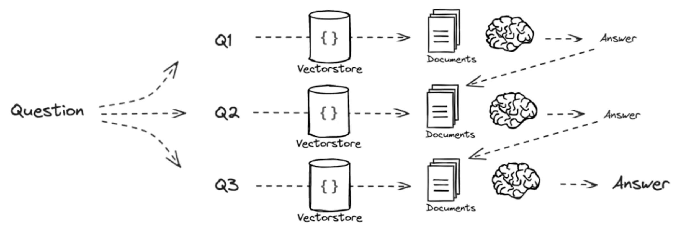
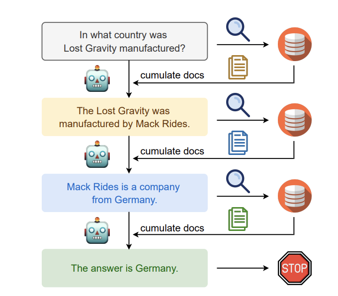

# 查询分解(query decomposition)

[详细讲了 decomposition](https://zhuanlan.zhihu.com/p/685746861)

---

### decompose

**序列求解思想**

( 源于 [least-to-most prompting](https://arxiv.org/pdf/2205.10625.pdf) and [IRCoT](https://arxiv.org/pdf/2212.10509.pdf) )

