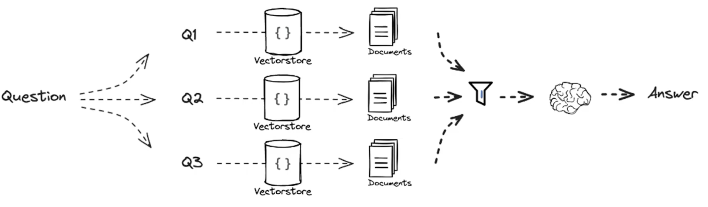
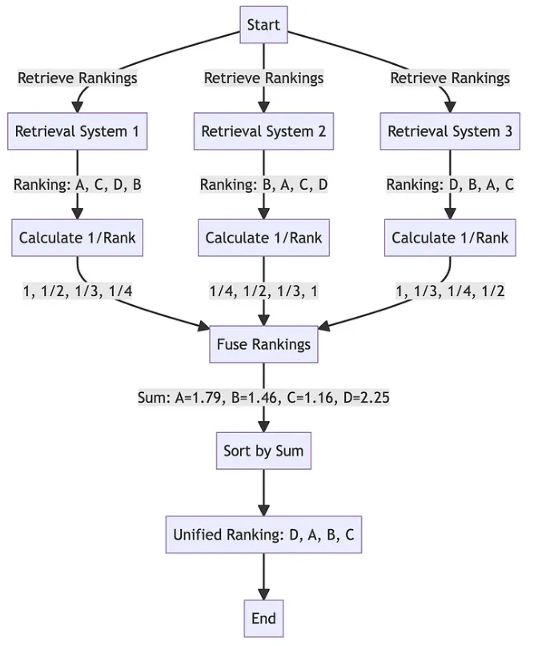

# RAG Fusion

[RAG Fusion 参考，还讲了 RRF算法](http://www.bimant.com/blog/rag-fusion-crash-tutorial/)

---

### 概念
RAG 融合（RAG Fusion）是指在 RAG 模型中**将检索和生成两个阶段进行有效整合的过程**。在传统的 RAG 模型中，首先进行文档检索以获取相关文档，然后使用生成模型根据这些文档生成答案。但在某些情况下，这种简单的串行方法可能无法充分利用检索和生成之间的互补性。

RAG 融合的目的是在保留检索和生成各自优势的同时，更加有效地利用两者之间的关系，从而提高整体的性能。这可以通过以下几种方式来实现：

1. **交互式融合**：在检索和生成之间建立一种交互式的机制，让它们可以相互影响和调整。例如，在生成阶段可以考虑将生成的内容作为反馈信息反过来影响检索过程，以提高检索的准确性。

2. **信息传递**：在检索到相关文档后，将一些关键信息传递给生成模型，以帮助生成更加相关和准确的答案。这些信息可以是关键词、上下文信息等。

3. **多阶段生成**：将生成过程分为多个阶段，每个阶段都与检索结果有关，逐步细化生成的内容。例如，先生成一个粗略的答案，然后根据检索到的文档进一步完善和细化答案。

4. **端到端训练**：将检索和生成过程作为一个整体进行端到端的训练，以更好地优化两者之间的关系，使得模型能够更好地学习到检索和生成之间的互相影响。

通过 RAG 融合，可以更好地整合检索和生成两个阶段，充分发挥它们各自的优势，从而提高整体系统的性能和效果。

 

### 流程图部分

之前的 多重查询之后， 可能会存在很多相似文档，给大模型之前肯定还是需要做些处理，故上面流程图中，文档与大模型之间的部分，就是 Fusion。这里涉及到一个 算法(Reciprocal ran fusion)，这是一个对文档进行打分的一个算法

 

### reciprocal rank fusion 

- 案例流程图

 

- 计算公式
$$RRFscore(d\in D)=\sum_{r\in R}\frac1{k+r(d)} ,$$

来源（https://plg.uwaterloo.ca/~gvcormac/cormacksigir09-rrf.pdf）