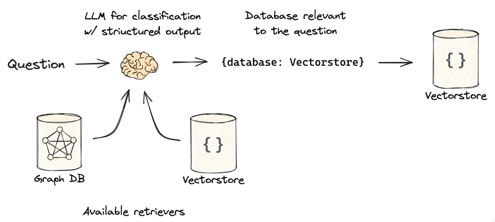
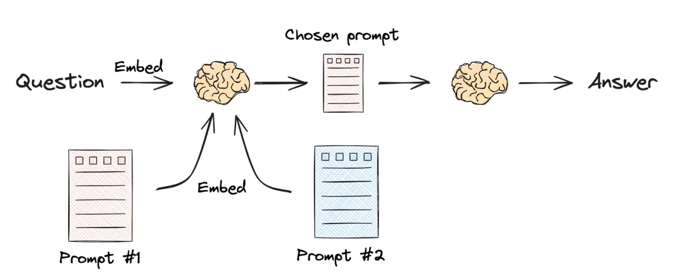

# routing （路由）
[langchain 官网英文文档介绍的 routing](https://python.langchain.com/docs/use_cases/query_analysis/techniques/routing/)

有时我们有针对不同领域的多个索引，并且对于不同的问题，我们希望查询这些索引的不同子集。例如，假设我们有一个用于所有 LangChain python 文档的向量存储索引，以及一个用于所有 LangChain js 文档的向量存储索引。给定一个有关 LangChain 使用的问题，我们想要推断问题所指的是哪种语言并查询相应的文档。Query routing是对应该对哪个索引或索引子集执行查询进行分类的过程。

---

- 逻辑路由（logic routing）

1. 逻辑路由**更侧重于查询的结构和形式**，它根据查询的逻辑结构来确定处理路径。
2. 在RAG系统中，逻辑路由可能涉及到对查询语句的解析，识别出查询中的逻辑关系，如AND、OR、NOT等操作。
3. 逻辑路由的目标是确保查询按照既定的规则和顺序被正确处理，以便系统能够生成准确的回答。
4. 例如，如果用户提出一个复杂的SQL查询，逻辑路由会确保查询中的各个部分按照正确的逻辑顺序被执行。

 
 

- 语义路由（semantic routing）

1. 语义路由**侧重于理解查询的语义内容**，即查询的实际含义和意图。
2. 在RAG系统中，语义路由可能涉及到自然语言处理（NLP）技术，如语义分析、实体识别和意图识别，以确保系统能够准确理解用户的问题。
3. 语义路由的目标是将用户的查询映射到最相关的数据源或处理路径，即使这些路径可能不是直观的或直接的。
4. 例如，如果用户询问“最近的天气如何？”，语义路由会识别出这是一个关于天气查询的问题，并将其路由到提供天气信息的服务或数据库。

 
 

### 总结
logic routing是解决可能有不同的datasource，semantic routing是解决可能有不同的prompt。动态解决这些问题，就需要routing。