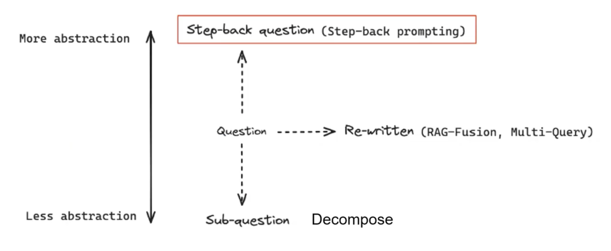

# 技巧：退一步 (step back)

[退一步，看得更远：通过抽象引发大型语言模型中的推理](https://zhuanlan.zhihu.com/p/663680218)

也就是常见的 `step back prompting`

[论文： take a step back ..](https://arxiv.org/pdf/2310.06117.pdf)

---

 

### 思想

Step Back Prompting 是一种用于改进自然语言处理模型性能的策略，也可以应用于 RAG 模型中。这个思想的核心概念是在模型生成不佳的情况下，回退到之前的状态（step back），重新进行提示（prompting），以期望得到更好的结果。

在 RAG 中使用 Step Back Prompting 的思想通常是指，在生成答案后，对生成结果进行评估，如果结果不佳，就返回到之前的阶段（step back），重新构造或调整输入问题或查询，然后再次输入模型进行生成。这个过程可能会多次迭代，直到得到满意的结果为止。

具体来说，Step Back Prompting 在 RAG 中的应用可能涉及以下几个步骤：

1. **生成答案**：首先，使用当前的查询和检索到的文档生成答案。

2. **答案评估**：对生成的答案进行评估，检查其是否满足预期的质量和准确性标准。这个评估过程可以基于一些预先定义的评价指标，也可以是人工进行的。

3. **判断是否需要回退**：如果生成的答案不满足要求，就判断是否需要回退到之前的阶段。这个决策可能基于一些规则或者启发式方法，也可能是基于模型的自动判断。

4. **调整输入**：如果需要回退，就根据当前的情况调整输入问题或查询。这可能包括修改问题的表达方式、调整检索条件、添加额外的提示等。

5. **重新生成**：调整完输入后，再次输入模型进行生成，得到新的答案。

6. **循环迭代**：如果生成的新答案仍然不满意，就重复上述过程，进行多次迭代，直到得到满意的结果为止。

通过这种方式，Step Back Prompting 可以帮助 RAG 模型在生成不佳的情况下进行自我纠正，从而提高了模型的稳健性和性能。

 

### 为什么需要 step back？
- 可能是因为问的不够全面，有些点没问到，所以回溯重新prompt可能又是新答案
- 回到更广泛的问法，可能会出现更多的答案