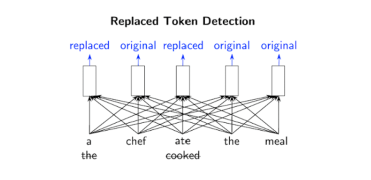
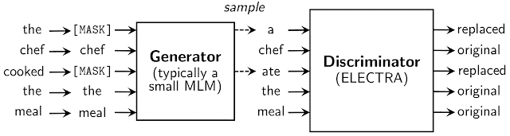

# ELECTRA and RTD任务

**参考资料**

- [ELECTRA: Pre-training Text Encoders as Discriminators Rather Than Generators](https://arxiv.org/abs/2003.10555)

- [完胜 BERT，谷歌优秀 NLP 预训练模型开源](https://www.51cto.com/article/612645.html)

---

### 核心思想 -RTD

ELECTRA 使用一种称为替换令牌检测（RTD）的新预训练任务，该任务在从所有输入位置（如：LM）学习的同时，训练双向模型（如：MLM）。

具体而言，ELECTRA 的目标是学习区分输入的词。它不使用掩码，而是从一个建议分布中采样词来替换输入，这解决了掩码带来的预训练和 fine-tune 不一致的问题。

然后模型再训练一个判别器，来预测每个词是原始词还是替换词。**而判别器的一个优点则是：** ==模型从输入的所有词中学习==，而不是像 MLM 那样，仅使用掩盖的词，因此计算更加有效。

正如很多开发者联想到的对抗学习方法，ELECTRA 确实受到到生成对抗网络的启发（GAN）。但不同的是，**模型采用的是最大似然而非对抗学习**。

**例如下图中**，单词「cooked」可以替换为「ate」。尽管这有些道理，但它并不适合整个上下文。预训练任务需要模型（即鉴别器）来确定原始输入中的哪些标记已被替换或保持相同。

**正是由于该模型的二进制分类任务适用于每个输入单词，而非仅有少量的掩码单词**（在 BERT 样式的模型中为 15％），因此，RTD 方法的效率比 MLM 高。这也解释了为什么 ELECTRA 只需更少的示例，就可以达到与其它语言模型相同性能的原因。

 
 

### 具体架构
替换令牌来自生成器的神经网络。**生成器的目标是训练掩码语言模型**，即给定输入序列后，按照一定的比例（通常 15%）将输入中的词替换成掩码；然后通过网络得到向量表示；之后再采用 softmax 层，来预测输入序列中掩盖位置的词。

尽管生成器的结构类似于 GAN，但由于难以将该方法应用于文本任务，因此得到的训练目标函数为掩盖词的最大似然。

之后，生成器和判别器共享相同的输入词嵌入。**判别器的目标是判断输入序列每个位置的词是否被生成器替换，如果与原始输入序列对应位置的词不相同，就判别为已替换**。

