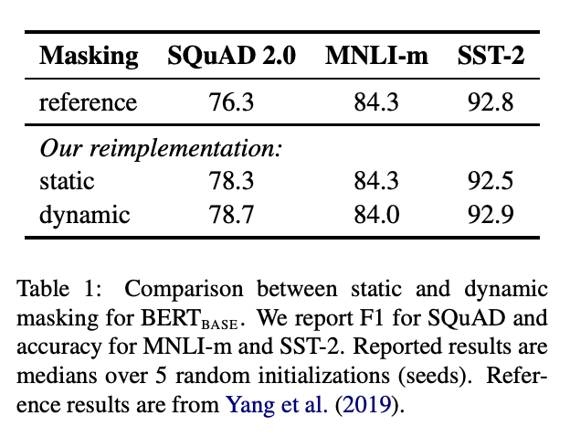
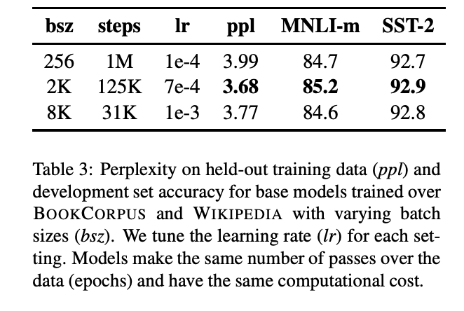

# RoBERTa
[RoBERTa: A Robustly Optimized BERT Pretraining Approach](https://arxiv.org/pdf/1907.11692.pdf)

项目地址 [pytorch/fairseq](https://github.com/facebookresearch/fairseq)

---

RoBERTa全称：Robustly optimized BERT approach

RoBERTa之于BERT的改动很简单，包括

- 用了更多的训练语料；

训练上，
- 采用动态【MASK】；
- 去掉下一句预测的NSP任务；
- 更大的batch_size；
- 文本编码。

 
 

### 优化策略
 

#### 更多的数据
在BERT采用的数据BOOKCORPUS + English WIKIPEDIA（共16G）基础上

- 增加 CC-NEWS（76GB）
- 增加 OPENWEBTEXT（38GB）
- 增加 STORIES（31GB）

也就是RoBERTa一共用了160GB语料进行预训练。

 
 

#### 动态【MASK】
预训练的每一个step，是重新挑选15%token进行【MASK】的。

而BERT是固定的，就是对于同一个样本，在不同的epoch，【MASK】掉的token是一样的，**实验结果见下图**，有很微弱的提升。

 
 

#### 去掉NSP任务
首先，看一下结果图，SEGMENT-PAIR就是BERT采用的方式，**虽然是句子对输入，但其实一个句子不只有一句，而是文章里面的连续片段，可以包含多句**。而SENTENCE-PARI就是两个单句拼接在一起。可以看到单句拼接比片段拼接效果要差。

FULL-SENTENCES 和 DOC-SENTENCES 都是去掉NSP任务的，可以看到去掉NSP任务后，模型性能有所提升。FULL-SENTENCES是可以跨文档来采样句子。DOC-SENTENCES是保证采样的句子都在同一个文档里面，可以看到DOC-SENTENCES表现稍微好一点。

所以，最后**RoBERTa是采用去掉NSP而且一个样本是从同一个文档里面进行采样**。

 
 

#### 更大的batch_size
BERT的batch_size是256，一共训练了1M步，实验证明，采用更大的batch_size以及训练更多步，可以提高性能。最后RoBERTa采用的batch_size是8K。

 
 

#### Byte-level BPE编码
- BERT采用的是基于character level的Byte-Pair Encoding（BPE）编码，词表大小是30K；
- RoBERTa采用更巧妙的BPE偏码方式，即基于bytes-level的BPE编码，该方法用bytes（字节）作为基础的子词单元，词表的大小是50K。采用bytes-level的BPE编码的好处是可以在不需要引入任何未知字符前提下对任意文本进行编码，作者相信这个编码方式更通用。想深入了解的看这篇博文[浅谈Byte-Level BPE](https://zhuanlan.zhihu.com/p/146114164)。

