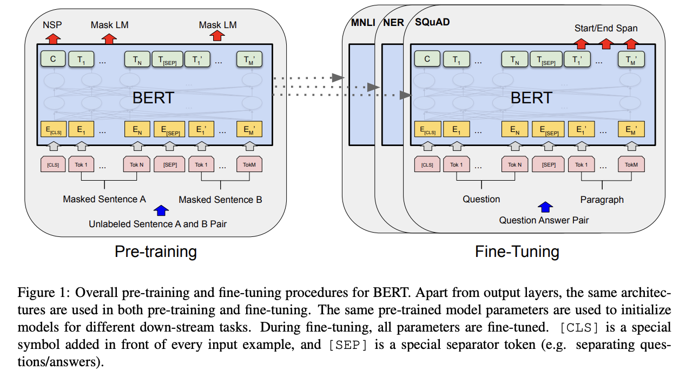
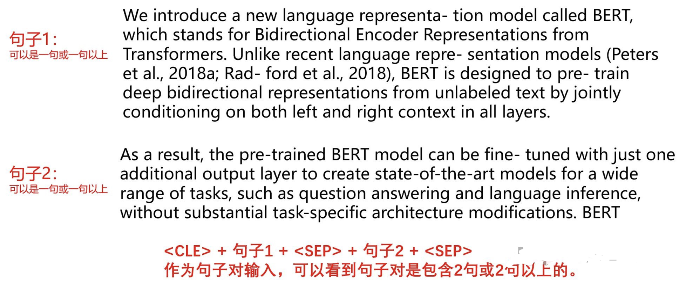

# BERT
[Bidirectional Encoder Representations from Transformers](https://arxiv.org/pdf/1810.04805.pdf)

---

从论文题目和BERT英文全称，可以看到BERT做的是一个**上下文双向的信息编码**。整篇论文的比较对象是ELMo和GPT，ELMo和GPT的最大问题在于**不是真正的双向编码**。

- ELMo虽然把LSTM的正向向量和反向向量拼接在一起，但由于只是拼接，并没有发生交互，所以并不是真正的双向；
- GPT利用的是Transformer的Decoder来训练语言模型，预测下一个token的时候，只能看到之前的token。

BERT用到的是transformer的encoder部分，编码每个token的时候考虑了所有输入token的交互，所以**BERT是真正的双向编码模型，表征能力也比ELMo和GPT要强！**

 
 

### 两种范式：feature-based & fine-tuning
- **feature-based：** 代表作如EMLo，想想在17年之前，Transformer没出的时候，大家最常解决NLP任务的方法就是**用别人训练好的词向量作为embedding**，然后后面接全新初始化的RNN/LSTM/CNN等网络结构，也就是预训练只提供了feature-based的embedding。

 

- **fine-tunning：** 代表作如GPT，用于下游任务时，**不仅保留了输入的embedding，Transformer里面的参数（如attention层、全连接层）也同样可以保留**，在fine-tuning的时候只需在原来的Transfomer上加一些简单的层，就可以应用于具体的下游任务。

BERT当然也是属于fine-tuning范式。

 
 
 

### 模型总览

#### 模型架构
BERT提供了一种解决各种下游任务的统一结构。当我们要对具体的任务做微调时，我们只需要在原来的结构上面增加一些网络层就OK了，**这样预训练的网络结构和具体下游任务的网络结构差别很小，有助于把BERT预训练时学习到的特征尽可能保留下来，这也是fine-tunning范式的一大优点。**

 
 

#### 模型输入
在模型输入的时候，并非是具体的单词，而是WordPiece。

具体的，我们看谷歌发布的原生BERT的vocab词表，有一些token是带有##前缀的，如embedding这个单词，通过WordPiece会拆分成em、##be、##dd、##ing四个token，带有##前缀的token表示它是单词的一部分，且不在单词的开头，所以在词表里面bed、##bed，它们的含义是完全不一样的。**引入WordPiece作为输入可以有效缓解OOV（Out Of Vocabulary）问题，且进一步增加词表的丰富度和表征能力**。具体怎么把一个完整的单词进行WordPiece切分，可以看看这篇博客[一文讀懂BERT中的WordPiece](https://www.796t.com/content/1546620258.html)。

对于中文，还是单字作为输入，因为中文很难像英文一样，再进行拆分下去（这几年也有人研究把字按拼音或偏旁拆，这里就不进行深入讨论了）。

 
 

#### Sentence Pairs输入
BERT引入了句子对作为输入，为什么要引入句子对作为输入？

是为了让BERT能应对更多的下游任务，例如句子相似度任务、问答任务等都是多句输入。

注意！这里的"句子"**是广义的，表示的并非是单句，而是一段文章的连续片段，可以包含一个句子或多句句子**，所以输入的时候，其实是可能不止两个句子的，看下图的例子。

个人感觉原文就不应该用Sentence pairs来表达，而应该用Segment Pairs。在后面的RoBERTa实验里论证，用单句拼接作为句子对，效果不如用连续片段拼接作为句子对。

 
 

### 训练任务
 

#### 任务一：Masked LM（MLM）
把输入的句子对进行WordPiece处理后，随机选15%的token【MASK】掉，然后对【MASK】掉的token进行预测。

MLM任务会引起一个问题：**预训练和下游任务输入不一致，因为下游任务的时候，输入是不带【MASK】的，这种不一致会损害BERT的性能**，这也是后面研究的改善方向之一。BERT自身也做出了一点缓解，就是对这15%要预测的token的输入进行一些调整，

- 80%用【MASK】代替；
- 10%用随机的词token替；
- 10%保持原来的token不变。

 
 

#### 任务二：Next Sentence Prediction（NSP）
判断句子对是否是真正连续的句子对。

具体来说，当采样预训练样本时，句子对 A 和 B，B 有 50% 的概率是 A 的真实的后一句；有 50% 的概率是语料库中的随机一句，在预训练时，让模型去学习

 
 
 

### BERT with Feature-based范式
这个实验很有意思，就是**把BERT作为feature-based范式来应用，而不是fine-funing范式**。具体的，把BERT某些层的向量拿出来，作为token的embedding，这些embedding在后面的fine-tuning任务中不更新。还不明白的，类比下，用word2vec作为token的特征，然后后面接全新初始化的网络层，只不过这里的word2vec向量用BERT某些层的输出作为代替。

假如直接用BERT embeddings作为feature，自然每个token的feature都是固定的（这就有点像用预训练好的的word2vec向量作为特征）；如果取后面的层（每个token的feature不一样，有点像ELMo，会动态编码每个token）。

实验证明，BERT无论是作为feature-based范式还是fine-tuning范式，效果都是十分不错的。

 
 

---
### 补充

 

#### BERT 的三种embedding

在BERT模型中，最后得到的三种embedding**不是简单的加权求和**。BERT模型输出的三种embedding是：
1. **Token Embeddings**：对应于输入序列中每个 token 的原始词向量。这些词向量通常是通过预训练阶段学习到的，对应于输入文本中的每个词。
2. **Segment Embeddings**：对应于输入序列中的 segment（例如句子A和句子B）的向量表示。这些向量用于将不同的句子区分开来，使得模型能够识别不同句子之间的关系。
3. **Position Embeddings**：对应于输入序列中每个 token 的位置信息。这些向量用于表示每个 token 在输入序列中的位置，以帮助模型理解序列中的顺序信息。

在BERT模型中，这**三种embedding是通过相加而得到的**。每个token的最终表示是通过将对应的Token Embedding、Segment Embedding和Position Embedding相加得到的。这种加法操作是为了丰富每个 token 的表示，使其能够包含更丰富的信息，从而更好地理解文本序列。

 
 

#### 三种embedding 相加 而不是相乘
在BERT模型中，采用相加而不是相乘的原因主要是因为相加更符合序列表示的直觉和需求。

1. **并行计算**：相加操作能够在每个embedding维度上进行独立的并行计算，这样可以加速计算过程，提高模型的训练和推理效率。相比之下，相乘操作需要进行逐元素的乘法运算，相对更加复杂和耗时。

2. **信息融合**：相加操作能够实现不同embedding之间的信息融合，而不是简单地覆盖或取代。每个embedding都包含了不同的语义信息，通过相加操作，可以将这些信息融合在一起，使得最终的表示更加丰富和多样化。

3. **减少信息损失**：相加操作可以避免信息损失。在相乘操作中，如果某个embedding的值接近0，那么相乘的结果会接近于0，从而可能导致信息的丢失。而相加操作不会受到这种影响，能够更好地保留原始信息。

4. **模型的可解释性**：相加操作更直观，更容易理解。通过相加操作，可以清晰地看到每个embedding对最终表示的贡献，有助于模型的可解释性和调试。

综上所述，相加操作更适合于BERT模型中embedding的融合和表示，能够更好地满足模型训练和推理的需求。

 
 

#### 为什么[CLS] 标记的隐藏状态会包含整个输入序列的信息？
`[CLS]` 标记的隐藏状态会包含整个输入序列的信息，主要是由于BERT模型的预训练任务和模型结构的设计。

1. **预训练任务**：在BERT的预训练阶段，模型通过两种任务进行训练：Masked Language Modeling（MLM）和下一句预测（Next Sentence Prediction，NSP）。在MLM任务中，部分输入序列的token会被随机遮蔽，模型需要根据上下文来预测被遮蔽的token；在NSP任务中，模型需要判断两个句子是否是原始文本中相邻的句子。这两个任务都要求模型能够理解和编码整个输入序列的语义信息，包括单个句子和不同句子之间的关系。

2. **Transformer结构**：BERT模型是基于Transformer结构构建的，其中包含了多层的自注意力机制。在编码器（Encoder）部分，每一层都会对输入序列进行编码，并且通过自注意力机制来动态地捕捉序列中的上下文信息。==**由于BERT模型使用了双向的Transformer编码器，因此每个token的表示会受到整个输入序列的影响，而`[CLS]` 标记位于输入序列的开头，因此其隐藏状态会包含整个序列的综合信息**==。

综合来看，由于BERT模型在预训练阶段通过MLM和NSP任务对整个输入序列进行编码，同时模型的Transformer结构使得每个token都能够获得全局的上下文信息，因此`[CLS]` 标记的隐藏状态会包含整个输入序列的语义信息。
