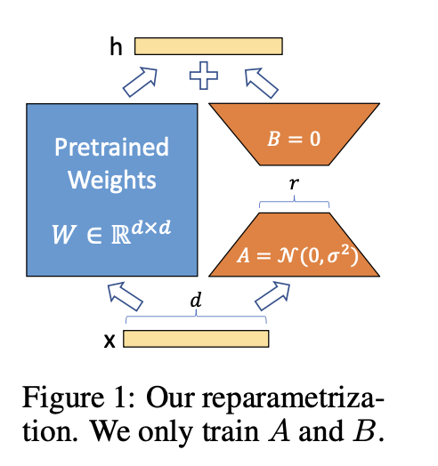

# LoRA: Low-Rank Adaptation of Large Language Models

---

### Abstract

LoRA 冻结了预训练的模型权重，并将可训练的 **秩分解矩阵** 注入（inject）到 Transformer 架构的每一层中，大大减少了下游任务的可训练参数的数量。与使用 Adam 微调的 GPT-3 175B 相比，LoRA 可以将可训练参数数量减少 10,000 倍，GPU 内存需求减少 3 倍.

https://github.com/microsoft/LoRA 上提供 RoBERTa、DeBERTa 和 GPT-2 的实现和模型检查点

 
 
 

### 1. Introduction

1. 在 LoRA之前，适应新的下游任务通过调整学习参数或者学习新任务的外部模块来缓解fine-tuned 全参数的问题。虽然提高了部署时的运行效率，但这会引入推理延迟(inference latency), 并且效果不好
2. [研究1](http://arxiv.org/abs/1804.08838) [研究2](http://arxiv.org/abs/2012.13255) 表明，学习到的过参数化（over-learningover-learned）模型实际上存在于较低的内在维度上。受这些研究启发，**假设模型适应期间权重的变化也具有较低的“内在等级（intrinsic rank）”** 。
3. LoRA 允许我们通过优化适应过程中密集层变化的秩分解矩阵来间接训练神经网络中的一些密集层，同时保持预训练权重冻结，如**图 1 所示**。

LoRA的几个优点：
- 预训练模型可以**共享并用于构建许多用于不同任务的小型LoRA 模块**。我们可以通过替换**图 1** 中的矩阵 𝐴 和 𝐵 来冻结共享模型并高效地切换任务，从而显着降低存储要求和任务切换开销。
- 使用自适应优化器时，LoRA 使训练更加高效，并将硬件进入门槛降低了多达 3 倍，因为我们不需要计算梯度或维护大多数参数的优化器状态。相反，我们**只优化注入的、小得多的低秩矩阵**。
- 我们简单的线性设计使我们能够在部署时将可训练矩阵与冻结权重合并，通过构造，与完全微调的模型相比，**不会引入推理延迟**。

 
 
 

### 2. Problem Statement

在完全微调期间，模型被初始化为预先训练的权重 $\Phi_0$，并通过重复遵循梯度更新为 $\Phi_0+\Delta\Phi $，以最大化条件语言建模目标：

$$\max_{\Phi}\sum_{(x,y)\in\mathcal{Z}}\sum_{t=1}^{|y|}\log\Bigl(P_{\Phi}(y_{t}\mid x,y_{<t})\Bigr)$$

**完全微调的缺点：**
对每个不同的下游任务，都需要重新学习一组新的 $\Delta\Phi$, 并且这里$|\Delta\Phi|$ 的维度是等于 $|\Phi_0|$ 的维度，这意味着参数量很大.

LoRA 通过 使得 $\Delta\Phi=\Delta\Phi(\Theta)$ 获取一个更小的变化参数，其中 $\left|\Theta\right|\ll\left|\Phi_0\right|$， 最小可以达到 $\Delta\Phi_0$ 的 0.01%

 
 

### 3. 

之前的一些工作（make model adaptation more parameter- and compute-efficient. ）也不错。比如在语言建模任务中，**高效adaptation的两种策略：** adding adapter layers  和 optimizing some forms of the input layer activations。 但是，仍然存在局限，特别是在大规模且对延迟敏感的生产场景中。（==很明显这是因为计算量导致的计算效率问题==）

 

- adapter层 会引入 inference latency
  
- prefix tuning 很难优化， 性能在可训练参数中并非单调变化，并且在 prefix tuning中，这个（可训练）前缀占有了 输入序列的部分长度，这就相当于**减少了**用来适应下游任务输入的长度（因为输入长度固定），这样就使得性能收到影响。

 
 

### 4. our method
[Aghajanyan](http://arxiv.org/abs/2012.13255) 表明了，预训练的语言模型具有较低的 “instrisic dimension”，尽管随机投影到较小的子空间，但仍然可以有效地学习。

（换句话说，**也就是预训练语言模型 具有某种程度的冗余**，即使在比较低维度的表示中，也能捕捉到任务相关的关键特征进行有效的学习。）

受此启发，作者也假设 权重的更新在适应过程中也具有较低的“instrisic rank”，将权重矩阵 $W_0$ 通过低秩分解 $W_0 + \Delta W = W_0 + BA$ 来约束更新。

在训练期间， $W_0$ 被冻结并且**不接收**梯度更新，而 A 和 B 包含可训练参数。

LoRA 可以通过调整 秩r 来粗略恢复 full-tuning 的表达能力。

因为 LoRA 计算是通过 $W = W_0 + BA$ 来更新，当切换到其他下游任务， 只要减去 $BA$ ，添加 $B'A'$ 即可。 内存消耗少，推理过程无引入额外延迟。

 
 
 

### 5. Experiments

#### baseline

- **Fine-tuning:** 基本上就是冻结前面参数，微调后面两层的参数，跟full-tuning 差别不大
  
- **Bias-only or BitFit:** 冻结其他内容，只训练 偏差向量
  
- **Prefix-embedding tuning (PreEmbed):** 在输入标记中插入特殊标记。这些特殊标记具有可训练的词嵌入，并且通常不在模型的词汇表中。放置此类令牌的位置可能会对性能产生影响。
  
- **Prefix-layer tuning (PreLayer):** 是 PreEmbed拓展，不只是学习一些特殊标记的词嵌入（或者等效地，嵌入层之后的激活），而是学习每个 Transformer 层之后的激活

- **Adapter tuning:**  在自注意力模块（和MLP模块）和后续的残差连接之间插入适配器层。有两个完全连接的层，其中适配器层存在偏差，中间存在非线性

- **LoRA:** 在自注意力模块（和MLP模块）和后续的残差连接之间插入适配器层。有两个完全连接的层，其中适配器层存在偏差，中间存在非线性

 
 
 

### 6. related work

- 之前的许多低秩工作也表明了，许多庞大参数的神经网络，经过训练后的权重矩阵也是具有低秩的特点。
- low rank adaptation 对于对抗训练很有用

 
 
 

### 7. understand the low rank updates
**提出问题：**
1. 给定参数预算约束，我们应该调整预训练 Transformer 中的哪个权重矩阵子集来最大化下游性能？
2. “最优”适应矩阵 $\Delta W$ 真的是 **'rank-deficient'** 的吗？如果是这样，在实践中使用什么等级比较好？
3. $W$ 和 $\Delta W$ 之间有什么联系？相关度高吗？ $\Delta W$ 与 $W$ 相比有多大？

**注：** 'rank-deficient' 指的是在进行适应（adaptation）过程中，通过引入一个秩缺失矩阵来减少模型参数的数量，从而降低模型的复杂度。

 
 

**问题1:**
- LoRA 只考虑自注意力模块中的 权重矩阵

**问题2:**
- LoRA 在很低的 rank 中已经有很好的效果了。表明了更新矩阵 $\Delta W$ 可能具有非常小的 'intrinsic rank'
- 增加 r 并不能覆盖更有意义的子空间，这表明低秩适应矩阵就足够了。

**补充：** 'intrinsic rank' 通常指的是数据中存在的真实结构或潜在维度的数量。换句话说，是指能够描述数据中所包含信息的有效维度的数量。

**问题3:**
- 没看懂

