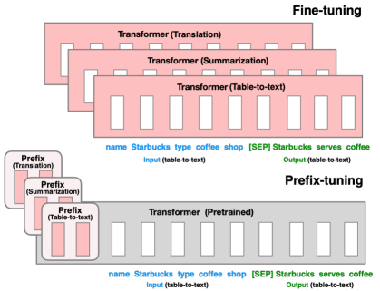
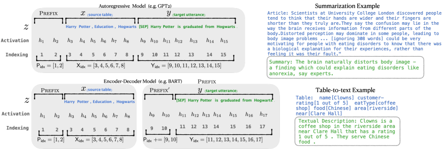
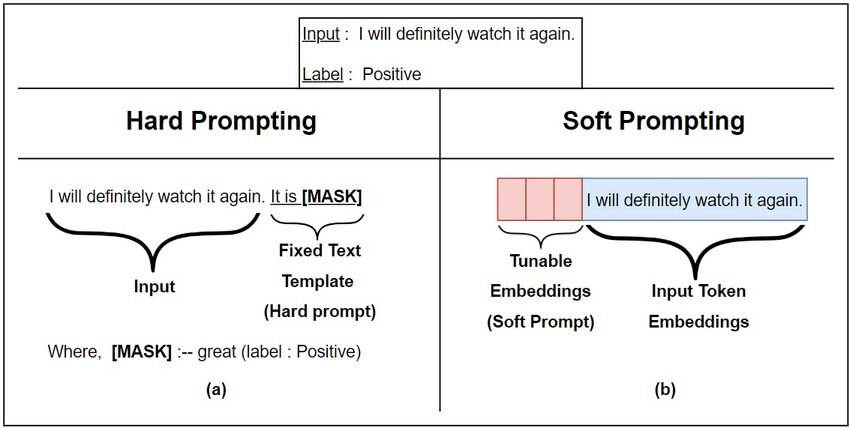
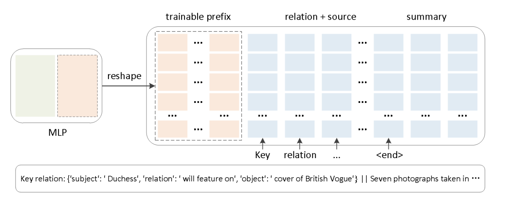
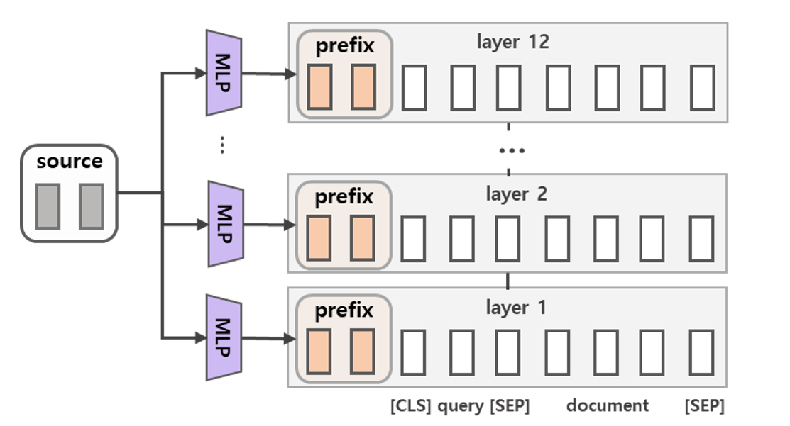

# Prefix-Tuning

[Prefix-Tuning: Optimizing Continuous Prompts for Generation](https://arxiv.org/abs/2101.00190)

---

### 背景

在Prefix Tuning之前的工作主要是人工设计离散的模版或者自动化搜索离散的模版。对于人工设计的模版，模版的变化对模型最终的性能特别敏感，加一个词、少一个词或者变动位置都会造成比较大的变化。而对于自动化搜索模版，成本也比较高；同时，以前这种离散化的token搜索出来的结果可能并不是最优的。（==**其实就是灾难性遗忘的问题**==）

除此之外，**传统的微调范式利用预训练模型去对不同的下游任务进行微调，对每个任务都要保存一份微调后的模型权重，一方面微调整个模型耗时长；另一方面也会占很多存储空间**。

基于上述两点，Prefix Tuning提出固定预训练LM，**为LM添加可训练，任务特定的前缀，这样就可以为不同任务保存不同的前缀，微调成本也小**；同时，这种Prefix实际就是连续可微的Virtual Token（Soft Prompt/Continuous Prompt），相比离散的Token，更好优化，效果更好。

 
 

### 技术原理
Prefix Tuning（论文：Prefix-Tuning: Optimizing Continuous Prompts for Generation），**在输入token之前构造一段任务相关的virtual tokens作为Prefix，然后训练的时候只更新Prefix部分的参数，而PLM中的其他部分参数固定**。

针对不同的模型结构，需要构造不同的Prefix。

- **针对自回归架构模型**：在句子前面添加前缀，得到 z = [PREFIX; x; y]，合适的上文能够在固定 LM 的情况下去引导生成下文（比如：GPT3的上下文学习）。
- **针对编码器-解码器架构模型**：Encoder和Decoder都增加了前缀，得到 z = [PREFIX; x; PREFIX0; y]。Encoder端增加前缀是为了引导输入部分的编码，Decoder 端增加前缀是为了引导后续token的生成。

 

**该方法其实和构造Prompt类似**，只是Prompt是人为构造的“显式”的提示，并且无法更新参数，而Prefix则是可以学习的“隐式”的提示。

 

同时，为了**防止直接更新Prefix的参数导致训练不稳定和性能下降的情况**，在Prefix层前面加了MLP结构，训练完成后，只保留Prefix的参数。

除此之外，通过消融实验证实，**只调整embedding层的表现力不够**，将导致性能显著下降，因此，在每层都加了prompt的参数，改动较大。

---

## 补充

### Prefix实际就是连续可微的Virtual Token（Soft Prompt/Continuous Prompt），相比离散的Token，更好优化，效果更好

**(==上面这句话是什么意思？==)**

这句话是在描述 Prefix-tuning 方法中使用的“前缀”（prefix）的特点。在 NLP 中，传统的 token（如单词或子词）通常是离散的，这意味着它们是固定的、不可微分的元素。在微调预训练模型时，如果直接操作这些离散的 token，会导致优化过程变得复杂，因为梯度无法通过这些固定的 token 流传。
Prefix-tuning 方法引入的“前缀”实际上是一系列连续的、可学习的向量，这些向量被称为“Virtual Token”、“Soft Prompt”或“Continuous Prompt”。这些向量是连续的，因此它们是可微分的，可以直接通过梯度下降等优化算法进行更新。这种连续性使得前缀参数的优化过程更加平滑，更容易找到最优解。
相比传统的离散 token，使用连续可微的 virtual token 有以下优点：
1. **优化更简单**：由于连续向量的可微分性，优化算法可以更直接地更新这些参数，而不需要考虑离散 token 的复杂组合。
2. **更好的性能**：实验结果表明，使用连续的 prefix 可以在某些任务上获得比离散 token 更好的性能，因为它们可以为模型提供更细粒度的任务特定信息。
3. **参数效率**：由于前缀参数的数量通常远小于整个模型的参数数量，因此这种方法在参数效率上更高，可以更快地适应新任务。
总的来说，Prefix-tuning 通过使用连续可微的 virtual token 作为前缀，简化了预训练模型的微调过程，提高了参数效率，并且在实际应用中取得了不错的性能表现。

 
 

### Prefix-tuning是为了解决什么问题提出来的？
Prefix-tuning 是一种用于微调预训练语言模型（如 GPT-2、GPT-3）的技术，它主要旨在解决以下问题：
1. **参数效率问题**：传统的微调方法涉及到更新整个预训练模型的参数，这可能需要大量的计算资源和时间。对于大型模型来说，这种方法在实践上可能不切实际。
2. **灾难性遗忘问题**：当预训练模型在特定任务上进行微调时，它可能会“忘记”之前学到的通用知识，导致在原始预训练任务上的性能下降。
3. **任务间的迁移问题**：在不同的任务之间进行迁移学习时，需要模型能够快速适应新的任务，同时保留旧任务的知识。

为了解决这些问题，Prefix-tuning 提出了一种新的微调方法，它不是更新模型的全部参数，而是只更新模型输入的前缀（prefix）。这个前缀是一个可学习的、与任务相关的向量序列，它被添加到模型的输入序列的开头，作为上下文来引导模型生成或选择输出。
通过这种方式，Prefix-tuning 能够：
- **减少需要训练的参数数量**：只需要优化前缀参数，而不是整个模型，这样可以显著减少训练成本。
- **提高参数效率**：前缀参数为模型提供了任务特定的提示，使得模型能够更加聚焦于当前任务，同时保留预训练时的通用知识。
- **实现任务间的迁移学习**：由于前缀是任务特定的，因此可以为每个任务设计不同的前缀，使得模型能够更好地适应新的任务，同时保留旧任务的知识。

Prefix-tuning 因此提供了一种在保持预训练模型原有能力的同时，快速适应新任务的微调方法，特别适合于资源受限的环境或需要快速适应多个任务场景。
