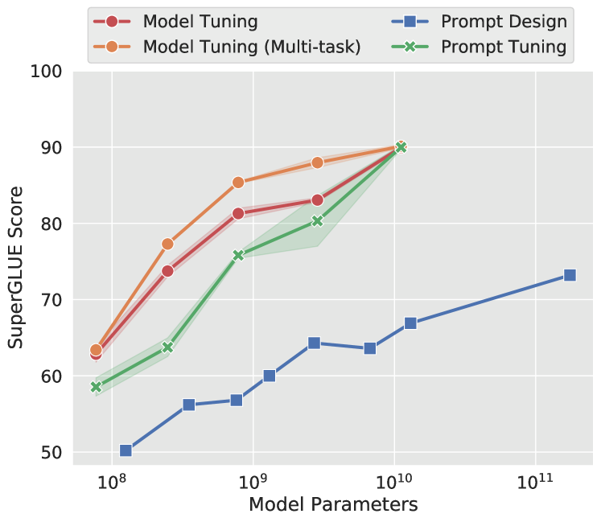

# Prompt Tuning

[The Power of Scale for Parameter-Efficient Prompt Tuning](https://arxiv.org/abs/2104.08691)

---

### 背景

大模型全量微调对每个任务训练一个模型，开销和部署成本都比较高。同时，离散的prompts（指人工设计prompts提示语加入到模型）方法，**成本比较高，并且效果不太好**。

基于此，作者提出了Prompt Tuning，**通过反向传播更新参数来学习prompts，而不是人工设计prompts**；同时冻结模型原始权重，只训练prompts参数，训练完以后，用同一个模型可以做多任务推理。

 
 

### 技术原理

Prompt Tuning（论文：**The Power of Scale for Parameter-Efficient Prompt Tuning**），该方法可以看作是Prefix Tuning的简化版本，它给每个任务定义了自己的Prompt，然后拼接到数据上作为输入，但**只在输入层加入prompt tokens**，并且不需要加入 MLP 进行调整来解决难训练的问题。

**Model tuning** 需要为每个下游任务制作整个预训练模型的特定于任务的副本，并且推理必须分批执行。**Prompt tuning** 只需要为每个任务存储一个小的特定于任务的提示，并使用原始的预训练模型启用混合任务推理。对于 T5“XXL”模型，调整模型的每个副本都需要 110 亿个参数。相比之下，假设提示长度为 5 token，我们调整的提示将只需要每个任务20,480个参数，减少超过5个数量级

 

通过实验发现，**随着预训练模型参数量的增加**，Prompt Tuning的方法会**逼近全参数微调**的结果。

 

同时，Prompt Tuning 还提出了 **Prompt Ensembling**，也就是在一个批次（Batch）里同时训练同一个任务的不同 prompt（**即采用多种不同方式询问同一个问题**），这样相当于训练了不同模型，比模型集成的成本小多了。

除此之外，Prompt Tuning 论文中还探讨了 Prompt token 的初始化方法和长度对于模型性能的影响。通过消融实验结果发现，与随机初始化和使用样本词汇表初始化相比，Prompt Tuning采用类标签初始化模型的效果更好。不过随着模型参数规模的提升，这种gap最终会消失。

Prompt token 的长度在20左右时的表现已经不错（超过20之后，提升Prompt token长度，对模型的性能提升不明显了），同样的，这个gap也会随着模型参数规模的提升而减小（即对于超大规模模型而言，即使 Prompt token 长度很短，对性能也不会有太大的影响）