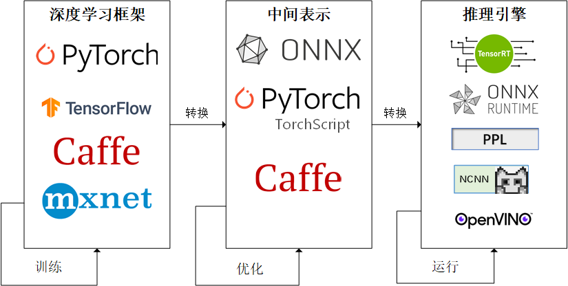

# 模型部署过程

[模型部署入门](https://zhuanlan.zhihu.com/p/477743341)

---

### 主要过程

为了让模型最终能够部署到某一环境上，开发者们可以使用任意一种深度学习框架来定义网络结构，并通过训练确定网络中的参数。之后，模型的结构和参数会被转换成一种只描述网络结构的中间表示，一些针对网络结构的优化会在中间表示上进行。最后，用面向硬件的高性能编程框架（如 CUDA，OpenCL）编写，能高效执行深度学习网络中算子的推理引擎会把中间表示转换成特定的文件格式，并在对应硬件平台上高效运行模型。

---

详细解释将深度学习模型的中间表示（Intermediate Representation, IR）转化为其他硬件能够识别的过程。这个过程通常涉及到以下几个步骤：
### 1. 中间表示（IR）的选择和转换
首先，你需要选择一个中间表示格式，如ONNX、TensorFlow Lite、Core ML等，然后将你的模型（无论是使用TensorFlow、PyTorch、Caffe等框架训练的）转换为这种中间表示。这一步通常可以通过各个框架提供的转换工具来完成。
### 2. 模型优化
一旦模型被转换为中间表示，下一步通常是进行模型优化。这包括算子融合、权重剪枝、量化等，以提高模型的性能和减少资源消耗。**这些优化可以在中间表示的层面上进行，也可以在特定硬件的目标代码生成之前进行**。
### 3. 代码生成和编译
优化后的模型需要被转换为目标硬件平台上的可执行代码。这一步通常涉及到以下操作：
- **图编译**：将优化后的模型图转换为特定硬件上的执行图。这可能涉及到硬件无关的优化，如算子融合和内存布局优化。
- **代码生成**：根据目标硬件平台（如CPU、GPU、FPGA等），生成高效的执行代码。这可能涉及到使用特定于硬件的编译器或工具链。
### 4. 集成和部署
生成的代码需要与目标硬件平台上的运行时环境集成。这可能涉及到与特定硬件相关的库和驱动程序的集成。集成完成后，模型就可以在目标硬件上进行部署和推理了。
### 5. 测试和验证
在目标硬件上部署模型后，需要对其进行测试和验证，以确保模型的性能和准确性符合预期。这可能涉及到性能基准测试和准确性评估。
### 6. 性能监控和调优
在实际运行环境中，可能需要对模型的性能进行监控，并根据需要进行进一步的调优。这可能涉及到对模型或执行代码的调整。

在整个过程中，如果目标硬件是GPU，可能会使用CUDA或OpenCL来生成和优化执行代码。CUDA主要用于NVIDIA GPU，而OpenCL适用于多种类型的GPU和其他并行计算设备。这些工具和API允许开发者编写和优化特定于硬件的代码，以充分利用GPU的并行计算能力。
