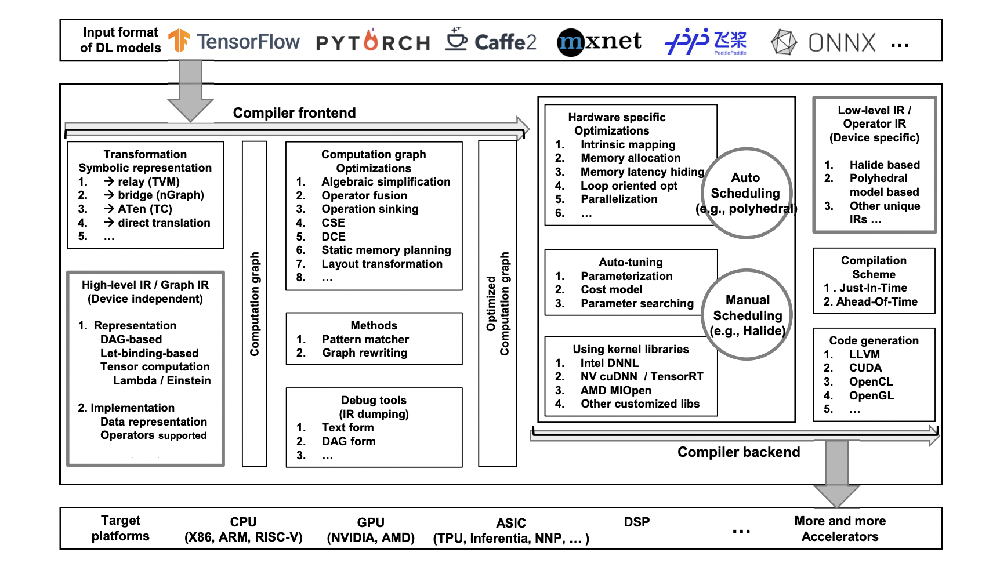

# 深度学习编译系统架构

[The Deep Learning Compiler: A Comprehensive Survey](https://arxiv.org/abs/2002.03794)

[博客: 关于深度学习编译器架构的综述论文](https://www.51fusa.com/client/knowledge/knowledgedetail/id/569.html)

---

 

### 1. 引言
- **深度学习模型部署的挑战**：介绍了深度学习模型在不同硬件上部署的挑战，如GPU、FPGA、ASIC等。
- **深度学习编译器的重要性**：讨论了深度学习编译器在解决这些挑战中的关键作用。
- **论文目标**：综述现有深度学习编译器的设计和性能，为未来研究提供指导。
### 2. 背景
#### 2.1 深度学习框架
- **主流框架**：介绍了TensorFlow、PyTorch、MXNet等主流深度学习框架的特点。
- **框架比较**：比较了这些框架在设计上的优缺点和它们在社区中的地位。
#### 2.2 深度学习硬件
- **硬件分类**：详细解释了深度学习硬件的三种类型：通用硬件、专用硬件和神经形态硬件。
- **硬件特点**：分别讨论了每种硬件的计算特性和代表产品。
#### 2.3 硬件特定深度学习代码生成器
- **FPGA在深度学习中的应用**：探讨了FPGA在深度学习模型部署中的优势。
- **代码生成器**：介绍了FPGA特定的代码生成器及其对深度学习编译器的影响。
### 3. 深度学习编译器的设计架构
#### 3.1 编译器前端
- **功能描述**：解释了编译器前端将模型转换为计算图表示的作用。
- **优化技术**：讨论了前端进行的关键优化技术，如节点级、块级和数据流级优化。
#### 3.2 编译器后端
- **功能描述**：说明了编译器后端将高级IR转换为低级IR并进行硬件特定优化的过程。
- **优化技术**：讨论了后端进行的关键优化技术，如内存分配、内存延迟隐藏、循环优化等。
#### 3.3 中间表示（IR）
- **高级IR和低级IR**：详细介绍了高级IR和低级IR的设计和实现。
- **IR的异同**：讨论了不同编译器中IR的异同，以及它们对编译器性能的影响。
### 4. 深度学习编译器的比较
- **性能评估**：通过定量性能比较，评估了不同深度学习编译器在CNN模型上的性能。
- **比较维度**：比较了端到端性能和每层（卷积层）的性能。
### 5. 未来研究方向
- **动态形状和预/后处理**：讨论了动态模型和复杂预/后处理对编译器的影响。
- **自动调优**：探讨了自动调优技术在编译器中的作用和未来发展方向。
- **多面体模型**：介绍了多面体模型在编译器设计中的潜力。
### 6. 结论
- **现有编译器设计总结**：总结了现有深度学习编译器的设计原则和关键组件。
- **未来研究方向**：指出了未来研究的方向，以促进深度学习编译器领域的发展。
