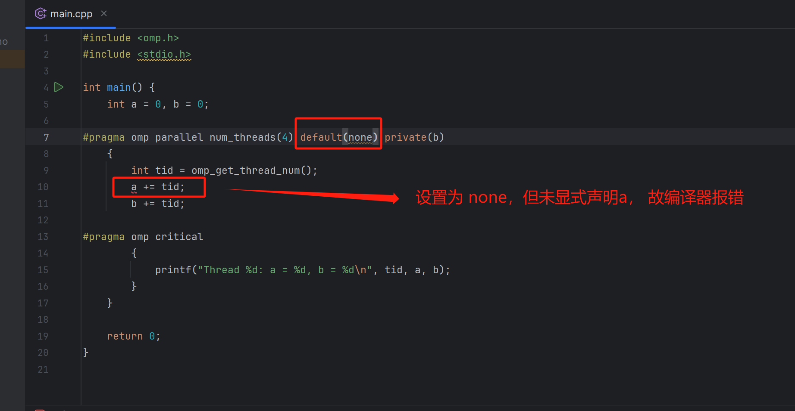

# 本节介绍一下不同的OpenMP指令的使用案例

[1. private 子句](#1private-子句)
[2. firstprivate子句](#2-firstprivate子句)
[3. lastprivate子句](#3-lastprivate子句)
[4. threadprivate子句](#4-threadprivate子句)
[5. shared子句](#5-shared子句)
[6. default子句](#default子句)


---

## 后续发现

^注^ **在OpenMP的并行区域内，使用`std::cout`输出是不被允许的，因为`std::cout`并不是线程安全的。在并行区域内可能会导致输出混乱或其他问题。为了解决这个问题，你可以使用OpenMP提供的线程安全的I/O函数，比如`printf`。**

---

### 1.private 子句
`private` 子句用于将变量声明为**私有变量**，这意味着每个线程都会**拥有其自己的变量实例**，而不会互相干扰。

下面是一个简单的C++程序，演示了如何在OpenMP中使用private子句来创建私有变量：
```cpp{.line-numbers}
#include <iostream>
#include <omp.h>
using namespace std;

int main()
{
    int x = 10; //定义一个共享变量x（即外部变量），初始值为10

#pragma omp parallel private(x) //使用firstprivate指令，把x的值拷贝给每个线程的私有变量
    {
        for (int i = 0; i < 4; ++i) {
            x += i;
            cout << "x = " << x << endl;
        }
    }

    cout << "The value of x in the main thread is " << x << endl; //主线程输出共享变量x的值，不受其他线程的影响
    return 0;
}

```

输出结果如下：（部分节选）
```
x = 62910459
x = 62910462
x = 62910096
x = 62910097
x = 62910099
x = 62910102
x = 62911296
x = 62911297
x = 62911299
x = 62911302
x = 0
x = 1
x = 3
x = 6
The value of x in the main thread is 10
```


**最后一行可以看到全局的 `x` 并没有改变。而里面的局部`x`跟外面的没有关系(即并没有继承共享变量)，因为初始值并不是外部给的`x = 10`**


<br>
<br>
<br>


### 2. firstprivate子句

* **使用原因**：`private` 声明的私有变量**不能继承同名变量的值**，但实际情况中有时需要**继承原有共享变量的值**，OpenMP 提供了 firstprivate 子句来实现这个功能。

* **简介：**`firstprivate`子句用于将**外部(共享)变量**的值传递到并行区域内，同时在并行区域内各个线程都可以**独立**访问和修改这个值。
 
下面是一个简单的C++程序，演示了如何在OpenMP中使用`firstprivate`子句：

```c++{.line-numbers}
#include <iostream>
#include <omp.h>
using namespace std;

int main()
{
    int x = 10; //定义一个共享变量x（即外部变量），初始值为10

    #pragma omp parallel firstprivate(x) //使用firstprivate指令，把x的值拷贝给每个线程的私有变量
    {
        int tid = omp_get_thread_num(); //获取线程的编号
        
        x += tid; //每个线程对私有变量x进行加法操作，加上自己的编号
        
        cout << "Thread " << tid << " has x = " << x << endl; //每个线程输出自己的私有变量x的值
    }
    
    cout << "The value of x in the main thread is " << x << endl; //主线程输出共享变量x的值，不受其他线程的影响
    return 0;
}

```

输入结果如下：
```
Thread 0 has x = 10
Thread 1 has x = 11
Thread 2 has x = 12
Thread 3 has x = 13
The value of x in the main thread is 10
```

可以看到 原来的 外部变量x 并没有发生变化，任然是10


<br>
<br>
<br>


### 3. lastprivate子句
有时在并行区域内的私有变量的值经过计算后，**在退出并行区域时，需要将它的值赋给同名的共享变量**。前面的 `private` 和 `firstprivate` 子句在退出并行区域时都没有将私有变量的**最后取值**赋给对应的共享变量

```cpp{.line-numbers}
int main()
{
    int x = 10;

//使用lastprivate子句，把每个线程的私有变量x的最后一个值赋给共享变量x 
#pragma omp parallel for firstprivate(x), lastprivate(x)    //（带上firstprivate 是为了继承同名变量x）
    for (int i = 0; i < 4; i++)
    {
       x += i;
       cout << "x = " << x << endl;
    }

    cout << "last x = " << x <<endl;   

    return 0;
}
```

输出结果如下:
```
x = 10
x = 11
x = 12
x = 13
last x = 13
```
如果没有 `lastprivate`，那么这里的 `last x` 应该还是 10; 有`lastprivate`所以最终拿到的最后一次分配线程的值


<br>
<br>
<br>


### 4. threadprivate子句

`threadprivate`指令是用来指定一个全局变量或者静态变量，在每个线程中都有一个副本，**这样每个线程就可以使用自己的变量**，而不会影响其他线程的变量。

```cpp{.line-numbers}
#include <iostream>
#include <omp.h>
using namespace std;

int x = 10; //定义一个全局变量x
#pragma omp threadprivate(x) //使用threadprivate指令，把x声明为每个线程的私有变量

void foo() //定义一个函数foo，用来修改x的值
{
    int tid = omp_get_thread_num(); 
    x += tid; 
    cout << "Thread " << tid << " has x = " << x << endl; //每个线程输出自己的私有变量x的值
}


int main()
{
    #pragma omp parallel //定义一个并行区域
    {
        foo(); //每个线程调用foo函数
    }
    cout << "The value of x in the main thread is " << x << endl; //主线程输出全局变量x的值，不受其他线程的影响
    return 0;
}

```

输出结果如下：
```
Thread 0 has x = 10
Thread 1 has x = 11
Thread 2 has x = 12
Thread 3 has x = 13
The value of x in the main thread is 10

```

**注：** 看到这里有人或许会疑惑 `threadprivate` 跟 `firstprivate` 的效果是不一样吗？

* 但其实是不一样的，`firstprivate` 是在**一个并行区域内**，把一个共享变量的值 **复制** 给每个线程的私有变量。而 `threadprivate` 是在**整个程序的生命周期内**，把一个全局变量或者静态变量 **声明** 为每个线程的私有变量
<br>

* `firstprivate` 的私有变量在**并行区域结束后**就会被销毁，而 `threadprivate` 的私有变量在不同的并行区域之间可以保持一致。
<br>

* `firstprivate` 更适合用于需要一个**初始值**的私有变量，而 `threadprivate` 更适合用于需要在**多个并行区域之间共享**的私有变量

**举例：**
```cpp{.line-numbers}
#include <iostream>
#include <omp.h>
using namespace std;

int x = 10; //定义一个全局变量x，

void foo() //定义一个函数foo，用来修改x的值
{
    cout << "foo" <<endl;
    int tid = omp_get_thread_num(); 
    x += tid; 
    cout << "Thread " << tid << " has x = " << x << endl; //每个线程输出自己的私有变量x的值
}

void foo2() 
{
    cout << "foo2" <<endl;
    int tid = omp_get_thread_num(); 
    x += tid; 
    cout << "Thread " << tid << " has x = " << x << endl; 
}


int main()
{
#pragma omp parallel firstprivate(x)
    {
        foo(); //每个线程调用foo函数
        foo2();
    }
    cout << "The value of x in the main thread is " << x << endl; //主线程输出全局变量x的值
    return 0;
}


```

输出结果如下：（部分节选，**这部分结果是错误演示**！！！）
```
foofoo
foo
Thread foo
Thread 5 has x = foo
Thread 7 has x = 49
foo2
Thread 7 has x = 56
foo
Thread 13 has x = 69
foo2
Thread 13 has x = 82

···
···

foo2
Thread 6 has x = 387
Thread 3 has x = 387
foo2
Thread 3 has x = 390
Thread 15 has x = 390
Thread 0 has x = 390
Thread 14 has x = 390
The value of x in the main thread is 390

Process finished with exit code 0

```
这里出现了一个**bug**，可以看到 `firstprivate` 中的私有变量 `x` 是**一直在累加的**，`foo()` 和 `foo2()` 用的是同一个共享变量`x`，这里的原因是因为 `x` 是实参，全局参数，`foo()` 和 `foo2()` 中的`x` 操作一直在累加导致全局的 `x`变了

**再次修改代码：**
```cpp{.line-numbers}
#include <iostream>
#include <omp.h>
using namespace std;

int x = 10; 

void foo(int x) //（！！！加入了形参，避免了修改x的bug）
{
    cout << "foo" <<endl;
    int tid = omp_get_thread_num(); 
    x += tid; //每个线程对私有变量x进行加法操作，加上自己的编号
    cout << "Thread " << tid << " has x = " << x << endl; //每个线程输出自己的私有变量x的值
}

void foo2(int x) 
{
    cout << "foo2" <<endl;
    int tid = omp_get_thread_num(); 
    x += tid; 
    cout << "Thread " << tid << " has x = " << x << endl; 
}


int main()
{

#pragma omp parallel firstprivate(x)//定义一个并行区域
    {
        foo(x); //每个线程调用foo函数
        foo2(x);
    }
    cout << "The value of x in the main thread is " << x << endl; //主线程输出全局变量x的值，不受其他线程的影响
    return 0;
}

```

输出结果如下：（部分节选，**正确演示**）
```cpp{.line-numbers}

foofoo
foo
Thread foo
Thread 11 has x = 21
foo2
foo
Thread 4 has x = 14
foo2
Thread 4 has x = 14
foo
Thread 2 has x = 12

···
···

foo2
Thread 3 has x = fooThread 14 has x = 24
foo2
13
Thread 14 has x = 24

Thread 6 has x = 16
foo2
Thread 6 has x = 16
The value of x in the main thread is 10

Process finished with exit code 0

```

在输出结果的6~9行，可以看到在 `firstprivate` 中，**同一个并行区域，每个线程都是独立的**，所以值相同


<br>
<br>
<br>


### 5. shared子句

**shared 子句用来声明一个 或 多个变量是共享变量**

下面是一个简单的C++程序，演示了如何在OpenMP中使用 `shared` 子句：

```cpp{.line-numbers}
#include <iostream>
#include <omp.h>

int main() {
    int sharedVariable = 0;

#pragma omp parallel shared(sharedVariable)
    {
        // 所有线程共享同一个 sharedVariable
#pragma omp for
        for (int i = 0; i < 5; ++i) {
            // 多个线程并发执行这个循环
            sharedVariable += i;
            std::cout << "Thread " << omp_get_thread_num() << ": sharedVariable = " << sharedVariable << std::endl;
        }
    }

    std::cout << "After parallel region: sharedVariable = " << sharedVariable << std::endl;

    return 0;
}
```
在这个例子中，`sharedVariable` 被声明为 `shared`，**这意味着在并行区域内的所有线程都共享同一个 `sharedVariable`**。各个线程并发地对其进行操作，因此你可能会看到**输出的顺序是不确定的**。最终，在并行区域结束后，`sharedVariable` 的值会反映所有线程对它进行的累加操作。


**执行结果如下：**
```
Thread 1: sharedVariable = 10
Thread 3: sharedVariable = 10
Thread 4: sharedVariable = 10
Thread 0: sharedVariable = 10
Thread 2: sharedVariable = 10
After parallel region: sharedVariable = 10   //并行域结束后的结果
```
^注^需要注意的是，在并行区域内使用共享变量时，**如果存在写操作**，必须对共享变量加以保护，否则不要轻易使用共享变量，尽量将共享变量的访问转化为私有变量的访问。（**这里的演示并没有加保护**）


<br>
<br>
<br>


### 6. default子句

**`default` 子句用来允许用户控制并行区域中变量的共享属性。有 `none` 和 `shared` 两种**

* **`none`**: 默认共享性为 none, 未显式声明共享性的变量会引发编译器的错误 
  


* **`shared`**: 默认共享性为 shared，未显式声明共享性的变量 将默认为共享

<br>

（*^注*^开始纠错 `cout`带来的错误，这里开始下面的全用 C 编写*）

**下面是一个C写的 `none` 属性的 `default` 子句程序：**

```C{.line-numbers}
#include <omp.h>
#include <stdio.h>

int main() {
    int a = 0, b = 0;

#pragma omp parallel num_threads(4) default(none) shared(a) private(b)
    {
        int tid = omp_get_thread_num();
        a += tid;
        b += tid;

#pragma omp critical
        {
            printf("Thread %d: a = %d, b = %d\n", tid, a, b);
        }
    }

    return 0;
}


```


**执行结果如下：** (果然 cout 不是 I/O 安全的)
```
Thread 0: a = 0, b = 0
Thread 3: a = 6, b = 1486879779
Thread 1: a = 6, b = 281615849
Thread 2: a = 6, b = 1486879658
```
采用 `none` 属性的 `default`，表示共享性为 `none`, 这意味着 并行区域中 **未显式声明** 共享性的变量将会引发编译器错误。这里的 `a` 是显式声明为 `shared`，`b`声明为 `private`，所有变量都声明了，故不报错。

* 从上面结果可以看到，共享的 `a` 与 外部的 `a = 0`共享一个`a`, 最终根据代码中的逻辑累加起来了;

* 而 `b` 没有累加正确，因为他是 `private` 的，跟外部变量 `b = 0` 隔离了，而是一个局部的 `b`, 故值是随机的。

<br>
<br>


**下面是一个C写的 `shared` 属性的 `default` 子句程序：**
```c{.line-numbers}
#include <omp.h>
#include <stdio.h>

int main() {
    int a = 0, b = 0;

#pragma omp parallel num_threads(4) default(shared) private(b)
    {
        int tid = omp_get_thread_num();
        a += tid;
        b += tid;

#pragma omp critical
        {
            printf("Thread %d: a = %d, b = %d\n", tid, a, b);
        }
    }

    return 0;
}

```

**执行结果如下：**
```
Thread 1: a = 1, b = -673187807
Thread 2: a = 6, b = -673187686
Thread 0: a = 6, b = 0
Thread 3: a = 6, b = -673187565
```

这里声明了 b 是 private的，没有声明a，但是我的default的属性是 shared，这意味着并行着并行去中 **未显示声明共享性的变量**都默认设置为**共享**


如果b也不声明，也就是上面代码第七行改为:
```C
#pragma omp parallel num_threads(4) default(shared)
```

则执行结果为：

```
Thread 0: a = 0, b = 0
Thread 3: a = 6, b = 6
Thread 1: a = 6, b = 6
Thread 2: a = 6, b = 6
```


<br>
<br>
<br>


### 7. reduction子句

**`reduction` 子句用于执行归约操作，将多个线程的部分结果合并为一个最终结果。**

以下是一个简单的OpenMP示例，演示了使用reduction子句来计算数组元素的总和：
```c
#include <omp.h>
#include <stdio.h>

#define ARRAY_SIZE 100

int main() {
    int sum = 0;
    int array[ARRAY_SIZE];

    // Initialize the array
    for (int i = 0; i < ARRAY_SIZE; ++i) {
        array[i] = i + 1;
    }

    // Use reduction to calculate the sum of array elements (core)
    #pragma omp parallel for reduction(+:sum)
    for (int i = 0; i < ARRAY_SIZE; ++i) {
        sum += array[i];
    }

    printf("Sum: %d\n", sum);

    return 0;
}

```

**执行结果如下：**
```
Sum: 5050
```

在这个例子中，我们使用`#pragma omp parallel for reduction(+:sum)`来并行计算数组元素的总和。`reduction(+:sum)`指定了一个归约操作，**它将每个线程的局部变量 sum 的值相加**，并将结果存储在全局变量 sum 中。

<br>

* **这里发现一个问题，就是将 `reduction(+:sum)` 换成 `reduction(-:sum)` 结果居然是一样的**

**原因** ：由于数组元素是按顺序递增的！**最终还是看for循环里面的操作**

**具体解析如下：**
    让我们考虑一个简单的数组，其中的元素是按照顺序递增的：

```c
int array[] = {1, 2, 3, 4, 5};
int sum = 0;
int difference = 0;

#pragma omp parallel for reduction(+:sum) reduction(-:difference)
for (int i = 0; i < 5; ++i) {
    sum += array[i];
    difference -= array[i];
}

printf("Sum: %d\n", sum);
printf("Difference: %d\n", difference);
```

在这个例子中，我们同时使用了加法归约（`reduction(+:sum)`）和减法归约（`reduction(-:difference)`）来计算数组元素的总和和差。

由于数组元素 `{1, 2, 3, 4, 5}` 是按顺序递增的，每个线程在循环中计算的 `sum` 和 `difference` 分别是：

- 线程1：sum += 1, difference -= 1
- 线程2：sum += 2, difference -= 2
- 线程3：sum += 3, difference -= 3
- 线程4：sum += 4, difference -= 4
- 线程5：sum += 5, difference -= 5

在并行区域结束时，`sum` 的最终结果是 `1 + 2 + 3 + 4 + 5`，即数组元素的总和。而 `difference` 的最终结果是 `-(1 + 2 + 3 + 4 + 5)`。

由于数组元素是按顺序递增的，`1 + 2 + 3 + 4 + 5` 的和等于 `-(1) - (2) - (3) - (4) - (5)` 的差，因此 `sum` 和 `difference` 的最终结果是相反的。

这种情况下结果相反的原因是数组元素的性质使得减法的归约结果与加法的归约结果相等。在一般情况下，对于不同的数据分布或操作，加法和减法的归约结果可能是不同的。


<br>
<br>
<br>


### 8. copyin子句

* **`copyin`子句用来将主线程中`threadprivate`变量的值拷贝到执行并行区域的各个线程的`threadprivate`变量中，便于线程可以访问主线程中的变量值**

* `copyin` 中的参数必须被声明成 `threadprivate` 的，对于类类型的变量，必须带有明确的拷贝赋值操作符


以下是一个简单的OpenMP示例，演示了使用`copyin`子句

```C{.line-numbers}
#include <omp.h>
#include <stdio.h>

int shared_var = 5; // This is the master thread's initial value

// Declare a thread-private variable
#pragma omp threadprivate(shared_var)

int main() {


#pragma omp parallel num_threads(4) copyin(shared_var) 
    {
        // Each thread has its own private copy of shared_var
        int tid = omp_get_thread_num();
        printf("Thread %d: Initial shared_var = %d\n", tid, shared_var);

        // Each thread modifies its private copy of shared_var
        shared_var += tid;

        printf("Thread %d: Modified shared_var = %d\n", tid, shared_var);
    }

    // After the parallel region, shared_var retains its master thread's initial value
    printf("After parallel region: shared_var = %d\n", shared_var);

    return 0;
}


```

**执行结果如下：**
```
Thread 1: Initial shared_var = 5
Thread 1: Modified shared_var = 6
Thread 2: Initial shared_var = 5
Thread 2: Modified shared_var = 7
Thread 0: Initial shared_var = 5
Thread 0: Modified shared_var = 5
Thread 3: Initial shared_var = 5
Thread 3: Modified shared_var = 8
After parallel region: shared_var = 5
```

```C
#pragma omp parallel num_threads(4) copyin(shared_var) default(none)
```
* 如果加入 default(none) 结果 也没啥变化
