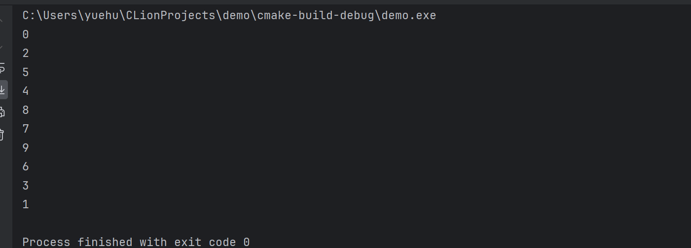
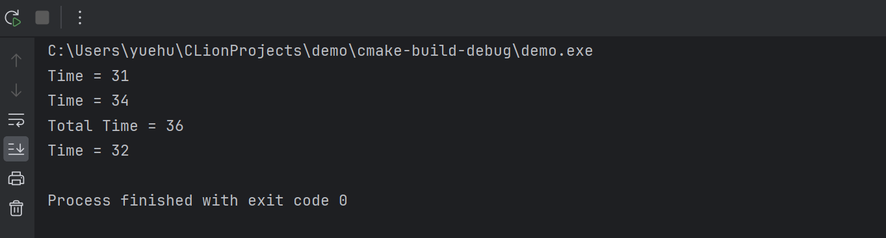

# OpenMP并行程序设计(一)
---

在win11中，使用CLion配置 `OpenMP`环境，需要在`CMakeLists.txt` 中配置如下内容：

```cmake{.line-numbers}
# openMP 配置
FIND_PACKAGE(OpenMP REQUIRED)
if (OPENMP_FOUND)
    message("OPENMP FOUND")
    set(CMAKE_C_FLAGS "${CMAKE_C_FLAGS} ${OpenMP_C_FLAGS}")
    set(CMAKE_CXX_FLAGS "${CMAKE_CXX_FLAGS} ${OpenMP_CXX_FLAGS}")
endif ()
```

然后直接引用 `#include<omp.h>` 即可

<br>

**先看一个简单的OpenMP程序，展现线程顺序**
```c++{.line-numbers}
#include <iostream>
#include "omp.h"

int main() {

#pragma omp parallel for
    for (int i = 0; i < 10; ++i) {
        std::cout << "第" << i << "个线程的 " << "Hello, World!" << std::endl;
    }

    return 0;
}

```

**执行结果：**

<br>

可以看到默认有`9`个不同顺序的线程（==不同的机器是不一样的，这里其实也表明了**并行是不分先后顺序的**==）

<br>


**测试引入OpenMP到`for`循环，变成并行执行，效率是否提升**

```cpp{.line-numbers}
//执行1亿次的测试案例
void test()
{
    int a = 0;
    clock_t t1 = clock();
    for (int i = 0; i < 100000000; ++i) {
        a = a+1;
    }
    clock_t t2 = clock();
    cout << "Time = " << t2 - t1 << endl;

}

//主函数
int main() {

    clock_t t1 = clock();
#pragma omp parallel for default(none)  //这里不加default(none) 会警告，原因是必须加 子句
    for (int i = 0; i < 2; ++i) {
        test();
    }
    clock_t t2 = clock();

    cout << "Total Time = " << t2 - t1 << endl;

    test();

    return 0;
}

```

**执行结果**


<br>

**分析：**
执行两次 1亿 次的 `test()` 函数，时间仅为`36s`，比单独执行一次 `test()` 仅多了 `4s`, 提升了几乎一倍;
<br>
量还是太小了，显示不出多线程的太大优势，**因为引入`OpenMP`指令是需要==额外开销的==**
