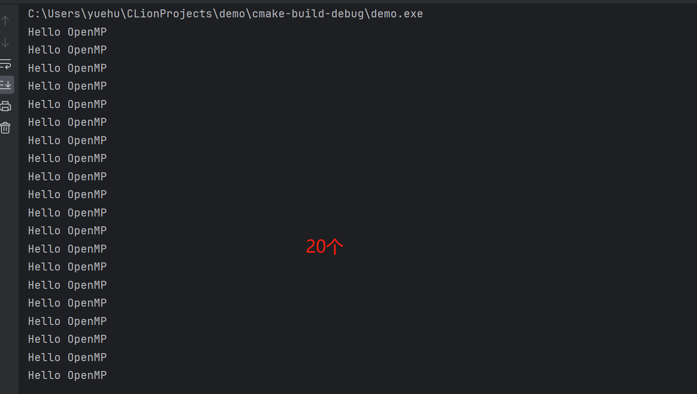
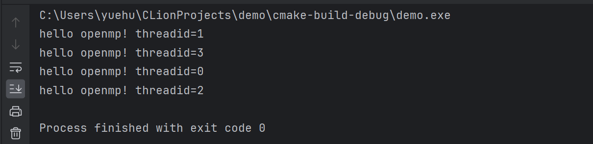
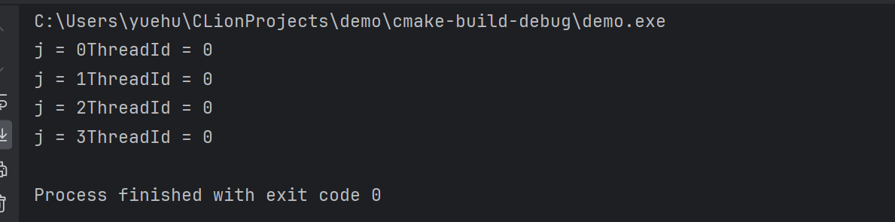
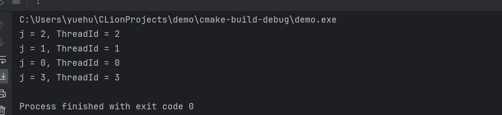
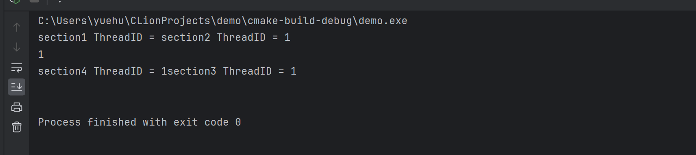
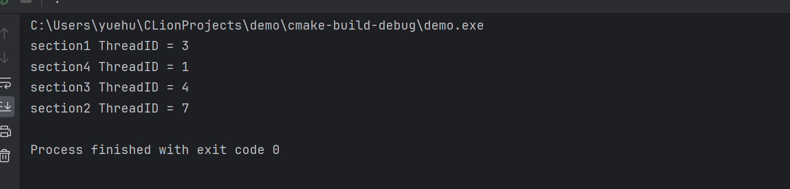
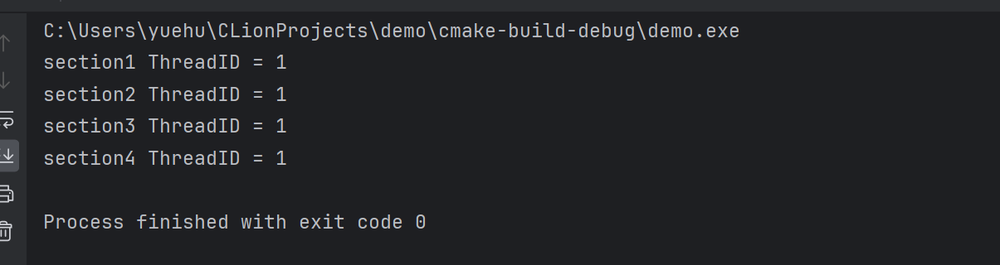
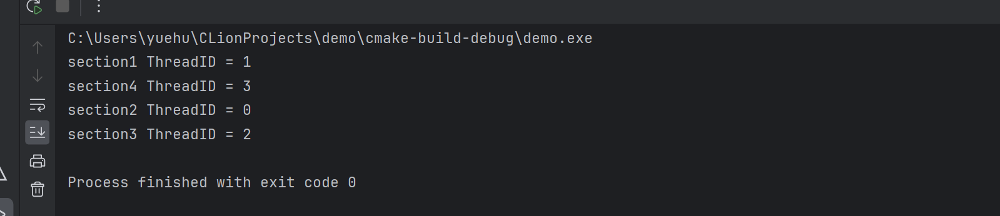

# OpenMP并行程序设计（二）

---
- [OpenMP并行程序设计（二）](#openmp并行程序设计二)
    - [1. fork/join 并行执行模式的概念](#1-forkjoin-并行执行模式的概念)
    - [2. OpenMP指令和库函数](#2-openmp指令和库函数)
      - [#pragma omp parallel private(i, j)](#pragma-omp-parallel-privatei-j)
      - [OpenMP的指令有一下一些](#openmp的指令有一下一些)
      - [OpenMP常用库函数:](#openmp常用库函数)
      - [OpenMP常用子句:](#openmp常用子句)
    - [3. parallel 指令用法](#3-parallel-指令用法)
    - [4. for指令的使用方法](#4-for指令的使用方法)
    - [5. sections 和 section 指令的用法](#5-sections-和-section-指令的用法)


### 1. fork/join 并行执行模式的概念
    OpenMP 是一个编译器指令和库函数的集合，主要是为共享式存储计算机上的并行程序设计使用的。

上一次写的 `OpenMP` 不难发现，**`OpenMP` 并行执行的程序** 需要全部执行完，才能执行**其他非并行部分**的代码。
这就是 ==**fork/join**== 并行执行模式


 **fork/join模式执行代码的基本思想**：程序开始时叧有一个主线程，程序中的**串行部分**都由主线程执行，**并行
的部分**是通过派生其他线程来执行，但是如果并行部分没有结束时是不会执行串行部分的

如 [并行程序设计(一)](./并行程序设计（一）.md) 中提到的for循环：

```cpp{.line-numbers}
//主函数
int main() {

    clock_t t1 = clock();
#pragma omp parallel for
    for (int i = 0; i < 2; ++i) {
        test();
    }
    clock_t t2 = clock();

    cout << "Total Time = " << t2 - t1 << endl;

    test();

    return 0;
}

```
<br>

在没有执行完 `for` 循环中的代码之前，后面**第9行**的 `clock_t t2 = clock();` 这行代码是==不会执行的==，如果和调用线程创建函数相比，它相当亍**先创建线程，并等待线程执行完**，所以这种并行模式中在主线程里创建的线程**并没有和主线程**并行运行

<br>

### 2. OpenMP指令和库函数
下面来介绍 OpenMP 的基本指令和常用指令的用法，在 `C/C++`中，`OpenMP` 指令使用的**格式**为
`＃pragma omp 指令 [子句[子句]…]`
<br>

前面提到的 `parallel for` 就是一条指令，有些书中也将 `OpenMP` 的 **“指令”** 叫做 **“编译指导语句”**，后面的子句
是可选的。例如：
#### #pragma omp parallel private(i, j)

`parallel` 就是指令， `private` 是子句
为叙述方便把包含 `#pragma` 和 `OpenMP 指令`的一行叫做语句，如上面那行叫 `parallel` 语句。

<br>

#### OpenMP的指令有一下一些
**`parallel`**，用在一个代码段之前，表示这段代码将被多个线程并行执行
$\quad$
**`for`**，用亍 for 循环之前，将循环分配到多个线程中并行执行，必须保证每次循环之间无相关性。
$\quad$
**`parallel for`**， parallel 和 for 语句的**结合**，也是用在一个 for 循环之前，表示 for 循环的代码将**被多个线程并行执行**。
$\quad$
**`sections`**，用在**可能会被并行执行**的代码段之前
$\quad$
**`parallel sections`**，parallel 和 sections 两个语句的结合
$\quad$
**`critical`**，用在一段**代码临界区**之前
$\quad$
**`single`**，用在一段只被单个线程执行的代码段之前，**表示后面的代码段将被单线程执行**。
$\quad$
**`barrier`**，用于并行区内代码的**线程同步**，所有线程执行到 barrier 时要停止，**直到所有线程**都执行到 barrier 时才继续往下执行。
$\quad$
**`atomic`**，用于指定一块**内存区域被制动更新**, 避免竞态条件(race condition)
$\quad$
**`master`**，用于指定一段代码块**由主线程执行**
$\quad$
**`ordered`**， 用于指定**并行区域的循环按顺序执行**
$\quad$
**`threadprivate`**, 用于指定一个变量是**线程私有**的。

<br>

#### OpenMP常用库函数:
**`omp_get_num_procs`**, 返回运行本线程的多处理机的处理器个数。
$\quad$
**`omp_get_num_threads`**, 返回当前并行区域中的活动线程个数。
$\quad$
**`omp_get_thread_num`**, 返回线程号
$\quad$
**`omp_set_num_threads`**, 设置并行执行代码时的线程个数
$\quad$
**`omp_init_lock`**, 初始化一个简单锁
$\quad$
**`omp_set_lock`**， 上锁操作
$\quad$
**`omp_unset_lock`**， 解锁操作，要和 `omp_set_lock` 函数配对使用。
$\quad$
**`omp_destroy_lock`**， **`omp_init_lock`** 函数的配对操作函数，关闭一个锁


<br>

#### OpenMP常用子句:

**`private`**, 指定每个线程都有它自己的变量私有副本。

**`firstprivate`**，指定每个线程都有它自己的**变量私有副本**，并且变量要被继承主线程中的初值。

**`lastprivate`**，主要是用来指定将线程中的**私有变量的值**在并行处理结束后**复制回主线程**中的对应变量。

**`reduce`**，用来指定一个或多个变量是**私有的**，并且在并行处理结束后这些变量要**执行指定的运算**。

**`nowait`**，忽略指定中**暗含**的等待

**`num_threads`**，指定线程的个数

**`schedule`**，指定如何调度 `for` 循环迭代

**`shared`**，指定一个戒多个变量为多个线程间的共享变量

**`ordered`**，用来指定 `for` 循环的执行要按顺序执行

**`copyprivate`**，用于 `single` 指令中的指定变量为多个线程的共享变量

**`copyin`**，用来指定一个 threadprivate 的变量的值要用主线程的值迚行刜始化。

**`default`**，用来指定并行处理区域内的变量的使用方式，缺省是 shared


<br>

### 3. parallel 指令用法

**`parallel` 是用来构造一个并行块的，也可以使用其他指令如 `for`、`sections` 等和它配合使用**。

在 C/C++中，`parallel` 的使用方法如下：
```c++{.line-numbers}
#pragma omp parallel [for | sections] [子句[子句]…]
{
    //code
}
```

**`parallel` 后面要跟 一个大括号 对将要执行 并行的代码括起来**
```cpp{.line-numbers}
void main(int argc, char *argv[]) {
    #pragma omp parallel
    {
        printf(“Hello, World!\n”);
    } 
}
```

**执行上述代码的结果：**


说明了有`20`个线程 执行了`parallel` 中的代码

<br>

**指定使用多少个线程来执行，需要使用`num_threads()`子句**
```cpp{.line-numbers}
int main() {

#pragma omp parallel num_threads(4)
    {
        cout << "hello openmp! threadid=" << omp_get_thread_num()<<endl;
    }
    return 0;
}

```
**执行上述代码的结果：**


可以看到他们线程的执行顺序并不是固定的, 并且可以看到 `cout << "hello openmp! threadid=" << omp_get_thread_num()<<endl;` ==被重复执行了== `4`次，说明parallel为这段代码创建了多个线程来重复执行这段代码。
**和传统的创建线程函数比起来，相当于为一个线程入口函数==重复调用创建==线程函数来创建线程并等待线程执行完。**


### 4. for指令的使用方法

**`for` 指令则是用来将一个 `for` 循环分配到多个线程中执行。`for` 指令一般可以和 `parallel` 指令合起来形成 `parallel for` 指令使用，也可以单独用在 `parallel` 语句的并行块中。**

在 C/C++中，`for` 的使用方法如下：
```cpp{.line-numbers}
#pragma omp [parallel] for [子句]
    for(i=0; i < n; i++)
```

单独使用 `for`是什么效果？
```cpp{.line-numbers}
int main() {

    int j = 0;
#pragma omp for
    for ( j = 0; j < 4; j++ ){
        cout << "j = " << j << "ThreadId = " << omp_get_thread_num() << endl;
    }

    return 0;
}

```
上述代码执行结果：


可以发现根本就没效果, 4次执行都在同一个线程里，故`for` 必须搭配 `parallel` 使用

以下是 `parallel for` 的使用：
```cpp{.line-numbers}
int main() {

    int j = 0;
#pragma omp parallel for
    for ( j = 0; j < 4; j++ ){
        cout << "j = " << j << ", ThreadId = " << omp_get_thread_num() << endl;
    }

    return 0;
}
```


第二种写法：(拆开来写，但是`parallel`需要单独一个`{ }`)
```cpp{.line-numbers}
int main() {

    int j = 0;
#pragma omp parallel
    {
#pragma omp for
        for ( j = 0; j < 4; j++ ){
            cout << "j = " << j << ", ThreadId = " << omp_get_thread_num() << endl;
        }
    };


    return 0;
}
```

<br>


### 5. sections 和 section 指令的用法
**`section` 是用在 `sections` 语句里, 用来将 `sections` 语句里的代码划分成几个不同的段，每段都并行执行。**

在 C/C++中，`section` 的使用方法如下：
```cpp{.line-numbers}
#pragma omp [parallel] sections [子句] 
{
    #pragma omp section
    {
        //代码块
    } 
}
```

`sections` 的使用示例：(==需要注意的是==，`section`句子是没有`parallel`的)
```cpp{.line-numbers}
int main() {

#pragma omp parallel sections
    {
    #pragma omp  section
            cout << "section1 ThreadID = " << omp_get_thread_num() <<endl;
    #pragma omp  section
            cout << "section2 ThreadID = " << omp_get_thread_num() <<endl;
    #pragma omp  section
            cout << "section3 ThreadID = " << omp_get_thread_num() <<endl;
    #pragma omp  section
            cout << "section4 ThreadID = " << omp_get_thread_num() <<endl;

    }
    return 0;
}
```


**这里有个惊讶的发现：没有线程保护的话，可能==输出的所有都是乱的==**


再执行一次，正确执行结果如下：



第二种写法：（即拆分`OpenMP`句子）
```cpp{.line-numbers}
int main() {

#pragma omp parallel
    {
        #pragma omp sections
        {
            #pragma omp  section
                        cout << "section1 ThreadID = " << omp_get_thread_num() <<endl;
            #pragma omp  section
                        cout << "section2 ThreadID = " << omp_get_thread_num() <<endl;
            #pragma omp  section
                        cout << "section3 ThreadID = " << omp_get_thread_num() <<endl;
            #pragma omp  section
                        cout << "section4 ThreadID = " << omp_get_thread_num() <<endl; 
        }
        

    }
    return 0;
}
```

第二种写法的结果：



可以看到线程可以同步使用的，不知道是不是存在 **数据竞争**

如果是多`sections`模块进行执行，那么它们之间是串行执行的


