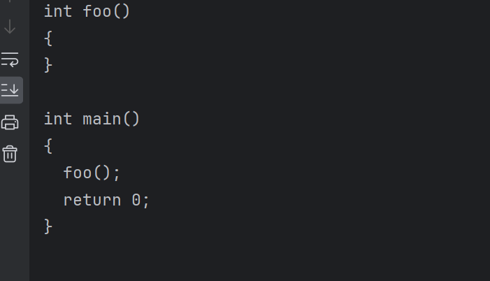

# pycparser: *c-to-c.py*

---
**说明：**

    Example of using pycparser.c_generator, serving as a simplistic translator 
    from C to AST and back to C.
    也就是说，只是将C代码变成 AST，然后再变成C代码的这样一个过程


<br>
<br>
<br>


**示例代码：**

```python{.line-numbers}
import sys
sys.path.extend(['.', '..'])

from pycparser import parse_file, c_generator


def translate_to_c(filename):
    """ Simply use the c_generator module to emit a parsed AST.
    """
    ast = parse_file(filename, use_cpp=False)
    generator = c_generator.CGenerator()
    print(generator.visit(ast))


if __name__ == "__main__":

    # print(sys.argv[0])
    if len(sys.argv) > 1:
        translate_to_c(sys.argv[1])
    else:
        print("Please provide a filename as argument")

```

<br>
<br>
<br>

**文件目录类似于**
* example
    - c_file
      - basic.c
      - funky.c
      - ...
    - c-to-c.py
    - ...

`basic.c` 详情如下：
```c{.line-numbers}
int foo() {}

int main() {
  foo();
  return 0;
}
```

按照代码，需要配置参数 或者执行 python c-to-c.py c_file/basic.c

<br>
<br>
<br>

**运行结果如下：**


还是有点差异的，特别是 `{}` 的位置，都是单独占一行，而不是第一个与代码同一行