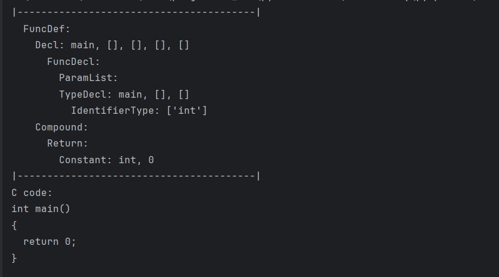

# pycparser: *construct_ast_from_scratch.py*

---
**说明：**

    Tiny example of writing an AST from scratch to C code.
    从零开始编写 AST 到 C 代码的小例子。


<br>
<br>
<br>


**示例代码：**
```python{.line-numbers}
import sys

# This is not required if you've installed pycparser into
# your site-packages/ with setup.py
sys.path.extend(['.', '..'])

from pycparser import c_ast, c_generator


# target C code:
# int main() {
#     return 0;
# }

# 从零开始编写 AST 到 C 代码的小例子。
def empty_main_function_ast():
    constant_zero = c_ast.Constant(type='int', value='0')
    return_node = c_ast.Return(expr=constant_zero)
    compound_node = c_ast.Compound(block_items=[return_node])
    type_decl_node = c_ast.TypeDecl(declname='main', quals=[],
                                    type=c_ast.IdentifierType(names=['int']),
                                    align=[])
    func_decl_node = c_ast.FuncDecl(args=c_ast.ParamList([]),
                                    type=type_decl_node)
    func_def_node = c_ast.Decl(name='main', quals=[], storage=[], funcspec=[],
                               type=func_decl_node, init=None,
                               bitsize=None, align=[])
    main_func_node = c_ast.FuncDef(decl=func_def_node, param_decls=None,
                                   body=compound_node)

    return main_func_node


def generate_c_code(my_ast):
    generator = c_generator.CGenerator()
    return generator.visit(my_ast)


if __name__ == '__main__':
    main_function_ast = empty_main_function_ast()
    print("|----------------------------------------|")
    main_function_ast.show(offset=2)
    print("|----------------------------------------|")
    main_c_code = generate_c_code(main_function_ast)
    print("C code: \n%s" % main_c_code)

```


<br>
<br>
<br>


**运行结果如下：**
