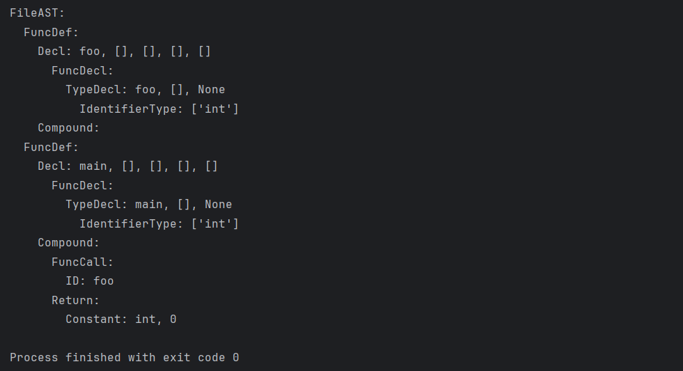
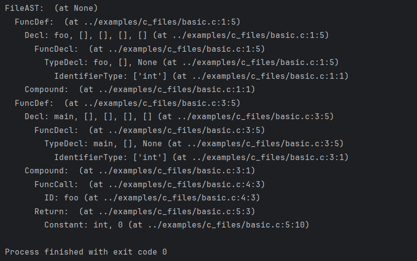

# pycparser: *dump_ast.py*

---
**说明：**

    Basic example of parsing a file and dumping its parsed AST.
    解析文件并转储其解析的 AST 的基本示例。


<br>
<br>
<br>


**示例代码：**
```python{.line-numbers}
import argparse
import sys

# This is not required if you've installed pycparser into
# your site-packages/ with setup.py
sys.path.extend(['.', '..'])

from pycparser import parse_file

if __name__ == "__main__":
    argparser = argparse.ArgumentParser('Dump AST')
    argparser.add_argument('filename',
                           default='../examples/c_files/basic.c',
                           nargs='?',
                           help='name of file to parse')
    argparser.add_argument('--coord', help='show coordinates in the dump',
                           action='store_true')
    args = argparser.parse_args()

    ast = parse_file(args.filename, use_cpp=False)
    ast.show(showcoord=args.coord)
```


<br>
<br>
<br>


**运行结果如下：**


<br>
<br>
<br>

**加上参数 `--coord`，结果如下**

