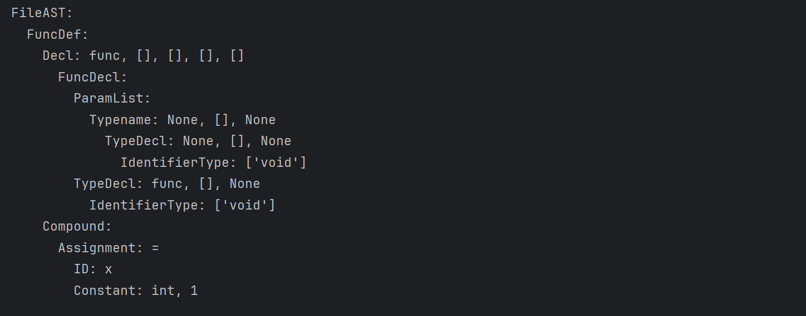
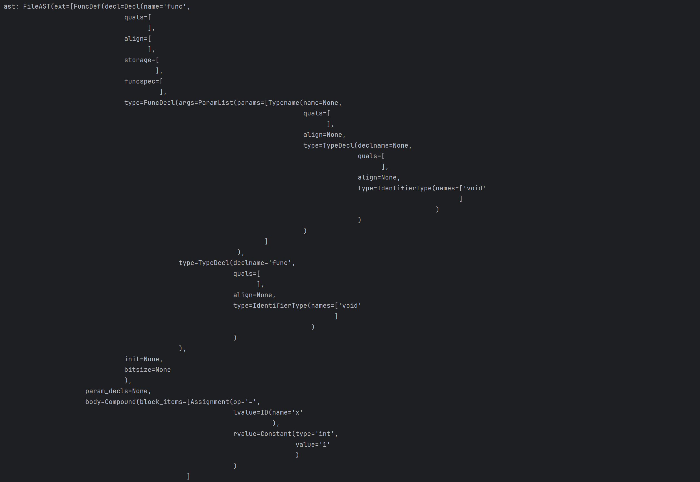

# pycparser: *c-to-c.py*

---
**说明：**

    Simple example of serializing AST
    简单演示序列化AST


<br>
<br>
<br>


**示例代码：**
```python{.line-numbers}
import pickle
import sys

sys.path.extend(['.', '..'])
from pycparser import c_parser

text = r"""
void func(void)
{
  x = 1;
}
"""

if __name__ == '__main__':
    parser = c_parser.CParser()
    ast = parser.parse(text)
    dump_filename = 'ast.pickle'    # 定义存储序列化后的 AST 对象的文件名。

    with open(dump_filename, 'wb') as f:
        # 使用 pickle 库将 AST 对象序列化并写入文件中
        # protocol参数是指定序列化和反序列化的协议，这么写表示支持当前最新标准
        pickle.dump(ast, f, protocol=pickle.HIGHEST_PROTOCOL)

    # Deserialize.
    with open(dump_filename, 'rb') as f:
        ast = pickle.load(f)
        ast.show()

```

<br>
<br>
<br>


**运行结果如下：**



<br>
<br>
<br>


**新发现**：
`print` 第16行的 `ast = parser.parse(text)` , 发现跟反序列化后得到的 `ast = pickle.load(f)` **格式** 有不同之处

<br>
<br>
<br>

**如图所示**:

`ast = parser.parse(text)`



<br>


`ast = pickle.load(f)`

