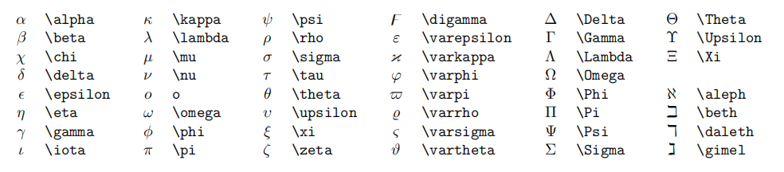

# hello markdown!
或者用 标题然后下一行用==

## 二级标题格式 ##

或者“标题内容”下一行用 ---


---


文字格式
--- 
（分割线格式 “ --- ”）


**重点 （就是加粗的格式， ** x ** ）**

非重点（即没有加粗的格式）

*斜体的格式*

~~删除线~~ （~~ 内容 ~~）

==高亮== (== 内容 ==)

---


列表：
---

* 无序列表1（* 内容）
  * 嵌套列表1
  * 嵌套列表2
* 无序列表
* 无序列表


1. 有序列表（1. 内容）
   1. 嵌套有序1
   2. 嵌套有序2


---

引用文本
---
> 格式 （> 内容）
> By. solo


代码格式
---
`行内代码格式`  ``
比如：这是**python**中的`print`函数

**代码块语法：**
```
print('hello markdown!')

格式 ``` ```
```

带有代码行 语言+{.line-numbers}
```python{.line-numbers}
print(" hello markdown! ")

```


图片与超链接
---

[超链接名](链接地址) （格式为： [名] (地址)）

 (格式是上面的再加个 ！)


表格
---
| 表头 | 表头 |
| ---- | ---- |
| 内容 | 内容 |
| >    | 内容 |


注释：
---
<!-- 注释内容（预览上是看不见的） -->


任务列表
---
- [x] 已经完成的事 1
- [x] 已经完成的事 2 
- [ ] 未完成的事 1


数学公式
---

单位圆：$x^2+y^2=1$

公式块：
$$
\begin{cases}
x=\rho\cos\theta \\
y = \rho\sin\theta \\
\end{cases}
$$


可以但是不推荐公式中使用中文：

$x = \text{中文 english}$


### 1.上标和下标
上：$x^2+y^{12}=1$

下：$x_1+y_{12}=1$


**HyperSnips拓展：**
xsr  =>  x^{2}

xtp  =>  x^{...}

x1  =>  x_1

xii  =>  x_i

xsb  =>  x_{...}


### 2.分式

较小的行内分数： $\frac{1}{2}$

展示型的分式： $\displaystyle\frac{x+1}{x-1}$


**HyperSnips拓展：**
1/  =>  \frac{1}{...}

(1 + 2)/  =>  \frac{(1+2)}{...}

//  =>  \frac{...}{...}


### 3.根式

开平方：$\sqrt{3}$

开$n$次方：$\sqrt[n]{3}$


### 4.空格

紧贴：$a\!b$

没有空格：$ab$

小空格：$a\,b$

中等空格：$a\;b$

大空格：$a\ b$

quad空格：$a\quad b$

两个quad空格：$a\qquad b$


### 5.累加，累乘和积分
累加: $\quad \sum_{k=1}^n\frac{1}{k} \qquad \displaystyle\sum_{k=1}^n\frac{1}{k}$
($\quad$解析：$\sum_{下标记}^{上标}\frac{分子}{分母}$ $\quad$)

累乘: $\quad\prod_{i=1}^n\frac{1}{n} \qquad \displaystyle\prod_{i=1}^n\frac{1}{n}$
($\quad$解析：同上 $\quad$)

积分：$\quad \int_0^1x{\rm d}x \qquad \displaystyle\iint_{D_{xy}} \qquad \iiint_{\Omega_{xyz}}$

（$\quad$解析：${\rm d}x$  $\quad$）


### 6.括号修饰
圆括号: $\displaystyle \left(\sum_{i=1}^n\frac{1}{n} \right)^2$

($\quad$ 没有加 \left 和 \right的效果：$\displaystyle (\sum_{i=1}^n\frac{1}{n} )^2$ $\quad$)

尖括号: $\displaystyle \left\langle\sum_{i=1}^n\frac{1}{n} \right\rangle^2$

（$\quad$ 尖括号用 l or r + angle 表示，其他括号不一一展示  $\quad$）


### 7.多行算式对齐

**居中：**

$$
\begin{aligned}
y &=(x+5)^2-(x+1)^2 \\
&=(x^2+10x+25)-(x^2+2x+1) \\
&=8x+24 \\
\end{aligned} 
$$

$$
\begin{cases}
y &=(x+5)^2-(x+1)^2 \\
&=(x^2+10x+25)-(x^2+2x+1) \\
&=8x+24 \\
\end{cases} 
$$


**左对齐：**
$
\begin{aligned}
y &=(x+5)^2-(x+1)^2 \\
&=(x^2+10x+25)-(x^2+2x+1) \\
&=8x+24 \\
\end{aligned} 
$

$
\begin{cases}
y &=(x+5)^2-(x+1)^2 \\
&=(x^2+10x+25)-(x^2+2x+1) \\
&=8x+24 \\
\end{cases} 
$


8.方程式
---
$$
\begin{cases}
k_{11}x_1+k_{12}x_2+\cdots+k_{1n}x_n=b_1 \\
k_{21}x_1+k_{22}x_2+\cdots+k_{2n}x_n=b_2 \\
\cdots \\
k_{n1}x_1+k_{n2}x_2+\cdots+k_{nn}x_n=b_n \\
\end{cases}
$$


9.矩阵
---

**圆括号：**

$$
\begin{pmatrix}
1 & 1 & \cdots & 1 \\
1 & 1& \cdots &1 \\
\vdots &\vdots &\ddots &\vdots \\
1 & 1 & \cdots & 1 \\
\end{pmatrix}
$$
**方括号：**
$$
\begin{bmatrix}
1 & 1 & \cdots & 1 \\
1 & 1& \cdots &1 \\
\vdots &\vdots &\ddots &\vdots \\
1 & 1 & \cdots & 1 \\
\end{bmatrix}
$$

**行列式**
$$
\begin{vmatrix}
1 & 1 & \cdots & 1 \\
1 & 1& \cdots &1 \\
\vdots &\vdots &\ddots &\vdots \\
1 & 1 & \cdots & 1 \\
\end{vmatrix}
$$

**并排写法：**

$
\begin{pmatrix}
1 & 1 & \cdots & 1 \\
1 & 1& \cdots &1 \\
\vdots &\vdots &\ddots &\vdots \\
1 & 1 & \cdots & 1 \\
\end{pmatrix}\qquad
\begin{bmatrix}
1 & 1 & \cdots & 1 \\
1 & 1& \cdots &1 \\
\vdots &\vdots &\ddots &\vdots \\
1 & 1 & \cdots & 1 \\
\end{bmatrix}
$


10.特殊符号
---

[更多特殊符号](https://oeis.org/wiki/List_of_LaTeX_mathematical_symbols)


### 11.公式编号与引用

$$
x+2 \tag{1.2}
$$


$$
\begin{equation}
x^n+y^n=z^n
\end{equation}
$$

由公式$(1.2)$可得结论


### 12.零星语法
| | | | | | |
|--|--|--|--|--|--|
点乘 | $\cdot$     | 蕴涵| $\to$              |属于|      $\in$
叉乘 | $\times$    | 等价| $\leftrightarrow$  |包含于|    $\subset$
异或 | $\otimes$   | 因为| $\because$         |真包含于|  $\subseteq$
直和 | $\oplus$    | 所以| $\therefore$       |交|        $\cap$
加减 | $\pm$       |存在 | $\exist$           |并|       $\cup$
复合 | $\circ$     |任意 | $\forall$          |空集|     $\empty$

| | | | |
|--|--|--|--|
小于等于| $\leq$        |逻辑与| $\land$
大于等于| $\geq$        |逻辑或| $\lor$
不等| $\neq$            |逻辑非| $\lnot$ 
恒等| $\equiv$        |左小箭头| $\leftarrow$
约等| $\approx$       |右小箭头| $\rightarrow$
等价| $\cong$         |左大箭头| $\Leftarrow$
相似| $\sim$          |右大箭头| $\Rightarrow$
相似等于| $\simeq$    |右长箭头| $\xrightarrow[fgh]{abcde}$
点等| $\doteq$        |上横线|   $\overline{p}$

 
 
短向量 $\vec{x}$, 
长向量 $\overrightarrow{AB}$, 
无限 $\infty$, 
极限 $\lim$, 
微分 ${\rm d}$, 
偏导 $\partial$, 
点求导 $\dot{y}$, 
点二阶导 $\ddot{y}$, 
变化量 $\Delta$, 
梯度 $\nabla$.
横省略 $\cdots$, 
竖省略 $\vdots$, 
斜省略 $\ddots$.

常见函数 $\sin$, $\cos$, $\tan$, $\arcsin$, $\arccos$, $\arctan$, $\ln$, $\log$, $\exp$.


