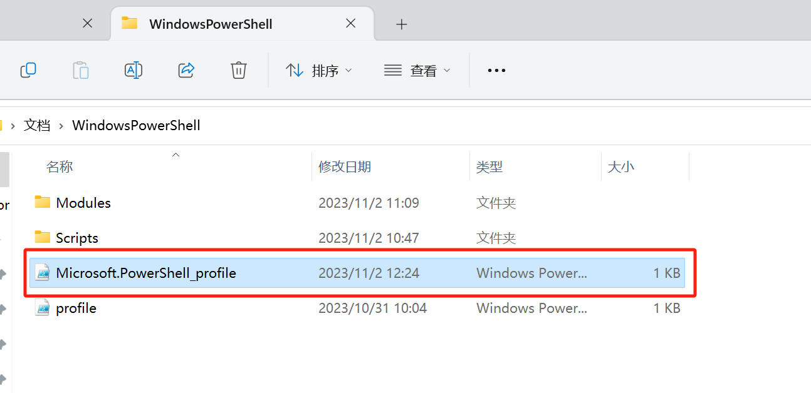
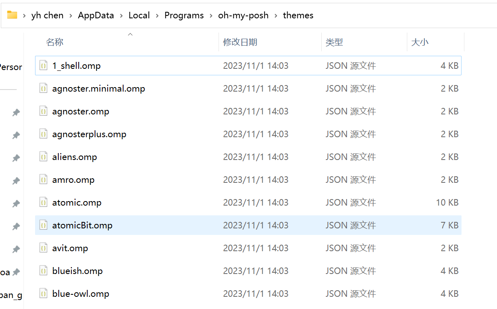
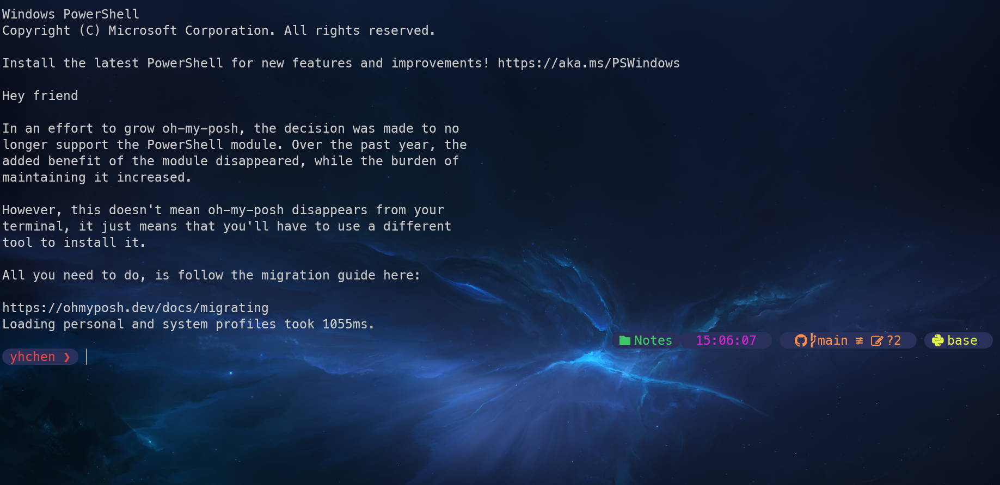

# oh-my-posh
### 记录两个文件夹的位置

---
* **配置文件地址**： D:\Documents\WindowsPowerShell
$\quad$

---

$\quad$
* **theme 地址**：C:\Users\yuehu\AppData\Local\Programs\oh-my-posh\themes
$\quad$

---

$\quad$

* **效果图**
$\quad$
