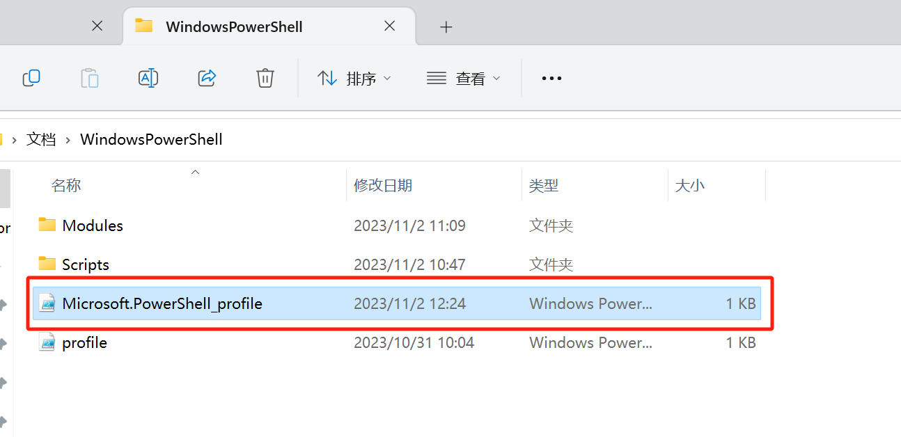
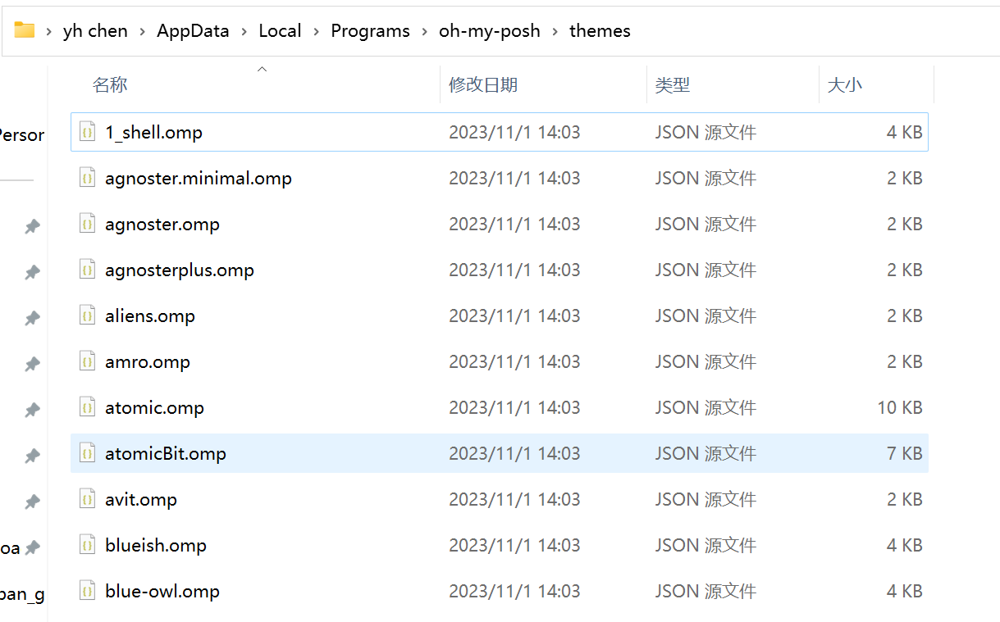
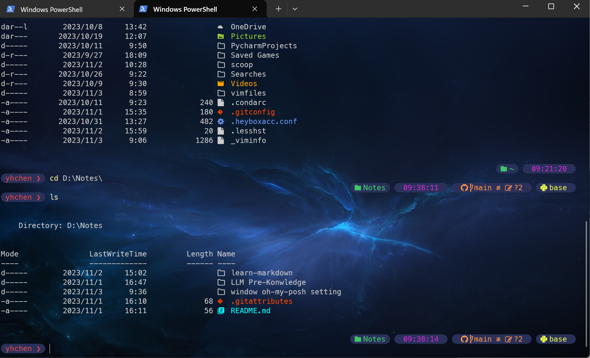
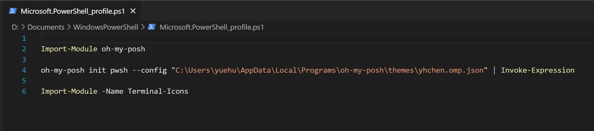

# oh-my-posh
### 记录两个文件夹的位置

---
* **配置文件地址**： D:\Documents\WindowsPowerShell
$\quad$


---

$\quad$
* **theme 地址**：C:\Users\yuehu\AppData\Local\Programs\oh-my-posh\themes
$\quad$


---

$\quad$

* **效果图**
$\quad$


$\quad$
* **记录下配置文件内容**

`Import-Module oh-my-posh`

`oh-my-posh init pwsh --config "C:\Users\yuehu\AppData\Local\Programs\oh-my-posh\themes\yhchen.omp.json" | Invoke-Expression`

`Import-Module -Name Terminal-Icons`




* **同样记录下yhchen.omp.json文件的详细内容**

我在 `bubblesextra.omp.json`基础上进行 **时间块** 的增加，详细内容如下：

```json{.line-numbers}
        {
          "background": "#29315A",
          "foreground": "#cd28cd",
          "leading_diamond": " \ue0b6",
          "properties": {
            "time_format": "15:04:05"
          },
          "style": "diamond",
          "template": " {{ .CurrentDate | date .Format }} ",
          "trailing_diamond": "\ue0b4",
          "type": "time"
        },
```
( **下图红框表示的是插入的位置** )


## 参考资料
> 1. https://zhuanlan.zhihu.com/p/444165353
> 2. https://zhuanlan.zhihu.com/p/626183544
> 3. [oh-my-posh 官网](https://ohmyposh.dev/docs/configuration/general)
> 4. [oh-my-posh 官网 主题页](https://ohmyposh.dev/docs/themes)